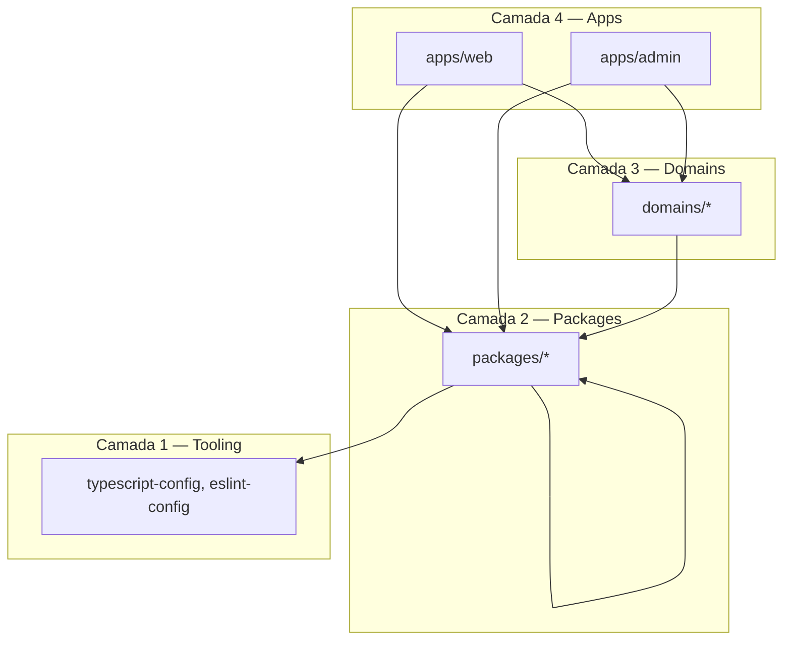

# Regras de Dependência — Omnia Platform

> Fluxo unidirecional de dependências. Violações bloqueiam merge.

## Diagrama de camadas



**Regra de ouro:** dependências fluem **para baixo** (apps → domains → packages → tooling).

---

## Regras explícitas

### Apps

| Regra | Motivo |
|-------|--------|
| **Portal não importa Admin** | Apps são independentes |
| **Portal não importa Payload** | CMS isolado — ADR-004 |
| **Admin não importa lógica de Portal** | Separação de concerns |
| Apps podem importar `packages/*` e `domains/*` | Composição na borda |

### Domains

| Regra | Motivo |
|-------|--------|
| **Domains não dependem de UI** | Lógica framework-agnostic |
| **Domains não importam apps** | Domínio no centro |
| Domains importam `packages/*` (interfaces) | Infra compartilhada |
| Domínios comunicam via **eventos**, não imports cruzados | Desacoplamento |

### Packages

| Regra | Motivo |
|-------|--------|
| **Packages nunca dependem de Apps** | Reutilização |
| **Packages nunca dependem de Domains** | Domínio não vaza para infra |
| Packages podem depender de outros packages | Composição |
| `integrations` não depende de `ai-core` | Adapters são raw |
| `ai-core` pode depender de `integrations` | Orquestração usa adapters |

### Regras de domínio específicas

| Regra | Motivo |
|-------|--------|
| **AI não depende de CRM** | Domínios independentes |
| **CRM depende apenas de interfaces** | DIP — contratos em `types/` |
| **UI não depende de Database** | Apps usam services |

---

## Matriz de dependência (resumo)

| De \ Para | apps | domains | packages | tooling |
|-----------|------|---------|----------|---------|
| **apps** | ❌ | ✅ | ✅ | ✅ |
| **domains** | ❌ | ⚠️ eventos | ✅ | ✅ |
| **packages** | ❌ | ❌ | ✅ | ✅ |
| **tooling** | ❌ | ❌ | ❌ | — |

⚠️ Domínios não se importam diretamente — usam `@omnia/events`.

---

## Packages por categoria

### Fundação (sem deps de negócio)
`types`, `constants`, `config`, `errors`, `logger`, `validation`

### Infraestrutura
`database`, `cache`, `queue`, `mail`, `search`, `integrations`, `storage`

### Cross-cutting
`auth`, `security`, `monitoring`, `feature-flags`, `i18n`

### Orquestração
`ai-core`, `automation`, `events`, `sdk`

### Apresentação
`ui` — **não** importa `database`, `auth` server-side

### Desenvolvimento
`testing`, `eslint-config`, `typescript-config`, `prettier-config`

---

## Detecção de violações

```bash
# Exemplo: Payload no portal (deve retornar vazio)
rg "from ['\"]payload|@payloadcms" apps/web/

# Packages importando apps (deve retornar vazio)
rg "from ['\"].*apps/" packages/
```

Ferramenta automatizada (`dependency-cruiser`) planejada para Sprint 2.

---

## Mudanças nestas regras

Alterações exigem **ADR** após Sprint 1.2.
