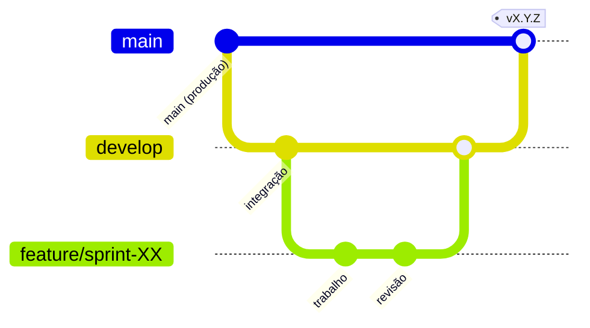
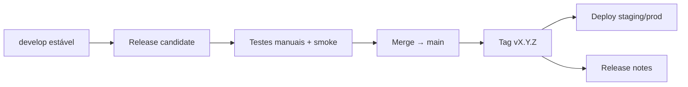

# Governança — Omnia Platform

> Processos oficiais de desenvolvimento, revisão e release.

## Fluxo Git



### Branches

| Branch | Propósito | Protegida |
|--------|-----------|-----------|
| `main` | Produção estável | ✅ |
| `develop` | Integração contínua | ✅ |
| `feature/*` | Novas features / sprints | — |
| `fix/*` | Correções não urgentes | — |
| `hotfix/*` | Correções urgentes em produção | — |

### Convenção de nomes

```
feature/sprint-02-auth
fix/crm-lead-validation
hotfix/jwt-expiry
```

---

## Pull Requests

1. **Base:** `feature/*` → `develop` (padrão) ou `hotfix/*` → `main` + backport
2. **Título:** `[Sprint X] Descrição clara`
3. **Descrição:** Summary + Test plan (template em `.github/`)
4. **Tamanho:** PRs pequenos e revisáveis (< 500 linhas quando possível)
5. **CI verde** obrigatório antes de merge
6. **Review aprovado** — mínimo 1 aprovação (CODEOWNERS)

### Checklist PR

- [ ] Build passa
- [ ] Lint e typecheck passam
- [ ] Documentação atualizada
- [ ] ADR criada (se mudança estrutural)
- [ ] Sem secrets no diff
- [ ] Test plan preenchido

---

## Code Review

### O que revisar

- Aderência a [PROJECT_PRINCIPLES.md](PROJECT_PRINCIPLES.md)
- Regras de [DEPENDENCY_RULES.md](DEPENDENCY_RULES.md)
- Segurança (auth, input, secrets)
- Performance em hot paths
- Nomenclatura e consistência

### Responsáveis

Ver [.github/CODEOWNERS](.github/CODEOWNERS).

---

## Commits

### Formato (Conventional Commits)

```
tipo(escopo): descrição curta

Corpo opcional com contexto.
```

| Tipo | Uso |
|------|-----|
| `feat` | Nova funcionalidade |
| `fix` | Correção de bug |
| `docs` | Documentação |
| `refactor` | Refatoração sem mudança de comportamento |
| `chore` | Manutenção, deps |
| `test` | Testes |
| `ci` | CI/CD |

**Exemplos:**
```
feat(auth): add JWT refresh token rotation
docs(governance): add quality gates
fix(web): correct health endpoint response
```

---

## Versionamento

[Semantic Versioning](https://semver.org/): `MAJOR.MINOR.PATCH`

| Incremento | Quando |
|------------|--------|
| MAJOR | Breaking changes de API |
| MINOR | Features compatíveis |
| PATCH | Bug fixes |

Tags em `main`: `v0.2.0`, `v1.0.0`, etc.

---

## Sprints

| Fase | Duração sugerida | Entregável |
|------|-----------------|------------|
| Planejamento | 1–2 dias | Escopo + ADRs se necessário |
| Implementação | Restante | Código + docs |
| Revisão | 1–2 dias | PR + auditoria |
| Merge | Após aprovação | `develop` |

Roadmap: [docs/13-roadmap/README.md](docs/13-roadmap/README.md)

---

## Definition of Done

Uma tarefa está **Done** quando:

1. Código implementado conforme spec
2. [QUALITY_GATES.md](QUALITY_GATES.md) atendidos
3. README/docs atualizados
4. PR aprovado e merged (ou aguardando revisão humana em sprints de arquitetura)
5. Sem dívidas técnicas não documentadas

---

## Release



1. Congelar `develop` para release
2. Smoke tests em staging
3. Merge `develop` → `main`
4. Tag + CHANGELOG
5. Deploy automatizado (futuro)

---

## Hotfix

1. Branch `hotfix/*` a partir de `main`
2. Fix mínimo e focado
3. PR → `main` (review acelerado)
4. Tag patch (`v1.0.1`)
5. **Backport** para `develop`

---

## Arquitetura congelada

Após **Sprint 1.2**, mudanças estruturais (novos apps, reorganização de packages, novos domínios) exigem **ADR** aprovada. Ver [ADR-008](docs/14-adr/ADR-008-architecture-freeze-governance.md).
