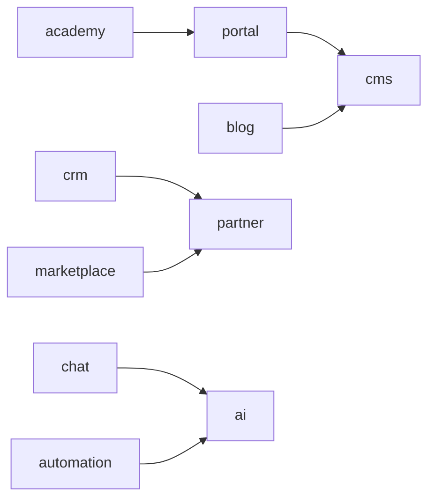

# Módulos — Omnia Platform

> Índice dos módulos de negócio. Detalhes em [modules/](modules/).

## Visão geral

A Omnia Platform é organizada em **10 módulos de negócio** (bounded contexts DDD), cada um mapeado para packages, apps e sprints.

## Mapa de módulos

| # | Módulo | Descrição | Sprint |
|---|--------|-----------|--------|
| 1 | [portal](modules/portal/) | Portal institucional multiempresa | 3 |
| 2 | [blog](modules/blog/) | Conteúdo editorial | 4 |
| 3 | [crm](modules/crm/) | CRM e pipeline de vendas | 5 |
| 4 | [marketplace](modules/marketplace/) | E-commerce B2B/B2C | 6 |
| 5 | [partner](modules/partner/) | Área do parceiro | 7 |
| 6 | [academy](modules/academy/) | Cursos e educação | 7+ |
| 7 | [chat](modules/chat/) | Chat inteligente | 8+ |
| 8 | [ai](modules/ai/) | Motor de IA transversal | 8+ |
| 9 | [automation](modules/automation/) | Workflows n8n | 8+ |
| 10 | [cms](modules/cms/) | Gestão de conteúdo (Payload) | 1/3 |

## Dependências entre módulos

## Packages por camada

| Camada | Packages |
|--------|----------|
| Domínio | `@omnia/types`, `@omnia/constants` |
| Aplicação | `modules/` (docs), use cases nos apps |
| Infraestrutura | `@omnia/database`, `@omnia/integrations` |
| Cross-cutting | `@omnia/auth`, `@omnia/security`, `@omnia/logger`, `@omnia/monitoring` |
| Apresentação | `@omnia/ui`, `@omnia/i18n`, apps |

## Apps

Ver [APPS_ARCHITECTURE.md](APPS_ARCHITECTURE.md) para divisão futura de aplicações.

## Multiempresa

Todas as empresas do ecossistema compartilham a plataforma com isolamento por `tenantId`:

- OFH, RR, NF, FDFA, CTE, CES
- Tipos em `@omnia/types/companies`
- Constantes em `@omnia/constants/companies`
