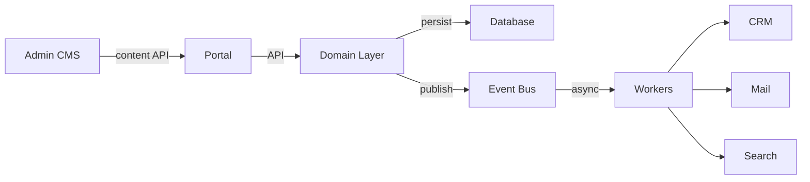
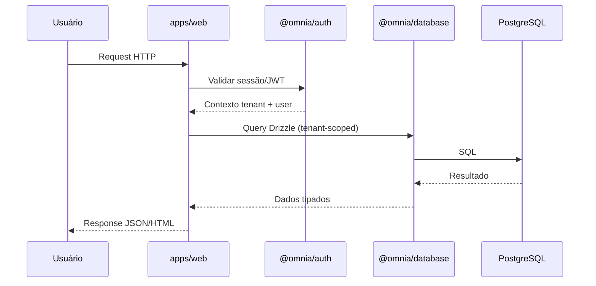
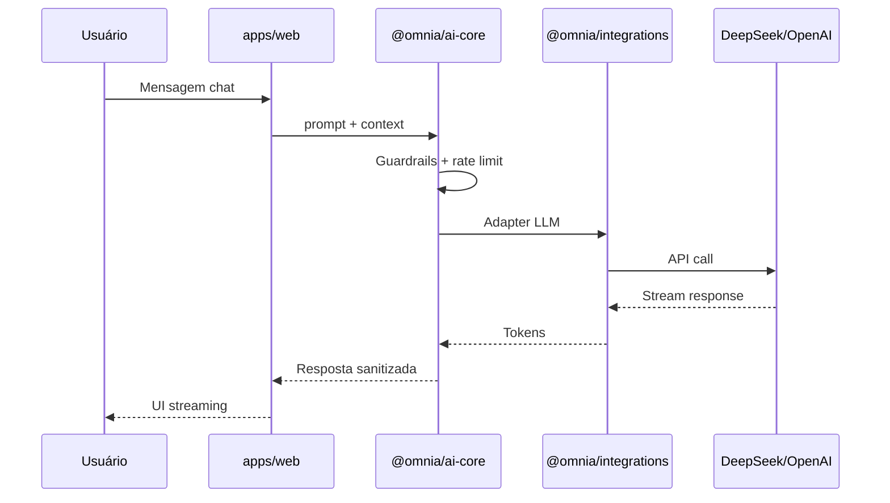
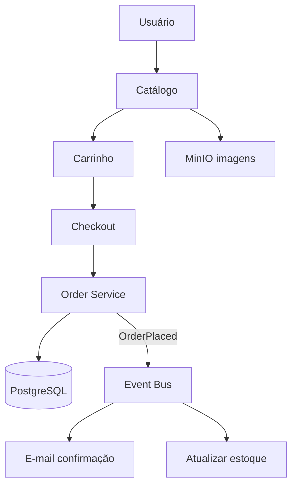
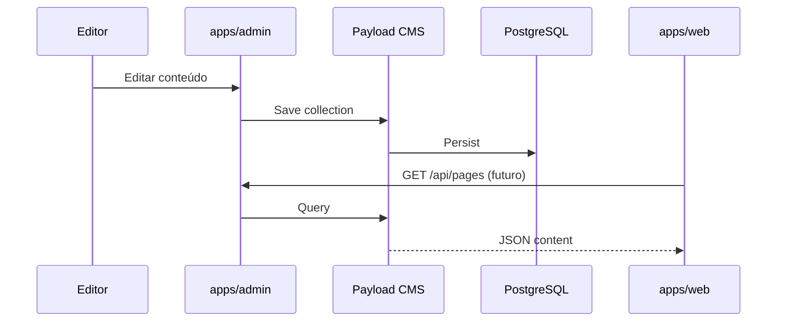
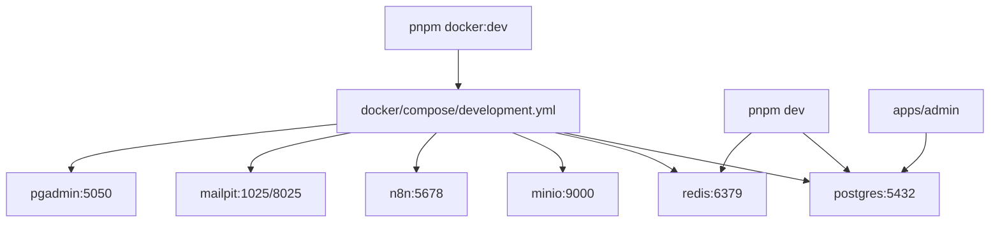

# Omnia Platform — Visão Geral do Sistema

> Documento mestre de arquitetura. **Congelado após Sprint 1.2** — alterações estruturais exigem ADR.

## Visão Geral

A **Omnia Platform** é um monorepo modular para gestão empresarial multi-tenant: portal institucional, CMS, CRM, marketplace, academy, parceiros, chat IA e automações.

### Componentes principais

| Camada | Localização | Papel |
|--------|-------------|-------|
| Apps | `apps/web`, `apps/admin` | Portal e backoffice CMS |
| Domínios | `domains/` | Bounded contexts (DDD) |
| Packages | `packages/` | Infraestrutura compartilhada |
| Dados | `packages/database` + Payload | Drizzle (app) + CMS |
| Eventos | `packages/events` + `events/` | Event-Driven Architecture |
| Infra | `docker/` | Serviços locais e produção |

---

## Arquitetura Geral

```mermaid
flowchart TB
    subgraph Clients
        Browser[Browser / Mobile]
        API_Client[API Pública]
    end

    subgraph Apps
        Web[apps/web<br/>Portal :3000]
        Admin[apps/admin<br/>CMS :3001]
    end

    subgraph Packages
        Auth[@omnia/auth]
        AI[@omnia/ai-core]
        DB[@omnia/database]
        Events[@omnia/events]
        Queue[@omnia/queue]
        Cache[@omnia/cache]
        Config[@omnia/config]
    end

    subgraph Domains
        CRM[domains/crm]
        MKT[domains/marketplace]
        Blog[domains/blog]
    end

    subgraph Infrastructure
        PG[(PostgreSQL)]
        Redis[(Redis)]
        MinIO[(MinIO)]
        N8N[n8n]
    end

    Browser --> Web
    Browser --> Admin
    API_Client --> Web
    Web --> Auth
    Web --> AI
    Web --> DB
    Admin --> DB
    Web -.->|REST CMS| Admin
    Domains --> Events
    Events --> Queue
    Queue --> Redis
    Cache --> Redis
    DB --> PG
    AI --> Redis
    Web --> MinIO
    N8N --> Web
```

---

## Fluxo entre Módulos



**Regra:** módulos comunicam via **APIs** ou **eventos** — nunca importação direta entre domínios.

---

## Fluxo Portal → API → Banco



> **Portal nunca acessa banco diretamente** — sempre via `@omnia/database`.

---

## Fluxo Portal → IA



> Toda IA passa por `@omnia/ai-core` — apps não chamam LLMs diretamente.

---

## Fluxo Portal → CRM

```mermaid
flowchart LR
    Web[apps/web] -->|REST API| CRM_API[CRM API Routes]
    CRM_API --> Domain[domains/crm]
    Domain --> DB[@omnia/database]
    Domain -->|LeadCreated| Events[@omnia/events]
    Events --> Queue[@omnia/queue]
    Queue --> Notify[@omnia/mail]
    Queue --> Search[@omnia/search]
```

---

## Fluxo Marketplace



---

## Fluxo Admin

```mermaid
flowchart LR
    Editor[Editor CMS] --> Admin[apps/admin]
    Admin --> Payload[Payload CMS]
    Payload --> PG[(PostgreSQL)]
    Admin --> RBAC[@omnia/security RBAC]
    Portal[apps/web] -->|GET /api/content| Payload
```

> Payload **exclusivo** em `apps/admin`. Portal consome via API REST.

---

## Fluxo Payload



---

## Fluxo n8n

```mermaid
flowchart LR
    Trigger[Webhook / Cron] --> N8N[n8n :5678]
    N8N -->|HTTP| API[Omnia API]
    N8N -->|Event| Queue[@omnia/queue]
    API --> Domain[Domain Services]
    N8N --> External[Sistemas externos]
```

> Automações passam por `@omnia/automation` como orquestrador de contratos.

---

## Fluxo MinIO

```mermaid
flowchart LR
    Upload[Upload request] --> Web[apps/web]
    Web --> Storage[@omnia/integrations/storage]
    Storage --> MinIO[(MinIO :9000)]
    CDN[CDN futuro] --> MinIO
```

Buckets documentados em [`storage/`](storage/).

---

## Fluxo Redis

```mermaid
flowchart TB
    subgraph Uses
        Cache[@omnia/cache]
        Sessions[@omnia/auth sessions]
        Queue[@omnia/queue BullMQ]
        RateLimit[@omnia/security rate-limit]
        PubSub[@omnia/events]
    end
    Uses --> Redis[(Redis :6379)]
```

---

## Fluxo Docker



---

## Escalabilidade (visão futura)

| Cenário | Estratégia |
|---------|------------|
| 500k usuários | Horizontal scaling apps, Redis cluster, read replicas PG |
| 50k parceiros | Tenant isolation, índices por tenant |
| 20M registros CRM | Particionamento, search index, archive |
| Chat IA | Queue + rate limit + streaming |
| Microserviços | Extrair domínios via eventos — contratos já preparados |

---

## Documentos relacionados

- [PROJECT_PRINCIPLES.md](PROJECT_PRINCIPLES.md)
- [DOMAIN_ARCHITECTURE.md](DOMAIN_ARCHITECTURE.md)
- [GOVERNANCE.md](GOVERNANCE.md)
- [DEPENDENCY_RULES.md](DEPENDENCY_RULES.md)
