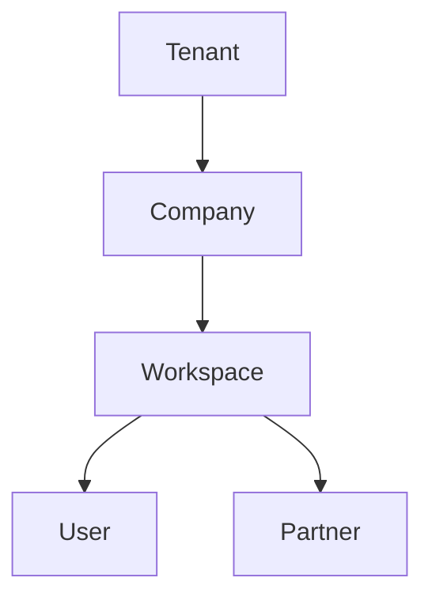

# Arquitetura Multiempresa — Omnia Platform

> Modelo de tenants, companies, workspaces, users e partners.

## Hierarquia

## Conceitos

### Tenant

Unidade de **isolamento de dados**. Todo registro de negócio possui `tenantId`.

- Exemplo: `ofh`, `renovacao`, `neurofrigo`
- Implementação futura: row-level security + header `X-Omnia-Tenant-Id`

### Company

Empresa do ecossistema Omnia Frigo Holding dentro de um tenant.

| Sigla | Empresa |
|-------|---------|
| OFH | Omnia Frigo Holding |
| RR | Renovação Refrigeração |
| NF | Neurofrigo |
| FDFA | Fred do Frio Academy |
| CTE | Centro Técnico Especializado |
| CES | Centro Educacional Sapientia |

### Workspace

Contexto operacional dentro de uma company (ex: CRM da RR, Academy da FDFA).

### User

Pessoa autenticada com roles RBAC. Pode pertencer a múltiplos workspaces.

### Partner

Ator externo B2B (parceiro comercial) com acesso restrito à área do parceiro.

## Relações

| De | Para | Cardinalidade |
|----|------|---------------|
| Tenant | Company | 1:N |
| Company | Workspace | 1:N |
| Workspace | User | N:M |
| Workspace | Partner | 1:N |
| User | Partner | 0:1 (partner pode ser user) |

## Implementação futura

- Tipos: `@omnia/types/companies`
- Constantes: `@omnia/constants/companies`
- Schema: `database/schemas/tenant.md`
- ADR: [ADR-005](docs/14-adr/ADR-005-multi-tenant-architecture.md)

## LGPD

- Dados pessoais vinculados a `tenantId` para isolamento
- Auditoria de acesso em `@omnia/security/audit`
- Exportação e exclusão por tenant (Sprint 2+)
