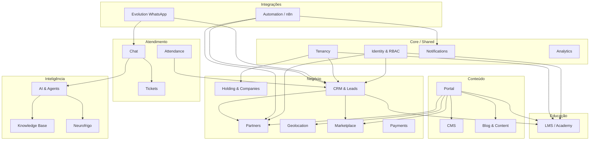
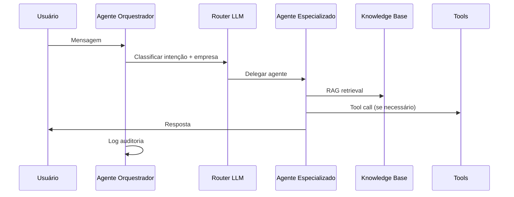

# Omnia Platform — Modelo de Domínio V2

> **Versão:** 2.0  
> **Status:** Oficial — complementa `PRODUCT_MASTER_V2.md`  
> **Data:** 2026-07-10  
> **Padrão:** Domain-Driven Design (DDD)  
> **Implementação:** Documentação apenas — Sprint 2 como baseline  

---

## 1. Propósito

Este documento define:

- Bounded contexts e aggregates
- Entidades, value objects e relacionamentos
- Eventos de domínio
- Modelo RBAC completo
- Modelos de CRM, LMS, Marketplace, Geolocalização e IA
- Fronteiras Payload CMS vs Drizzle ORM

### Regras de persistência (ADR-002, ADR-004)

| Camada | Tecnologia | Responsabilidade |
|--------|------------|------------------|
| **CMS** | Payload (`apps/admin`) | Conteúdo editorial, páginas, mídia, SEO, parceiros públicos |
| **App** | Drizzle (`@omnia/database`) | Transacional: CRM, LMS, pagamentos, tickets, analytics |
| **Portal** | `apps/web` | Leitura via REST — sem import Payload |

---

## 2. Mapa de bounded contexts



### Catálogo de bounded contexts

| # | Context | Package / Pasta | Aggregate roots |
|---|---------|-----------------|-----------------|
| 1 | **Tenancy** | `domains/core`, `@omnia/types/tenant` | `Tenant`, `Workspace` |
| 2 | **Holding & Companies** | `domains/companies` | `Holding`, `Company`, `Unit`, `Branch` |
| 3 | **Identity & RBAC** | `domains/identity`, `@omnia/auth` | `User`, `Role`, `Permission`, `Session` |
| 4 | **CMS** | `domains/cms` | `Page`, `Post`, `MediaAsset`, `Menu` |
| 5 | **Portal** | `domains/portal` | `SiteConfig` (read model) |
| 6 | **Blog & Content** | `domains/blog` | `Article`, `Category`, `Tag`, `Author` |
| 7 | **CRM & Leads** | `domains/crm` | `Lead`, `Opportunity`, `Pipeline`, `Activity` |
| 8 | **Partners** | `domains/partner` | `Partner`, `PartnerReview`, `PartnerPlan` |
| 9 | **Geolocation** | `domains/partner` (sub) | `GeoPoint`, `ServiceArea` |
| 10 | **LMS / Academy** | `domains/academy` | `Course`, `Class`, `Enrollment`, `Exam`, `Certificate` |
| 11 | **Marketplace** | `domains/marketplace` | `Product`, `Cart`, `Order` |
| 12 | **Payments** | `packages/integrations/payments` | `Payment`, `Invoice`, `Subscription` |
| 13 | **Chat** | `domains/chat` | `Conversation`, `Message` |
| 14 | **Tickets & Attendance** | `domains/chat` (sub) | `Ticket`, `Queue`, `Assignment` |
| 15 | **AI & Agents** | `@omnia/ai-core` | `AgentSession`, `AgentRun`, `ToolInvocation` |
| 16 | **Knowledge Base** | `@omnia/ai-core/knowledge` | `KnowledgeDocument`, `EmbeddingChunk` |
| 17 | **Neurofrigo** | `domains/ai` (sub) | `Device`, `Alert`, `TelemetryReading` |
| 18 | **Notifications** | `@omnia/mail`, `@omnia/queue` | `Notification`, `NotificationPreference` |
| 19 | **Analytics** | `@omnia/monitoring` (expand) | `PageView`, `ConversionEvent` |
| 20 | **Automation** | `domains/automation`, `@omnia/automation` | `Workflow`, `WorkflowRun` |
| 21 | **Evolution** | `@omnia/integrations/evolution` | `WhatsAppInstance`, `WhatsAppMessage` |

---

## 3. Entidades por domínio

### 3.1 Tenancy

| Entidade | Tipo | Atributos principais | Persistência |
|----------|------|----------------------|--------------|
| `Tenant` | Aggregate Root | id, slug, name, status, settings, createdAt | Payload ✅ / Drizzle |
| `Workspace` | Aggregate Root | id, tenantId, companyId, slug, name, type | Drizzle |
| `WorkspaceMember` | Entity | workspaceId, userId, roleId, joinedAt | Drizzle |

**Relacionamentos:**
- Tenant 1─N Company
- Tenant 1─N Workspace
- Workspace N─M User (via WorkspaceMember)

---

### 3.2 Holding & Companies

| Entidade | Tipo | Atributos principais | Persistência |
|----------|------|----------------------|--------------|
| `Holding` | Aggregate Root | id, tenantId, legalName, cnpj, branding | Drizzle |
| `Company` | Aggregate Root | id, tenantId, holdingId, name, slug, ecosystemRole, logo, status | Payload ✅ |
| `Unit` | Entity | id, companyId, name, region, managerId | Drizzle |
| `Branch` | Entity | id, unitId, address, geoPoint, phone | Drizzle |
| `Brand` | Value Object | logo, colors, fonts, voice | Payload (embedded) |

**Relacionamentos:**
- Holding 1─N Company
- Company 1─N Unit 1─N Branch
- Company 1─N Workspace
- Company 1─N Content (scope)

**Estado Sprint 2:** `tenants`, `companies` no Payload; Holding/Unit/Branch — planejado.

---

### 3.3 Identity & RBAC

| Entidade | Tipo | Atributos principais | Persistência |
|----------|------|----------------------|--------------|
| `User` | Aggregate Root | id, tenantId, email, name, avatar, status, type | Drizzle + Payload CMS users (separados) |
| `Role` | Entity | id, tenantId, slug, name, scope, permissions[] | Drizzle |
| `Permission` | Value Object | resource, action, conditions | Drizzle |
| `Session` | Entity | id, userId, token, refreshToken, expiresAt, device | Redis + Drizzle |
| `ApiKey` | Entity | id, tenantId, hashedKey, scopes, expiresAt | Drizzle |

**Relacionamentos:**
- User N─M Role (por workspace)
- User 0─1 Partner (se tipo parceiro)
- User 0─1 StudentProfile / InstructorProfile

**Nota:** Payload `users` = editores CMS. Drizzle `users` = identidade da plataforma (Sprint 3+).

---

### 3.4 CMS (Payload)

| Entidade | Collection/Global | Aggregate Root |
|----------|-------------------|----------------|
| `Page` | pages | ✅ Page |
| `LandingPage` | landing-pages | ✅ LandingPage |
| `Post` | posts | ✅ Post |
| `Category` | categories | Category |
| `Tag` | tags | Tag |
| `Author` | authors | Author |
| `MediaAsset` | media | ✅ Media |
| `Menu` | menus / navigation global | Menu |
| `Footer` | footer global | Footer |
| `Banner` | banners | Banner |
| `FAQ` | faqs | FAQ |
| `Testimonial` | testimonials | Testimonial |
| `Download` | downloads | Download |
| `Event` | events | Event |
| `CaseStudy` | case-studies | CaseStudy |
| `Form` | forms | Form |
| `GlobalSettings` | global-settings | ✅ GlobalSettings |
| `Partner` (perfil público) | partners | ✅ Partner (CMS facet) |

**Blocks (Value Objects compostos em Page):**
HeroBlock, RichTextBlock, CardsGridBlock, CompanyShowcaseBlock, TestimonialsBlock, FAQBlock, CTABlock, MediaGalleryBlock, MapEmbedBlock, FormEmbedBlock, BlogFeedBlock, CourseListBlock, VideoEmbedBlock, DownloadListBlock, StatsBlock

---

### 3.5 Portal (read models)

| Read Model | Fonte | Cache |
|------------|-------|-------|
| `HomePageVM` | globals + pages + companies | ISR 60s |
| `CompanyPageVM` | companies + pages | ISR |
| `BlogListVM` | posts | ISR |
| `PartnerMapVM` | partners + geo API | Redis 5min |
| `CourseCatalogVM` | courses | ISR |

Portal não possui aggregates próprios — consome APIs.

---

### 3.6 CRM & Leads

#### Aggregate: Lead

| Entidade | Tipo | Atributos |
|----------|------|-----------|
| `Lead` | **AR** | id, tenantId, companyId, name, email, phone, source, utm, status, score, assignedTo, partnerId |
| `LeadActivity` | Entity | leadId, type, note, createdBy, createdAt |
| `LeadAttachment` | Entity | leadId, mediaId, filename |

#### Aggregate: Opportunity

| Entidade | Tipo | Atributos |
|----------|------|-----------|
| `Opportunity` | **AR** | id, tenantId, leadId, title, value, stage, probability, expectedClose, ownerId |
| `Pipeline` | **AR** | id, tenantId, companyId, name, stages[] |
| `PipelineStage` | Value Object | name, order, probabilityDefault |

#### Aggregate: Activity (CRM)

| Entidade | Tipo | Atributos |
|----------|------|-----------|
| `Activity` | **AR** | id, type (call, email, meeting, task), relatedTo, dueAt, completedAt |

**Relacionamentos:**
- Lead 0─1 Opportunity
- Lead N─1 Partner (origem parceiro)
- Lead N─1 Company
- Opportunity N─1 Pipeline
- User 1─N Lead (assigned)

---

### 3.7 Partners

#### Aggregate: Partner

| Entidade | Tipo | Atributos |
|----------|------|-----------|
| `Partner` | **AR** | id, tenantId, userId, companyName, slug, status, plan, commissionRate |
| `PartnerProfile` | Entity | description, logo, cover, gallery[], certifications[] |
| `PartnerContact` | Value Object | phone, whatsapp, email, website, social{} |
| `PartnerService` | Entity | partnerId, name, category, priceRange |
| `PartnerProduct` | Entity | partnerId, name, sku, description |
| `PartnerReview` | Entity | partnerId, userId, rating, comment, moderated |
| `PartnerPlan` | Entity | slug, name, features[], priorityWeight |
| `PartnerLead` | Entity | partnerId, leadId, status, commission |

**Relacionamentos:**
- Partner 1─1 ServiceArea (geo)
- Partner N─M City/State (cobertura)
- Partner 0─1 User
- Partner 1─N PartnerReview
- Partner N─1 PartnerPlan

---

### 3.8 Geolocation

#### Aggregate: ServiceArea

| Entidade | Tipo | Atributos |
|----------|------|-----------|
| `GeoPoint` | Value Object | latitude, longitude, accuracy |
| `ServiceArea` | **AR** | partnerId, center (GeoPoint), radiusKm, cities[], states[], remoteOk |
| `GeoSearchQuery` | Value Object | origin, radiusKm, filters, sortBy |
| `GeoSearchResult` | Read Model | partnerId, distanceKm, score |

**Ordenação (PRODUCT_MASTER):** distância → especialidade → avaliação → plano → disponibilidade

**Persistência:** PostGIS `GEOGRAPHY(POINT)` + índice GIST (Sprint 7)

---

### 3.9 LMS / Academy

#### Aggregate: Course

| Entidade | Tipo | Atributos |
|----------|------|-----------|
| `Course` | **AR** | id, tenantId, companyId, title, slug, description, price, level, status, instructorIds[] |
| `CourseModule` | Entity | courseId, title, order, lessons[] |
| `Lesson` | Entity | moduleId, title, type (video, text, quiz), content, duration |
| `CourseMaterial` | Entity | courseId, title, fileId, type (pdf, video, slide) |

#### Aggregate: Class (Turma)

| Entidade | Tipo | Atributos |
|----------|------|-----------|
| `Class` | **AR** | id, courseId, name, startDate, endDate, maxStudents, instructorId, status |
| `ClassSchedule` | Entity | classId, dayOfWeek, startTime, endTime, location |

#### Aggregate: Enrollment

| Entidade | Tipo | Atributos |
|----------|------|-----------|
| `Enrollment` | **AR** | id, studentId, courseId, classId, status, progress%, enrolledAt |
| `LessonProgress` | Entity | enrollmentId, lessonId, completedAt, watchTime |

#### Aggregate: Exam

| Entidade | Tipo | Atributos |
|----------|------|-----------|
| `Exam` | **AR** | id, courseId, title, passingScore, timeLimitMin |
| `Question` | Entity | examId, type, text, options[], correctAnswer |
| `ExamAttempt` | Entity | examId, studentId, score, passed, submittedAt |

#### Aggregate: Certificate

| Entidade | Tipo | Atributos |
|----------|------|-----------|
| `Certificate` | **AR** | id, enrollmentId, studentId, courseId, code, issuedAt, pdfUrl |

#### Perfis educacionais

| Entidade | Tipo | Atributos |
|----------|------|-----------|
| `Instructor` | Entity | userId, bio, specialties[], companyId |
| `Student` | Entity | userId, profile, enrollments[] |

**Relacionamentos:**
- Course 1─N Module 1─N Lesson
- Class N─1 Course
- Enrollment N─1 Student, N─1 Course, 0─1 Class
- Exam N─1 Course
- Certificate 1─1 Enrollment (quando concluído)

**CMS vs Drizzle:** vitrine do curso no Payload; matrículas, provas, certificados no Drizzle.

---

### 3.10 Marketplace

#### Aggregate: Product

| Entidade | Tipo | Atributos |
|----------|------|-----------|
| `Product` | **AR** | id, tenantId, companyId, name, sku, price, stock, images[], status |
| `ProductCategory` | Entity | name, slug, parentId |
| `ProductVariant` | Entity | productId, sku, attributes{}, price, stock |

#### Aggregate: Cart

| Entidade | Tipo | Atributos |
|----------|------|-----------|
| `Cart` | **AR** | id, userId/sessionId, items[], expiresAt |
| `CartItem` | Entity | productId, variantId, quantity, price |

#### Aggregate: Order

| Entidade | Tipo | Atributos |
|----------|------|-----------|
| `Order` | **AR** | id, tenantId, userId, status, total, shipping, paymentId |
| `OrderItem` | Entity | orderId, productId, quantity, unitPrice |
| `Shipment` | Entity | orderId, carrier, trackingCode, status |

---

### 3.11 Payments

#### Aggregate: Payment

| Entidade | Tipo | Atributos |
|----------|------|-----------|
| `Payment` | **AR** | id, tenantId, amount, currency, method, status, gatewayRef |
| `Invoice` | Entity | paymentId, pdfUrl, dueDate |
| `Subscription` | **AR** | id, userId, planId, status, currentPeriodEnd |

**Integrações:** Stripe / Mercado Pago / PIX (decisão Sprint 10)

---

### 3.12 Chat, Tickets & Attendance

#### Aggregate: Conversation

| Entidade | Tipo | Atributos |
|----------|------|-----------|
| `Conversation` | **AR** | id, tenantId, channel (web, whatsapp), participantIds[], status |
| `Message` | Entity | conversationId, senderId, content, type, readAt |

#### Aggregate: Ticket

| Entidade | Tipo | Atributos |
|----------|------|-----------|
| `Ticket` | **AR** | id, tenantId, companyId, subject, priority, status, requesterId, assigneeId |
| `TicketMessage` | Entity | ticketId, authorId, body, internal |
| `Queue` | **AR** | id, companyId, name, slaMinutes, members[] |
| `Assignment` | Entity | ticketId, agentId, assignedAt |

#### Aggregate: AttendanceSession

| Entidade | Tipo | Atributos |
|----------|------|-----------|
| `AttendanceSession` | **AR** | id, agentId, channel, startedAt, endedAt, metrics |

---

### 3.13 AI, Knowledge Base & Neurofrigo

#### Aggregate: AgentSession

| Entidade | Tipo | Atributos |
|----------|------|-----------|
| `AgentSession` | **AR** | id, tenantId, userId, agentType, context, status |
| `AgentRun` | Entity | sessionId, prompt, response, tokens, latencyMs |
| `ToolInvocation` | Entity | runId, toolName, input, output |

#### Aggregate: KnowledgeDocument

| Entidade | Tipo | Atributos |
|----------|------|-----------|
| `KnowledgeDocument` | **AR** | id, tenantId, source (cms, manual, neurofrigo), title, content, status |
| `EmbeddingChunk` | Entity | documentId, chunkIndex, vector, metadata |

#### Aggregate: NeurofrigoDevice (Neurofrigo Command IA)

| Entidade | Tipo | Atributos |
|----------|------|-----------|
| `Device` | **AR** | id, tenantId, partnerId, serialNumber, model, location |
| `TelemetryReading` | Entity | deviceId, timestamp, temperature, humidity, status |
| `Alert` | **AR** | id, deviceId, severity, message, acknowledgedAt |

---

### 3.14 Notifications

#### Aggregate: Notification

| Entidade | Tipo | Atributos |
|----------|------|-----------|
| `Notification` | **AR** | id, userId, channel (email, push, whatsapp, in-app), template, status |
| `NotificationPreference` | Entity | userId, channel, enabled, quietHours |

---

### 3.15 Analytics

#### Aggregate: ConversionEvent

| Entidade | Tipo | Atributos |
|----------|------|-----------|
| `PageView` | Entity | url, sessionId, tenantId, companyId, timestamp |
| `ConversionEvent` | **AR** | id, type (lead, purchase, enroll), entityId, value, metadata |

---

### 3.16 Automation (n8n) & Evolution

#### Aggregate: Workflow

| Entidade | Tipo | Atributos |
|----------|------|-----------|
| `Workflow` | **AR** | id, slug, n8nWorkflowId, triggers[], version |
| `WorkflowRun` | Entity | workflowId, status, input, output, startedAt |

#### Aggregate: WhatsAppInstance (Evolution API)

| Entidade | Tipo | Atributos |
|----------|------|-----------|
| `WhatsAppInstance` | **AR** | id, tenantId, instanceName, status, qrCode |
| `WhatsAppMessage` | Entity | instanceId, direction, to, from, body, status |

---

## 4. Modelo RBAC completo

### 4.1 Dimensões de autorização

| Dimensão | Descrição |
|----------|-----------|
| **Tenant** | Isolamento de dados (holding) |
| **Company** | Escopo por marca (RR, FDFA, etc.) |
| **Workspace** | Contexto operacional (CRM-RR, LMS-FDFA) |
| **Resource** | Entidade (lead, course, partner, page) |
| **Action** | create, read, update, delete, publish, approve, assign |

### 4.2 Papéis (roles)

| Papel | Slug | Escopo | Descrição |
|-------|------|--------|-----------|
| **Super Admin Holding** | `super_admin_holding` | Tenant | Acesso total ao ecossistema |
| **Admin Empresa** | `company_admin` | Company | Administra uma empresa do grupo |
| **Editor** | `editor` | Company/CMS | Cria/edita conteúdo, não publica |
| **Marketing** | `marketing` | Company | Publica conteúdo, banners, LPs |
| **Professor** | `instructor` | LMS/Company | Gerencia turmas, materiais, provas |
| **Aluno** | `student` | LMS | Acessa cursos, provas, certificados |
| **Parceiro** | `partner` | Partner | Área do parceiro, leads, perfil |
| **Cliente** | `customer` | Self | Pedidos marketplace, matrículas |
| **Atendente** | `agent` | Support | Chat e tickets atribuídos |
| **Supervisor** | `supervisor` | Support/Company | Supervisiona filas e SLA |
| **Comercial** | `sales` | CRM/Company | Leads, pipeline, oportunidades |
| **Financeiro** | `finance` | Payments | Faturas, comissões, relatórios |
| **Suporte** | `support` | Tickets | Resolve tickets, KB |
| **Publicador CMS** | `publisher` | CMS | Aprova e publica conteúdo |
| **Revisor** | `reviewer` | CMS | Revisa antes de publicar |

### 4.3 Matriz de permissões (resumo)

| Recurso | Super Admin | Company Admin | Marketing | Editor | Comercial | Parceiro | Aluno | Atendente |
|---------|-------------|---------------|-----------|--------|-----------|----------|-------|-----------|
| Pages/CMS | CRUD+publish | CRUD+publish | CRUD+publish | CRU | R | R | R | R |
| Blog | CRUD+publish | CRUD+publish | CRUD+publish | CRU | R | R | R | R |
| Leads | CRUD | CRUD (company) | R | — | CRUD | R (own) | — | R |
| Partners | CRUD+approve | CRUD (company) | R | R | R | CRU (own) | R | R |
| Courses | CRUD | CRUD (company) | R | R | R | R | R (enrolled) | R |
| Enrollments | CRUD | CRUD | R | — | CRU | — | R (own) | R |
| Orders | CRUD | CRUD (company) | R | — | R | R (own) | R (own) | R |
| Tickets | CRUD | CRUD (company) | — | — | R | R (own) | R (own) | CRUD (assigned) |
| Users/Roles | CRUD | CRU (company) | — | — | — | — | — | — |
| Analytics | R | R (company) | R | — | R | R (own) | — | R |
| AI Agents | CRUD | RU | R | R | R | R | R | R |

### 4.4 Implementação técnica (alvo)

- `@omnia/auth` — JWT + refresh (Redis)
- `@omnia/security/rbac` — `can(user, action, resource)`
- Payload access control por collection
- Middleware Next.js por rota
- RLS PostgreSQL por `tenant_id`

---

## 5. Agentes de IA

### 5.1 Catálogo de agentes

| Agente | Slug | Domínio | Knowledge sources | Tools |
|--------|------|---------|-------------------|-------|
| **Orquestrador** | `orchestrator` | Transversal | Todos (roteamento) | route_to_agent, escalate |
| **Comercial** | `sales` | CRM | CRM playbook, produtos, pricing | create_lead, schedule_call |
| **Técnico** | `technical` | RR, CTE | Manuais, blog técnico, cases | search_kb, create_ticket |
| **Educacional** | `educational` | FDFA, CES | Cursos, FAQ matrícula | recommend_course, enroll_info |
| **Neurofrigo** | `neurofrigo` | NF | Telemetria, alertas, docs IoT | get_device_status, create_alert |
| **Parceiros** | `partner` | Partner | Onboarding, comissões | partner_status, lead_count |
| **Atendimento** | `attendance` | Support | FAQ, tickets, SLAs | open_ticket, transfer_queue |
| **Aluno** | `student` | LMS | Conteúdo do curso matriculado | lesson_help, exam_rules |
| **Professor** | `instructor` | LMS | Metodologia, rubricas | class_roster, grade_exam |
| **Supervisor** | `supervisor` | Support | Métricas fila, SLA | queue_stats, reassign |

### 5.2 Fluxo do orquestrador



### 5.3 Políticas

- Rate limit por tenant e por usuário
- PII masking em logs
- Human escalation para pagamentos, contratos, reclamações
- Neurofrigo agent apenas para devices autorizados

---

## 6. Eventos de domínio (catálogo completo)

### 6.1 Tenancy & Identity

| Evento | Payload mínimo | Consumidores |
|--------|----------------|--------------|
| `TenantCreated` | tenantId | Analytics |
| `UserCreated` | userId, tenantId, type | CRM, Notifications |
| `UserLoggedIn` | userId, sessionId | Analytics, Security |
| `UserRoleAssigned` | userId, roleId, workspaceId | Audit |
| `SessionRevoked` | sessionId | Security |

### 6.2 CMS & Content

| Evento | Payload mínimo | Consumidores |
|--------|----------------|--------------|
| `PagePublished` | pageId, slug | Cache invalidation, Search |
| `PageUnpublished` | pageId | Cache invalidation |
| `PostPublished` | postId, companyId | RSS, Notifications, Search |
| `MediaUploaded` | mediaId | Virus scan, CDN |

### 6.3 CRM & Leads

| Evento | Payload mínimo | Consumidores |
|--------|----------------|--------------|
| `LeadCreated` | leadId, source, companyId | n8n, Notifications, AI |
| `LeadUpdated` | leadId, changes | Analytics |
| `LeadAssigned` | leadId, assigneeId | Notifications |
| `LeadConverted` | leadId, opportunityId | Analytics, n8n |
| `OpportunityWon` | opportunityId, value | Finance, Analytics |
| `OpportunityLost` | opportunityId, reason | Analytics |

### 6.4 Partners & Geo

| Evento | Payload mínimo | Consumidores |
|--------|----------------|--------------|
| `PartnerCreated` | partnerId | CRM, n8n |
| `PartnerApproved` | partnerId | Geo index, Portal cache |
| `PartnerRejected` | partnerId, reason | Notifications |
| `PartnerReviewSubmitted` | partnerId, rating | Moderation |
| `PartnerPlanUpgraded` | partnerId, plan | Billing, Search ranking |

### 6.5 LMS

| Evento | Payload mínimo | Consumidores |
|--------|----------------|--------------|
| `CoursePublished` | courseId | Portal, Search |
| `EnrollmentCreated` | enrollmentId, studentId | Payments, Notifications |
| `LessonCompleted` | enrollmentId, lessonId | Progress, Analytics |
| `ExamSubmitted` | attemptId, score | Instructor notify |
| `CourseCompleted` | enrollmentId | Certificate generator |
| `CertificateIssued` | certificateId | Email, Portal |

### 6.6 Marketplace & Payments

| Evento | Payload mínimo | Consumidores |
|--------|----------------|--------------|
| `CartUpdated` | cartId | Analytics |
| `OrderPlaced` | orderId, total | Payments, n8n, Inventory |
| `OrderPaid` | orderId, paymentId | Fulfillment, Notifications |
| `OrderShipped` | orderId, tracking | Notifications |
| `PaymentFailed` | paymentId, reason | Notifications, CRM |
| `RefundIssued` | paymentId, amount | Finance |

### 6.7 Support & Chat

| Evento | Payload mínimo | Consumidores |
|--------|----------------|--------------|
| `ConversationStarted` | conversationId, channel | Analytics |
| `MessageReceived` | messageId, conversationId | AI, Notifications |
| `TicketOpened` | ticketId, priority | Queue, n8n |
| `TicketAssigned` | ticketId, agentId | Notifications |
| `TicketResolved` | ticketId | CSAT, Analytics |
| `SlaBreached` | ticketId | Supervisor, n8n |

### 6.8 AI & Neurofrigo

| Evento | Payload mínimo | Consumidores |
|--------|----------------|--------------|
| `AgentSessionStarted` | sessionId, agentType | Analytics |
| `AgentEscalated` | sessionId, reason | Ticket, Human queue |
| `KnowledgeDocumentIndexed` | documentId | Vector store |
| `DeviceAlertTriggered` | alertId, deviceId | n8n, Neurofrigo agent, SMS |
| `TelemetryAnomalyDetected` | deviceId, reading | Alerts |

### 6.9 Automation & Evolution

| Evento | Payload mínimo | Consumidores |
|--------|----------------|--------------|
| `WorkflowExecuted` | workflowId, runId | Audit |
| `WorkflowFailed` | workflowId, error | Alerting |
| `WhatsAppMessageReceived` | instanceId, from | Chat, CRM |
| `WhatsAppMessageSent` | instanceId, to | Audit |

### 6.10 Notifications & Analytics

| Evento | Payload mínimo | Consumidores |
|--------|----------------|--------------|
| `NotificationSent` | notificationId, channel | Audit |
| `NotificationFailed` | notificationId, error | Retry queue |
| `ConversionRecorded` | eventType, value | Dashboards |

---

## 7. Diagrama de relacionamentos principais

```mermaid
erDiagram
    Tenant ||--o{ Company : has
    Tenant ||--o{ Workspace : has
    Company ||--o{ Unit : has
    Unit ||--o{ Branch : has
    Workspace }o--o{ User : members
    User }o--o{ Role : has
    Company ||--o{ Page : owns
    Company ||--o{ Post : owns
    Company ||--o{ Course : offers
    Partner ||--|| ServiceArea : has
    Partner }o--o{ PartnerReview : receives
    Lead }o--|| Company : belongs
    Lead |o--o| Partner : referred_by
    Lead ||--o| Opportunity : converts
    Opportunity }o--|| Pipeline : in
    Student ||--o{ Enrollment : has
    Course ||--o{ Enrollment : has
    Class ||--o{ Enrollment : optional
    Enrollment ||--o| Certificate : earns
    Course ||--o{ Exam : has
    Student ||--o{ ExamAttempt : takes
    Product ||--o{ OrderItem : in
    Order ||--o{ OrderItem : contains
    Order ||--o| Payment : paid_by
    Ticket ||--o{ TicketMessage : has
    Conversation ||--o{ Message : has
    Device ||--o{ TelemetryReading : emits
    Device ||--o{ Alert : triggers
```

---

## 8. Duplicidades e fronteiras resolvidas

| Tópico | Decisão |
|--------|---------|
| **User CMS vs User App** | Payload users = CMS editors; Drizzle users = plataforma |
| **Partner CMS vs Partner transactional** | Perfil público no Payload; leads/comissões no Drizzle |
| **Course CMS vs LMS** | Vitrine/metadata no Payload; matrícula/provas no Drizzle |
| **Event (conteúdo) vs Event (domínio)** | `events` collection = eventos marketing; `Event` domain = event bus |
| **Lead Payload vs Drizzle** | Forms no Payload; leads processados no Drizzle CRM |
| **Company Payload vs Drizzle** | Payload = conteúdo; Drizzle = dados operacionais (futuro sync) |

---

## 9. Referências

- `PRODUCT_MASTER_V2.md`
- `TENANT_ARCHITECTURE.md`
- `database/schemas/`
- `events/README.md`
- `docs/14-adr/ADR-002`, `ADR-005`, `ADR-007`

---

*Próximo documento: `MASTER_ROADMAP_V2.md` — sequência de implementação por Sprint.*
