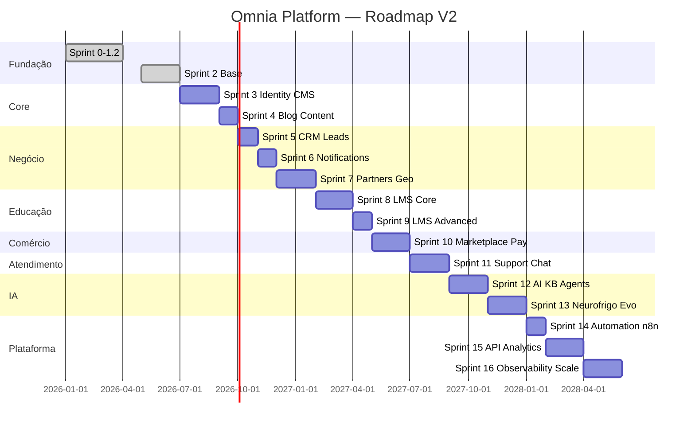
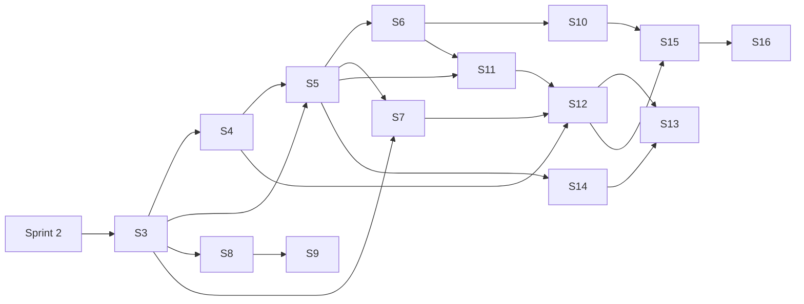

# Omnia Platform — Roadmap Técnico Mestre V2

> **Versão:** 2.0  
> **Status:** Oficial — sequência de implementação  
> **Data:** 2026-07-10  
> **Base:** `PRODUCT_MASTER_V2.md` + `DOMAIN_MODEL_V2.md`  
> **Sprints:** 0–16 (0–2 concluídas, 3–16 planejadas)  

---

## 1. Visão geral

### Mapa sprint → módulos

| Sprint | Módulos principais |
|--------|-------------------|
| 0–1.2 | Monorepo, ADRs, packages scaffold, Docker dev |
| 2 | CMS mínimo, portal home, multiempresa seed |
| 3 | Identity, RBAC, CMS completo, Page Builder |
| 4 | Blog, editorial, SEO avançado |
| 5 | CRM, leads, formulários |
| 6 | Notificações, e-mail transacional |
| 7 | Parceiros, geolocalização, mapa |
| 8 | LMS cursos, matrículas, materiais |
| 9 | LMS turmas, provas, certificados |
| 10 | Marketplace, pagamentos |
| 11 | Chat, tickets, atendimento |
| 12 | IA, knowledge base, agentes |
| 13 | Neurofrigo, Evolution WhatsApp |
| 14 | n8n, event bus |
| 15 | API pública, analytics |
| 16 | Observabilidade, escala, mobile |

---

## 2. Sprints concluídas (0–2)

### Sprint 0 — Fundação ✅

| Campo | Detalhe |
|-------|---------|
| **Objetivo** | Monorepo, documentação, CI placeholder |
| **Módulos** | Core |
| **Collections** | — |
| **APIs** | — |
| **Banco** | — |
| **Frontend** | — |
| **Backend** | — |
| **Payload** | — |
| **Testes** | Lint, typecheck |
| **Aceite** | Repo estruturado, ADR-001/002 |
| **Riscos** | — |
| **Dependências** | — |

### Sprint 0.5 — Foundation Hardening ✅

| Campo | Detalhe |
|-------|---------|
| **Objetivo** | Packages infra, guidelines, governança inicial |
| **Módulos** | Core, packages (18) |
| **Dependências** | Sprint 0 |

### Sprint 1 — Base Executável ✅

| Campo | Detalhe |
|-------|---------|
| **Objetivo** | Next.js web+admin, Payload mínimo, Docker, Drizzle conexão |
| **Módulos** | Portal scaffold, CMS scaffold |
| **APIs** | `/api/health` |
| **Banco** | PostgreSQL conexão |
| **Payload** | Config base |
| **Dependências** | Sprint 0.5 |

### Sprint 1.1 — Architecture Refinement ✅

| Campo | Detalhe |
|-------|---------|
| **Objetivo** | ADR-004–007, domains/, schemas/, `/api/status` |
| **Módulos** | Todos documentados |
| **Dependências** | Sprint 1 |

### Sprint 1.2 — Standards & Freeze ✅

| Campo | Detalhe |
|-------|---------|
| **Objetivo** | ADR-008 freeze, 9 packages cross-cutting |
| **Módulos** | config, errors, events, cache, mail, queue, validation, search, testing |
| **Dependências** | Sprint 1.1 |

### Sprint 2 — Platform Base ✅

| Campo | Detalhe |
|-------|---------|
| **Objetivo** | CMS operacional, portal home, seed holding, design system base |
| **Módulos** | CMS, Portal, Companies, Holding |
| **Collections** | users, tenants, companies, media, global-settings |
| **APIs** | Payload REST, portal `cms.ts`, health, status |
| **Banco** | Payload migrations PostgreSQL |
| **Frontend** | web: Hero, CompanyCards, Ecosystem*, Header*, Footer*; admin: dashboard, shell |
| **Backend** | Seed idempotente, bootstrap Docker |
| **Payload** | Lexical, importMap, CSS, migrations |
| **Testes** | lint, typecheck, build |
| **Aceite** | Admin healthy staging, 6 empresas seed, portal consome CMS |
| **Riscos** | Conteúdo hardcoded (*Ecosystem, Header, Footer*) |
| **Dependências** | Sprint 1.2 |

*\* dívida documentada — Sprint 3*

---

## 3. Sprints planejadas (3–16)

### Sprint 3 — Identity, RBAC & CMS Completo

| Campo | Detalhe |
|-------|---------|
| **Objetivo** | Autenticação app-wide, RBAC base, CMS administrável (pages, menus, footer), eliminar hardcoded |
| **Módulos** | Identity, RBAC, CMS, Portal, Tenancy |
| **Collections Payload** | pages, landing-pages, menus, footer (global), navigation (global), testimonials, banners, seo-defaults |
| **Blocks** | Hero, RichText, CardsGrid, CompanyShowcase, CTA, FAQ, Testimonials, FormEmbed |
| **APIs** | `/api/v1/auth/login`, `/api/v1/auth/refresh`, `/api/v1/auth/me`; portal CMS pages/menus |
| **Banco Drizzle** | tenants, users, roles, permissions, user_roles, workspaces, workspace_members, sessions |
| **Frontend** | Login admin/portal; menus/footer dinâmicos; preview CMS; Page Builder render |
| **Backend** | `@omnia/auth` JWT+Redis; Payload access control; RLS preparação |
| **Payload** | Versioning drafts, preview tokens, publish workflow, plugin SEO |
| **Testes** | Unit RBAC; E2E login; snapshot pages |
| **Aceite** | Zero hardcoded marketing na home; RBAC 5 roles mínimos; preview staging |
| **Riscos** | Duplicidade Payload users vs Drizzle users |
| **Dependências** | Sprint 2 |

---

### Sprint 4 — Blog & Conteúdo Editorial

| Campo | Detalhe |
|-------|---------|
| **Objetivo** | Blog completo, autores, taxonomias, downloads, eventos, cases |
| **Módulos** | Blog, Content, CMS, Portal, SEO |
| **Collections** | posts, categories, tags, authors, downloads, events, case-studies, faqs |
| **APIs** | `/api/v1/posts`, `/api/v1/categories`; RSS `/feed.xml`; sitemap |
| **Banco** | blog_post_analytics (opcional Drizzle) |
| **Frontend** | `/blog`, `/blog/[slug]`, `/noticias`, `/eventos`, `/cases`, `/materiais` |
| **Backend** | ISR por post; schema.org Article/Event |
| **Payload** | Editorial workflow (draft→review→publish) |
| **Testes** | E2E blog list/detail; SEO meta validation |
| **Aceite** | Posts por company; RSS; sitemap automático |
| **Riscos** | Slug collision cross-tenant |
| **Dependências** | Sprint 3 |

---

### Sprint 5 — CRM & Leads

| Campo | Detalhe |
|-------|---------|
| **Objetivo** | Pipeline comercial, captura de leads, integração formulários portal |
| **Módulos** | CRM, Leads, Portal, Notifications (básico) |
| **Collections Payload** | forms (definição) |
| **APIs** | `/api/v1/leads`, `/api/v1/opportunities`, `/api/v1/pipelines`, `/api/v1/activities` |
| **Banco** | crm_leads, crm_opportunities, crm_pipelines, crm_pipeline_stages, crm_activities |
| **Frontend** | Admin CRM dashboard; formulários portal → lead; `/contato` |
| **Backend** | Event bus: LeadCreated, LeadConverted; atribuição round-robin |
| **Payload** | Forms embed em pages |
| **Testes** | Integration lead creation; pipeline transitions |
| **Aceite** | Lead do portal aparece no CRM em <30s; roles Comercial isolados por company |
| **Riscos** | LGPD consent tracking |
| **Dependências** | Sprint 3 (auth), Sprint 4 (forms content) |

---

### Sprint 6 — Notificações & Comunicação

| Campo | Detalhe |
|-------|---------|
| **Objetivo** | E-mail transacional, in-app notifications, templates |
| **Módulos** | Notifications, CRM, Identity |
| **Collections** | notification-templates (Payload ou Drizzle) |
| **APIs** | `/api/v1/notifications`, webhooks internos |
| **Banco** | notifications, notification_preferences |
| **Frontend** | Bell icon admin; preference center |
| **Backend** | `@omnia/mail` SMTP prod; `@omnia/queue` workers |
| **Payload** | Templates editáveis marketing |
| **Testes** | E-mail delivery staging; queue retry |
| **Aceite** | LeadCreated dispara e-mail; opt-out LGPD |
| **Riscos** | Deliverability SPF/DKIM produção |
| **Dependências** | Sprint 5 |

---

### Sprint 7 — Parceiros & Geolocalização

| Campo | Detalhe |
|-------|---------|
| **Objetivo** | Rede de parceiros, mapa, busca geo, área do parceiro v1 |
| **Módulos** | Partners, Geolocation, CRM, Portal |
| **Collections** | partners (perfil completo), partner-plans |
| **APIs** | `/api/v1/partners`, `/api/v1/partners/nearby`, `/api/v1/partners/search` |
| **Banco** | partners, partner_reviews, partner_leads, service_areas (PostGIS) |
| **Frontend** | `/parceiros`, `/mapa`, `/parceiros/[slug]`; área parceiro `/parceiro` |
| **Backend** | Geo query Haversine/PostGIS; ranking algorithm |
| **Payload** | Partner approval workflow |
| **Testes** | Geo search accuracy; partner onboarding E2E |
| **Aceite** | Mapa ordena por distância+plano; aprovação admin |
| **Riscos** | LGPD geolocalização; PostGIS migration |
| **Dependências** | Sprint 5 (CRM), Sprint 3 (auth) |

---

### Sprint 8 — LMS Core (Cursos & Matrículas)

| Campo | Detalhe |
|-------|---------|
| **Objetivo** | Catálogo de cursos, matrículas, aulas, materiais, progresso |
| **Módulos** | LMS, Academy, Portal, Payments (prep) |
| **Collections** | courses (vitrine Payload) |
| **APIs** | `/api/v1/courses`, `/api/v1/enrollments`, `/api/v1/lessons`, `/api/v1/materials` |
| **Banco** | acad_courses, acad_modules, acad_lessons, acad_materials, acad_enrollments, acad_lesson_progress |
| **Frontend** | `/cursos`, `/cursos/[slug]`, player de aula, área aluno v1 |
| **Backend** | MinIO vídeos; progress tracking |
| **Payload** | Course marketing content + blocks |
| **Testes** | Enrollment flow; progress calculation |
| **Aceite** | Aluno assiste aula e progresso salva; FDFA e CES com cursos |
| **Riscos** | Streaming vídeo custo/CDN |
| **Dependências** | Sprint 3 (auth, RBAC student/instructor) |

---

### Sprint 9 — LMS Advanced (Turmas, Provas, Certificados)

| Campo | Detalhe |
|-------|---------|
| **Objetivo** | Turmas, provas, certificados PDF, perfil professor |
| **Módulos** | LMS, Academy |
| **Collections** | — (operacional Drizzle) |
| **APIs** | `/api/v1/classes`, `/api/v1/exams`, `/api/v1/certificates` |
| **Banco** | acad_classes, acad_schedules, acad_exams, acad_questions, acad_exam_attempts, acad_certificates |
| **Frontend** | Turmas admin; prova online; download certificado |
| **Backend** | PDF generator; anti-cheat básico |
| **Payload** | — |
| **Testes** | Exam grading; certificate issuance |
| **Aceite** | Certificado emitido ao completar curso com nota mínima |
| **Riscos** | Integridade acadêmica |
| **Dependências** | Sprint 8 |

---

### Sprint 10 — Marketplace & Pagamentos

| Campo | Detalhe |
|-------|---------|
| **Objetivo** | E-commerce B2B/B2C, carrinho, checkout, pagamentos |
| **Módulos** | Marketplace, Payments, CRM, Notifications |
| **Collections** | products (Payload vitrine) |
| **APIs** | `/api/v1/products`, `/api/v1/cart`, `/api/v1/orders`, `/api/v1/payments` |
| **Banco** | mkt_products, mkt_variants, mkt_carts, mkt_orders, mkt_order_items, payments, invoices |
| **Frontend** | `/loja`, `/carrinho`, `/checkout`, `/pedidos` |
| **Backend** | Gateway Stripe/MP/PIX; webhooks pagamento |
| **Payload** | Product catalog CMS |
| **Testes** | Checkout E2E sandbox; webhook idempotency |
| **Aceite** | Pedido pago gera notificação e CRM opportunity |
| **Riscos** | PCI compliance; fraude |
| **Dependências** | Sprint 6, Sprint 3 |

---

### Sprint 11 — Chat, Tickets & Atendimento

| Campo | Detalhe |
|-------|---------|
| **Objetivo** | Suporte omnichannel, filas, SLA, chat web |
| **Módulos** | Chat, Tickets, Attendance, CRM |
| **Collections** | — |
| **APIs** | `/api/v1/conversations`, `/api/v1/tickets`, `/api/v1/queues`, WebSocket `/ws/chat` |
| **Banco** | conversations, messages, tickets, ticket_messages, queues, assignments |
| **Frontend** | Widget chat portal; painel atendente; supervisor dashboard |
| **Backend** | SLA engine; routing rules |
| **Payload** | FAQ/KB links |
| **Testes** | Load chat; SLA breach alerts |
| **Aceite** | Ticket criado do chat; fila por company |
| **Riscos** | WebSocket scale |
| **Dependências** | Sprint 5, Sprint 6 |

---

### Sprint 12 — IA, Knowledge Base & Agentes

| Campo | Detalhe |
|-------|---------|
| **Objetivo** | Motor IA, RAG, 10 agentes especializados, orquestrador |
| **Módulos** | AI, Knowledge Base, Chat, CRM, LMS |
| **Collections** | knowledge-documents (Payload ou Drizzle) |
| **APIs** | `/api/v1/ai/chat`, `/api/v1/ai/sessions`, `/api/v1/kb/search` |
| **Banco** | agent_sessions, agent_runs, knowledge_documents, embedding_chunks (pgvector) |
| **Frontend** | Assistente portal; copilot admin |
| **Backend** | `@omnia/ai-core`; DeepSeek/OpenAI; indexing pipeline |
| **Payload** | CMS → KB sync |
| **Testes** | RAG relevance; agent routing accuracy |
| **Aceite** | 10 agentes roteados; auditoria prompts |
| **Riscos** | Alucinação; custo tokens; LGPD |
| **Dependências** | Sprint 11, Sprint 4 (content for KB) |

---

### Sprint 13 — Neurofrigo & Evolution (WhatsApp)

| Campo | Detalhe |
|-------|---------|
| **Objetivo** | Integração Neurofrigo IoT, Evolution API WhatsApp, agente NF |
| **Módulos** | Neurofrigo, Evolution, AI, Automation |
| **Collections** | — |
| **APIs** | `/api/v1/neurofrigo/devices`, `/api/v1/neurofrigo/alerts`, `/api/v1/whatsapp/webhook` |
| **Banco** | nf_devices, nf_telemetry, nf_alerts, whatsapp_instances, whatsapp_messages |
| **Frontend** | Dashboard Neurofrigo; alertas |
| **Backend** | Evolution API adapter; telemetry ingestion |
| **Payload** | — |
| **Testes** | Webhook WhatsApp; alert pipeline |
| **Aceite** | Alerta device → n8n → WhatsApp |
| **Riscos** | API Evolution instabilidade; IoT volume |
| **Dependências** | Sprint 12, Sprint 14 (parcial) |

---

### Sprint 14 — Automação n8n & Event Bus

| Campo | Detalhe |
|-------|---------|
| **Objetivo** | Event bus produtivo, workflows n8n versionados |
| **Módulos** | Automation, CRM, Partners, Notifications, all |
| **Collections** | — |
| **APIs** | `/api/v1/events` (internal), n8n webhooks |
| **Banco** | workflow_runs, event_outbox |
| **Frontend** | — |
| **Backend** | `@omnia/events` Redis Streams; `@omnia/automation` contracts |
| **Payload** | — |
| **Testes** | Workflow integration tests |
| **Aceite** | 10 workflows produtivos documentados |
| **Riscos** | Event ordering; dead letter queue |
| **Dependências** | Sprint 5+ eventos definidos |

---

### Sprint 15 — API Pública, SDK & Analytics

| Campo | Detalhe |
|-------|---------|
| **Objetivo** | API v1 documentada, SDK, dashboards analytics |
| **Módulos** | Analytics, API, SDK |
| **Collections** | — |
| **APIs** | `/api/v1/*` OpenAPI 3.1; rate limiting |
| **Banco** | page_views, conversion_events, aggregates |
| **Frontend** | `apps/docs` dev portal; analytics admin |
| **Backend** | `@omnia/sdk`; export CSV |
| **Payload** | — |
| **Testes** | Contract tests OpenAPI |
| **Aceite** | SDK publicado npm; dashboard conversões |
| **Riscos** | Breaking changes API |
| **Dependências** | Módulos 3–12 estáveis |

---

### Sprint 16 — Observabilidade, Escala & Mobile

| Campo | Detalhe |
|-------|---------|
| **Objetivo** | OTel, Prometheus, Grafana, Sentry, CDN, app mobile, LGPD tooling |
| **Módulos** | Core, Analytics, all |
| **Collections** | — |
| **APIs** | `/metrics`, health profundo |
| **Banco** | audit_logs, data_export_requests |
| **Frontend** | React Native app (leitura); PWA |
| **Backend** | Auto-scale policies; LGPD export/delete |
| **Payload** | — |
| **Testes** | Load test 100k users; chaos engineering básico |
| **Aceite** | SLO 99.9%; runbooks; mobile MVP |
| **Riscos** | Custo infra escala |
| **Dependências** | Sprint 15 |

---

## 4. Dependências entre sprints (grafo)

---

## 5. Payload Collections — roadmap consolidado

| Collection | Sprint | Domínio |
|------------|--------|---------|
| users | 2 ✅ | Identity/CMS |
| tenants | 2 ✅ | Tenancy |
| companies | 2 ✅ | Holding |
| media | 2 ✅ | CMS |
| global-settings | 2 ✅ | CMS |
| pages | 3 | CMS |
| landing-pages | 3 | CMS |
| menus / navigation | 3 | CMS |
| footer | 3 | CMS |
| banners | 3 | CMS |
| testimonials | 3 | CMS |
| posts | 4 | Blog |
| categories, tags, authors | 4 | Blog |
| downloads | 4 | Content |
| events | 4 | Content |
| case-studies | 4 | Content |
| faqs | 4 | Content |
| forms | 5 | CRM |
| partners | 7 | Partners |
| courses (vitrine) | 8 | LMS |
| products (vitrine) | 10 | Marketplace |
| knowledge-documents | 12 | AI |

---

## 6. APIs — roadmap consolidado

| Prefixo | Sprint | Domínios |
|---------|--------|----------|
| `/api/health`, `/api/status` | 1–2 ✅ | Core |
| Payload `/api/*` | 2 ✅ | CMS |
| `/api/v1/auth/*` | 3 | Identity |
| `/api/v1/pages`, `/api/v1/menus` | 3 | Portal/CMS |
| `/api/v1/posts/*` | 4 | Blog |
| `/api/v1/leads`, `/api/v1/opportunities` | 5 | CRM |
| `/api/v1/notifications` | 6 | Notifications |
| `/api/v1/partners/nearby` | 7 | Geo |
| `/api/v1/courses`, `/api/v1/enrollments` | 8–9 | LMS |
| `/api/v1/orders`, `/api/v1/payments` | 10 | Marketplace |
| `/api/v1/tickets`, `/ws/chat` | 11 | Support |
| `/api/v1/ai/*` | 12 | AI |
| `/api/v1/neurofrigo/*`, `/api/v1/whatsapp/*` | 13 | Integrations |
| `/api/v1/events` | 14 | Automation |
| `/api/v1/analytics` | 15 | Analytics |

---

## 7. Critérios globais de aceite por sprint

1. `pnpm lint && pnpm typecheck && pnpm build` — verde
2. Documentação sprint em `docs/13-roadmap/`
3. Release notes em `docs/20-release-notes/`
4. Sem violação ADR-004, ADR-008
5. Multiempresa respeitado (tenantId)
6. Conteúdo marketing via CMS (pós Sprint 3)
7. Testes mínimos conforme matriz de risco
8. Deploy staging validado

---

## 8. Riscos transversais

| Risco | Sprints afetadas | Mitigação |
|-------|------------------|-----------|
| Scope creep | Todas | PRODUCT_MASTER_V2 gate |
| Payload/Drizzle duplicidade | 3–10 | DOMAIN_MODEL_V2 fronteiras |
| Auth complexity | 3+ | `@omnia/auth` único |
| Geo performance | 7 | PostGIS early |
| IA custo/LGPD | 12–13 | Rate limit, auditoria |
| Integração WhatsApp | 13 | Fallback e-mail |
| Event bus reliability | 14 | Outbox pattern |
| API breaking changes | 15 | Versioning semver |

---

## 9. Referências

- `PRODUCT_MASTER_V2.md`
- `DOMAIN_MODEL_V2.md`
- `BACKLOG_V2.md`
- `docs/14-adr/`
- `docs/13-roadmap/SPRINT-02-STATUS.md`

---

*Este roadmap substitui a numeração conflitante em `docs/13-roadmap/README.md` para Sprints 3+.*
