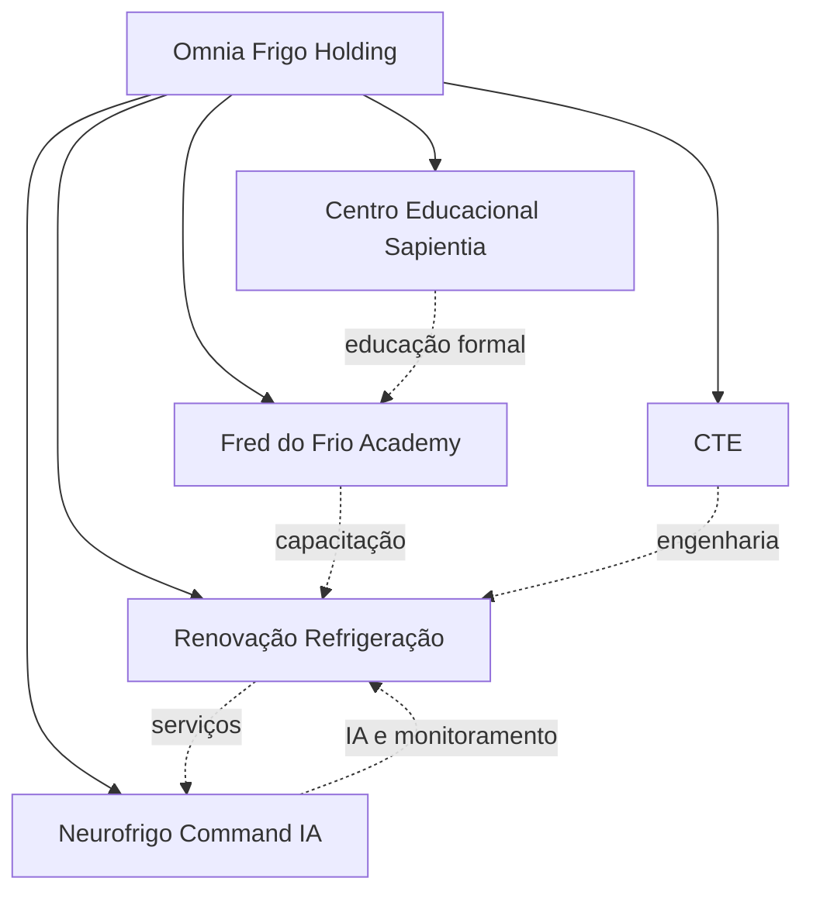
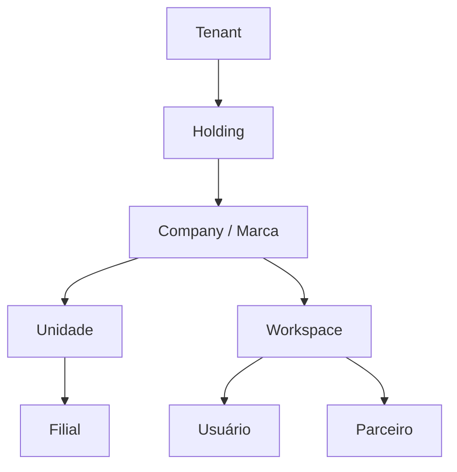
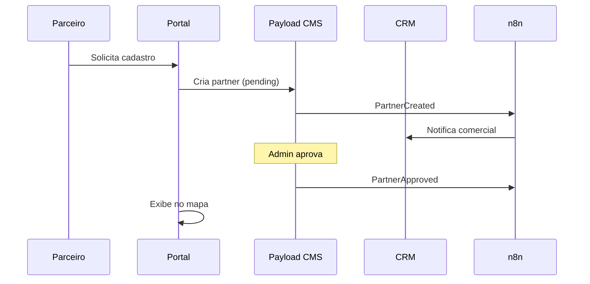

# Omnia Platform — Documento Mestre do Produto (V2)

> **Versão:** 2.0  
> **Status:** Oficial — fonte única de escopo de produto  
> **Data:** 2026-07-10  
> **Sprint de referência:** Sprint 2 concluída (Platform Base)  
> **Audiência:** Produto, engenharia, design, marketing, stakeholders da Holding

---

## 1. Propósito deste documento

Este documento consolida **definitivamente** o escopo, a visão e as regras de produto da **Omnia Platform**.

| Regra                  | Descrição                                                                                |
| ---------------------- | ---------------------------------------------------------------------------------------- |
| **Autoridade**         | Toda Sprint futura deve obedecer este documento                                          |
| **Escopo**             | Produto e experiência — não substitui ADRs técnicos nem `PROJECT_CONTEXT.md` operacional |
| **Relação com código** | Descreve o alvo; o estado atual de implementação está na seção 18                        |
| **Alterações**         | Mudanças de escopo exigem revisão de produto + registro em `docs/19-decisions/`          |

### Documentos complementares (não duplicar aqui)

| Documento                | Papel                                     |
| ------------------------ | ----------------------------------------- |
| `PROJECT_CONTEXT.md`     | Stack, monorepo, convenções de engenharia |
| `TENANT_ARCHITECTURE.md` | Modelo multiempresa técnico               |
| `docs/14-adr/`           | Decisões arquiteturais vinculantes        |
| `docs/13-roadmap/`       | Planejamento por Sprint                   |
| `MODULES.md`             | Índice de módulos de negócio              |

---

## 2. Visão do produto

### 2.1 O que é a Omnia Platform

A Omnia Platform **não é um site institucional**. É um **ecossistema digital integrado** da Omnia Frigo Holding, projetado para:

- Unificar presença digital, conteúdo, vendas, educação, parceiros e operações
- Escalar por módulos independentes com integração profunda
- Permitir que marketing e operações gerenciem conteúdo sem deploy de código
- Suportar multiempresa, multi-marca e isolamento de dados (LGPD)
- Evoluir com IA, automações e CRM corporativo

### 2.2 Princípio central de conteúdo

> **Regra de ouro:** Nenhum conteúdo que possa ser alterado pelo marketing pode permanecer hardcoded no portal.

Exceções permitidas (código fixo):

- Lógica de apresentação, layout estrutural e componentes de UI
- Textos de sistema (labels de acessibilidade, mensagens de erro técnicas)
- Integrações e contratos de API
- Feature flags e comportamento condicional

Todo o restante — textos, imagens, ordem de seções, menus, SEO, banners, landing pages — **deve ser administrável via Payload CMS**.

### 2.3 Superfícies do ecossistema

| Superfície           | App                                      | Público                      | Função                                                       |
| -------------------- | ---------------------------------------- | ---------------------------- | ------------------------------------------------------------ |
| **Portal**           | `apps/web`                               | Visitantes, clientes, alunos | Institucional, blog, mapa, parceiros, conversão              |
| **Admin Omnia**      | `apps/admin` (frontend)                  | Equipe interna               | Dashboard operacional, atalhos, métricas                     |
| **CMS Payload**      | `apps/admin` (payload)                   | Marketing, conteúdo, admins  | Gestão de conteúdo corporativo (estilo WordPress enterprise) |
| **Área do parceiro** | Futuro (`apps/partner` ou rota dedicada) | Parceiros B2B                | Cadastro, leads, materiais, performance                      |
| **CRM**              | Integrado ao admin                       | Comercial, SDR, CS           | Pipeline, leads, oportunidades                               |
| **Academy**          | Portal + admin                           | Alunos, instrutores          | Cursos, matrículas, certificados                             |
| **IA**               | Transversal (`@omnia/ai-core`)           | Usuários autenticados        | Assistente, chat, RAG, automações                            |

---

## 3. Empresas da Holding

### 3.1 Mapa do ecossistema



### 3.2 Ficha por empresa

#### Omnia Frigo Holding (OFH)

| Atributo                 | Definição                                                                                          |
| ------------------------ | -------------------------------------------------------------------------------------------------- |
| **Missão**               | Orquestrar o ecossistema digital e de negócios da refrigeração, educação e tecnologia aplicada     |
| **Responsabilidades**    | Governança de marca, estratégia digital, tenant principal, políticas de dados, visão institucional |
| **Papel na plataforma**  | Tenant raiz (`omnia-holding`), home institucional, narrativa do ecossistema                        |
| **Integração**           | Hub de conteúdo compartilhado; define globals de site, menus principais, SEO institucional         |
| **Dados compartilhados** | Branding, políticas, conteúdo institucional, configurações globais                                 |
| **Dados isolados**       | Métricas consolidadas da holding (futuro BI)                                                       |

#### Renovação Refrigeração (RR)

| Atributo                 | Definição                                                                                                  |
| ------------------------ | ---------------------------------------------------------------------------------------------------------- |
| **Missão**               | Entregar serviços especializados em refrigeração comercial e industrial com excelência operacional         |
| **Responsabilidades**    | Catálogo de serviços, área de parceiros técnicos, cases de campo, captação de leads de serviço             |
| **Papel na plataforma**  | Vertical de **Serviços** — landing pages, blog técnico, mapa de parceiros/atendimento                      |
| **Integração**           | CRM de leads de serviço; parceiros com especialidade em refrigeração; integração com NF para monitoramento |
| **Dados compartilhados** | Conteúdo institucional da holding, design system, mídia corporativa                                        |
| **Dados isolados**       | Pipeline comercial RR, contratos, ordens de serviço, avaliações por unidade                                |

#### Fred do Frio Academy (FDFA)

| Atributo                 | Definição                                                                                   |
| ------------------------ | ------------------------------------------------------------------------------------------- |
| **Missão**               | Capacitar profissionais do setor de refrigeração com formação prática e certificada         |
| **Responsabilidades**    | Cursos, turmas, instrutores, materiais didáticos, inscrições, certificados                  |
| **Papel na plataforma**  | Vertical de **Educação** — vitrine de cursos, blog educacional, eventos, downloads          |
| **Integração**           | Academy module; leads de matrícula no CRM; parceiros educacionais; conteúdo cruzado com CES |
| **Dados compartilhados** | Design, SEO base, autores convidados, eventos da holding                                    |
| **Dados isolados**       | Matrículas, progresso de alunos, pagamentos de curso, turmas                                |

#### CTE (Centro de Tecnologia e Engenharia)

| Atributo                 | Definição                                                                               |
| ------------------------ | --------------------------------------------------------------------------------------- |
| **Missão**               | Desenvolver soluções de engenharia, projetos e inovação técnica para refrigeração       |
| **Responsabilidades**    | Portfólio de projetos, especificações técnicas, cases de engenharia, materiais técnicos |
| **Papel na plataforma**  | Vertical de **Engenharia** — cases, downloads técnicos, landing de projetos             |
| **Integração**           | Blog técnico; leads B2B; suporte a RR em projetos complexos; dados para NF              |
| **Dados compartilhados** | Biblioteca de mídia técnica (quando autorizado), marca holding                          |
| **Dados isolados**       | Propostas comerciais, projetos sob NDA, documentação restrita                           |

#### Neurofrigo Command IA (NF)

| Atributo                 | Definição                                                                            |
| ------------------------ | ------------------------------------------------------------------------------------ |
| **Missão**               | Aplicar inteligência artificial e monitoramento inteligente ao setor de refrigeração |
| **Responsabilidades**    | Produtos de IA, dashboards de comando, integrações IoT, assistente inteligente       |
| **Papel na plataforma**  | Vertical de **Tecnologia / IA** — showcase de produtos IA, documentação, demos       |
| **Integração**           | `@omnia/ai-core`; chat no portal; alertas via n8n; dados operacionais de clientes RR |
| **Dados compartilhados** | Knowledge base pública, artigos sobre IA aplicada                                    |
| **Dados isolados**       | Modelos, telemetria, sessões de IA, dados sensíveis de clientes                      |

#### Centro Educacional Sapientia (CES)

| Atributo                 | Definição                                                                                     |
| ------------------------ | --------------------------------------------------------------------------------------------- |
| **Missão**               | Oferecer educação formal e continuada alinhada ao ecossistema Omnia                           |
| **Responsabilidades**    | Programas educacionais, parcerias acadêmicas, calendário acadêmico, comunicação institucional |
| **Papel na plataforma**  | Vertical de **Educação formal** — páginas institucionais, notícias, eventos acadêmicos        |
| **Integração**           | Academy (trilhas distintas de FDFA); blog; eventos; CRM de interessados                       |
| **Dados compartilhados** | Ecossistema, eventos conjuntos, autores                                                       |
| **Dados isolados**       | Registros acadêmicos, documentação de alunos (LGPD reforçada)                                 |

### 3.3 Relacionamento e compartilhamento de dados

| Tipo                               | Exemplos                                  | Regra                                                       |
| ---------------------------------- | ----------------------------------------- | ----------------------------------------------------------- |
| **Conteúdo global**                | Logo, rodapé, menus, hero da home holding | Global Payload `site-settings`; leitura por todas as marcas |
| **Conteúdo por empresa**           | Landing RR, cursos FDFA                   | Coleção `companies` + páginas com `company` relationship    |
| **Conteúdo por tenant**            | Blog RR vs blog OFH                       | Filtro `tenantId` / relação tenant em todas as coleções     |
| **Conteúdo público compartilhado** | Notícias da holding                       | `scope: holding` + publicação em múltiplas superfícies      |
| **Dados operacionais**             | Leads, parceiros, matrículas              | Isolados por tenant + company; RBAC por workspace           |
| **Mídia**                          | Logos, fotos, PDFs                        | Media Library Payload com pastas/tags por empresa           |

---

## 4. Arquitetura do Portal (`apps/web`)

### 4.1 Princípios (ADR-004)

- O portal **nunca** importa Payload diretamente
- Conteúdo consumido via **API REST** do admin (`NEXT_PUBLIC_ADMIN_URL/api/...`)
- ISR/revalidate para performance; preview via token em ambiente de staging
- Deploy independente do CMS

### 4.2 Estrutura de páginas (alvo)

| Área                      | Rota(s)                           | Fonte CMS                    | Editável pelo marketing            |
| ------------------------- | --------------------------------- | ---------------------------- | ---------------------------------- |
| **Home**                  | `/`                               | Globals + Blocks + Companies | ✅ Sim                             |
| **Empresa**               | `/empresas/[slug]`                | Pages + Company              | ✅ Sim                             |
| **Ecossistema**           | `/ecossistema`                    | Page Builder                 | ✅ Sim                             |
| **Blog**                  | `/blog`, `/blog/[slug]`           | Posts, Categories, Tags      | ✅ Sim                             |
| **Artigos / Notícias**    | `/noticias`, `/artigos`           | Posts (tipos)                | ✅ Sim                             |
| **Cursos**                | `/cursos`, `/cursos/[slug]`       | Courses collection           | ✅ Sim                             |
| **Parceiros**             | `/parceiros`, `/parceiros/[slug]` | Partners                     | ✅ Sim                             |
| **Mapa**                  | `/mapa`, `/encontrar-parceiro`    | Partners + geo               | ✅ Parcial (dados sim; lógica não) |
| **Landing Pages**         | `/lp/[slug]`                      | Landing Pages                | ✅ Sim                             |
| **FAQ**                   | `/faq`                            | FAQ blocks / collection      | ✅ Sim                             |
| **Depoimentos**           | Seção em home/landings            | Testimonials                 | ✅ Sim                             |
| **Downloads / Materiais** | `/materiais`, `/downloads`        | Media + Downloads            | ✅ Sim                             |
| **Vídeos**                | `/videos`                         | Media (type video) + embeds  | ✅ Sim                             |
| **Eventos**               | `/eventos`                        | Events collection            | ✅ Sim                             |
| **Cases**                 | `/cases`                          | Case Studies                 | ✅ Sim                             |
| **Contato**               | `/contato`                        | Global + Forms               | ✅ Sim                             |
| **Busca**                 | `/busca`                          | Search index                 | Metadados sim                      |

### 4.3 Home — seções obrigatórias

A home deve comunicar claramente o ecossistema. Seções mínimas (todas CMS-driven):

1. **Hero** — título, subtítulo, CTA, imagem/vídeo de fundo (`global-settings` + override por campanha)
2. **Ecossistema** — narrativa + cards editáveis (não array hardcoded)
3. **Empresas da Holding** — grid das 6 empresas com logo, descrição curta, papel, link
4. **Destaques** — banners rotativos, campanhas, métricas (opcional)
5. **Conteúdo recente** — últimos posts, cursos, eventos
6. **Parceiros em destaque** — curadoria editorial
7. **Depoimentos** — quotes com foto e empresa
8. **CTA final** — conversão (lead, WhatsApp, curso)
9. **SEO** — meta title, description, OG image por página

#### Empresas na Home (conteúdo esperado)

| Empresa                      | Mensagem na home                                | CTA sugerido         |
| ---------------------------- | ----------------------------------------------- | -------------------- |
| Omnia Frigo Holding          | Centro do ecossistema; visão e governança       | Conheça a holding    |
| Renovação Refrigeração       | Serviços de refrigeração comercial e industrial | Solicitar orçamento  |
| Fred do Frio Academy         | Formação prática em refrigeração                | Ver cursos           |
| CTE                          | Engenharia e projetos técnicos                  | Ver cases            |
| Neurofrigo Command IA        | IA e monitoramento inteligente                  | Conhecer soluções    |
| Centro Educacional Sapientia | Educação formal parceira                        | Programas acadêmicos |

> **Estado Sprint 2:** Hero e Company Cards vêm do CMS; seção Ecossistema ainda usa cards hardcoded — **dívida de produto** a resolver.

### 4.4 Componentes globais editáveis

| Componente    | Coleção / Global                  | Campos principais                                     |
| ------------- | --------------------------------- | ----------------------------------------------------- |
| **Cabeçalho** | `navigation` global ou collection | Logo, itens de menu, CTA, idiomas                     |
| **Rodapé**    | `footer` global                   | Colunas, links, redes, copyright, CNPJ                |
| **Menus**     | `menus`                           | Hierarquia, ícones, visibilidade por empresa          |
| **Banners**   | `banners`                         | Período, segmento, imagem, link, posição              |
| **SEO**       | Plugin/campos em Pages            | title, description, canonical, OG, robots, schema.org |

### 4.5 Page Builder (alvo)

Páginas compostas por **blocos reutilizáveis** (estilo WordPress Gutenberg / Payload Blocks):

| Bloco             | Uso                                |
| ----------------- | ---------------------------------- |
| Hero              | Título, mídia, CTA                 |
| Rich Text         | Conteúdo editorial Lexical         |
| Cards Grid        | Features, serviços, empresas       |
| Company Showcase  | Destaque de empresa do ecossistema |
| Testimonials      | Depoimentos                        |
| FAQ Accordion     | Perguntas frequentes               |
| CTA Banner        | Conversão                          |
| Media Gallery     | Imagens/vídeos                     |
| Partner Map Embed | Mapa de parceiros                  |
| Form Embed        | Lead capture → CRM                 |
| Blog Feed         | Lista de posts                     |
| Course List       | Lista de cursos                    |
| Stats             | Números (editáveis)                |
| Video Embed       | YouTube/Vimeo/arquivo              |
| Download List     | Materiais PDF                      |

---

## 5. CMS — Payload como WordPress corporativo

### 5.1 Filosofia

O Payload CMS em `apps/admin` funciona como um **WordPress enterprise**:

- Interface familiar para marketing (páginas, posts, mídia, menus)
- Versionamento, rascunhos e preview
- Blocos reutilizáveis e landing pages
- Multiempresa nativo
- API headless para o portal
- Sem plugins de terceiros inseguros — tudo versionado no monorepo

### 5.2 Modelo de conteúdo (alvo completo)

#### Collections (planejadas + existentes)

| Collection      | Status Sprint 2 | Função                    |
| --------------- | --------------- | ------------------------- |
| `users`         | ✅ Existe       | Admins e editores CMS     |
| `tenants`       | ✅ Existe       | Isolamento multiempresa   |
| `companies`     | ✅ Existe       | Empresas da holding       |
| `media`         | ✅ Existe       | Biblioteca de mídia       |
| `pages`         | 🔲 Sprint 3+    | Páginas com Page Builder  |
| `posts`         | 🔲 Sprint 4     | Blog, artigos, notícias   |
| `categories`    | 🔲 Sprint 4     | Taxonomia                 |
| `tags`          | 🔲 Sprint 4     | Taxonomia                 |
| `authors`       | 🔲 Sprint 4     | Autores                   |
| `partners`      | 🔲 Sprint 7     | Parceiros comerciais      |
| `courses`       | 🔲 Sprint 7+    | Cursos (Academy)          |
| `events`        | 🔲 Sprint 4+    | Eventos                   |
| `case-studies`  | 🔲 Sprint 5+    | Cases                     |
| `downloads`     | 🔲 Sprint 4+    | Materiais para download   |
| `testimonials`  | 🔲 Sprint 3+    | Depoimentos               |
| `banners`       | 🔲 Sprint 3+    | Banners promocionais      |
| `landing-pages` | 🔲 Sprint 3+    | LPs de campanha           |
| `faqs`          | 🔲 Sprint 3+    | FAQ estruturado           |
| `menus`         | 🔲 Sprint 3+    | Navegação                 |
| `forms`         | 🔲 Sprint 5+    | Formulários → CRM         |
| `leads`         | 🔲 Sprint 5+    | Leads (ou Drizzle + sync) |

#### Globals

| Global            | Status Sprint 2 | Função                                      |
| ----------------- | --------------- | ------------------------------------------- |
| `global-settings` | ✅ Existe       | Site name, hero, CTA base                   |
| `navigation`      | 🔲 Sprint 3+    | Menu principal                              |
| `footer`          | 🔲 Sprint 3+    | Rodapé                                      |
| `seo-defaults`    | 🔲 Sprint 3+    | SEO padrão do site                          |
| `social-links`    | 🔲 Sprint 3+    | Redes sociais                               |
| `map-settings`    | 🔲 Sprint 7+    | Config do mapa (zoom padrão, tile provider) |

### 5.3 Funcionalidades CMS obrigatórias (roadmap)

| Funcionalidade           | Descrição                                | Sprint alvo |
| ------------------------ | ---------------------------------------- | ----------- |
| **Versionamento**        | Histórico de revisões por documento      | Sprint 3+   |
| **Drafts**               | Rascunho vs publicado                    | Sprint 3+   |
| **Preview**              | URL de preview com token em staging      | Sprint 3+   |
| **Publicação**           | `status: draft                           | published   | scheduled` | Sprint 3+ |
| **Agendamento**          | Publicar em data/hora futura             | Sprint 4+   |
| **Blocos reutilizáveis** | Blocks field em Pages                    | Sprint 3+   |
| **Page Builder**         | Layout flexível por página               | Sprint 3+   |
| **SEO por entidade**     | Meta fields ou `@payloadcms/plugin-seo`  | Sprint 3+   |
| **Localização**          | PT-BR primário; EN futuro                | Sprint 6+   |
| **Workflow editorial**   | Revisor → publicador (roles)             | Sprint 4+   |
| **Media organizada**     | Pastas, tags, alt obrigatório            | Sprint 3+   |
| **Relacionamentos**      | Company, tenant, author em todo conteúdo | Sprint 3+   |

### 5.4 Papéis CMS (alvo)

| Papel              | Permissões                          |
| ------------------ | ----------------------------------- |
| **Super Admin**    | Tudo, todos os tenants              |
| **Holding Editor** | Conteúdo global + todas as empresas |
| **Company Editor** | Apenas sua empresa                  |
| **Author**         | Criar/editar próprios posts         |
| **Reviewer**       | Aprovar publicação                  |
| **Media Manager**  | Apenas mídia                        |

---

## 6. Multiempresa

### 6.1 Hierarquia de entidades



| Entidade            | Definição                                             | Exemplo                |
| ------------------- | ----------------------------------------------------- | ---------------------- |
| **Tenant**          | Isolamento lógico de dados (LGPD, billing, políticas) | `omnia-holding`        |
| **Holding**         | Entidade jurídica controladora                        | Omnia Frigo Holding    |
| **Company / Marca** | Empresa do ecossistema com identidade própria         | Renovação Refrigeração |
| **Unidade**         | Divisão operacional regional ou funcional             | RR Sudeste             |
| **Filial**          | Ponto físico com endereço                             | RR Campinas            |
| **Workspace**       | Contexto de trabalho (CRM RR, Academy FDFA)           | `crm-renovacao`        |
| **Usuário**         | Pessoa autenticada com RBAC                           | Editor RR              |
| **Parceiro**        | Ator externo B2B                                      | Instalador credenciado |

### 6.2 Conteúdo isolado vs compartilhado

| Escopo         | Isolamento              | Exemplo                       |
| -------------- | ----------------------- | ----------------------------- |
| `holding`      | Compartilhado no tenant | Home, política de privacidade |
| `company`      | Por empresa             | Landing RR, blog RR           |
| `workspace`    | Por área operacional    | Pipeline CRM RR Sudeste       |
| `partner`      | Por parceiro            | Perfil, leads do parceiro     |
| `user-private` | Por usuário             | Preferências, rascunhos       |

### 6.3 Regras de permissão (alvo)

- Todo registro de negócio carrega `tenantId` (ADR-005)
- Conteúdo CMS carrega `tenant` + `company` (opcional) + `scope`
- API do portal filtra por contexto (domínio/subpath pode resolver company)
- RLS PostgreSQL em tabelas Drizzle (Sprint 3+)
- Header `X-Omnia-Tenant-Id` em APIs internas

### 6.4 Estado atual (Sprint 2)

- ✅ Coleções `tenants` e `companies` no Payload
- ✅ Seed: 1 tenant + 6 empresas
- 🔲 Workspaces, unidades, filiais — não implementados
- 🔲 `tenantId` em Drizzle — schema vazio
- 🔲 RLS — planejado

---

## 7. Parceiros

### 7.1 Visão

Rede B2B de parceiros comerciais e técnicos (instaladores, revendedores, educadores credenciados), com perfil público, geolocalização e integração CRM.

### 7.2 Cadastro — campos obrigatórios

| Grupo                   | Campos                                                                                    |
| ----------------------- | ----------------------------------------------------------------------------------------- |
| **Identidade**          | Nome fantasia, razão social, slug, logo, capa, descrição curta/longa                      |
| **Documentos**          | CNPJ/CPF (criptografado), certificações, alvarás                                          |
| **Contato**             | Endereço completo, telefone, WhatsApp, e-mail, site                                       |
| **Redes sociais**       | Instagram, Facebook, LinkedIn, YouTube                                                    |
| **Serviços / Produtos** | Lista categorizada, tags de especialidade                                                 |
| **Geolocalização**      | Latitude, longitude, raio de atendimento (km)                                             |
| **Cobertura**           | Cidades[], estados[], atendimento remoto (sim/não)                                        |
| **Operação**            | Status (`pending`, `approved`, `rejected`, `suspended`), plano (`free`, `pro`, `premium`) |
| **Mídia**               | Galeria de fotos, vídeos                                                                  |
| **Avaliações**          | Nota média, contagem, reviews moderados                                                   |
| **CRM**                 | Leads recebidos, conversões, responsável comercial                                        |

### 7.3 Fluxos



### 7.4 Planos de parceiro (alvo)

| Plano       | Benefícios                                           |
| ----------- | ---------------------------------------------------- |
| **Free**    | Listagem básica no mapa                              |
| **Pro**     | Destaque regional, galeria completa, badge           |
| **Premium** | Topo em buscas, landing dedicada, leads prioritários |

---

## 8. Mapa de parceiros

### 8.1 Experiência do usuário

1. Usuário acessa `/mapa` ou `/encontrar-parceiro`
2. Sistema solicita geolocalização (com consentimento LGPD)
3. Se negado: seleção manual de cidade/estado
4. API retorna parceiros dentro do raio configurado
5. Resultados exibidos em lista + mapa interativo

### 8.2 Ordenação (prioridade)

| #   | Critério            | Peso                        |
| --- | ------------------- | --------------------------- |
| 1   | **Distância**       | Primário                    |
| 2   | **Especialidade**   | Match com filtro do usuário |
| 3   | **Avaliação**       | Média de reviews            |
| 4   | **Plano**           | Premium > Pro > Free        |
| 5   | **Disponibilidade** | Online/horário/atende hoje  |

### 8.3 Stack técnica (alvo — não implementar agora)

| Camada    | Tecnologia sugerida                                  |
| --------- | ---------------------------------------------------- |
| Mapa UI   | Mapbox GL / Leaflet / Google Maps (decisão Sprint 7) |
| Geo query | PostGIS ou cálculo Haversine em PostgreSQL           |
| Cache     | Redis por bounding box                               |
| CDN       | Tiles estáticos se aplicável                         |

### 8.4 Filtros

- Especialidade / serviço
- Empresa do ecossistema (RR, FDFA, etc.)
- Raio (5, 10, 25, 50, 100 km)
- Avaliação mínima
- Apenas parceiros verificados
- Aceita emergência / 24h

---

## 9. Conteúdo editorial

### 9.1 Tipos de conteúdo

| Tipo           | Collection              | URL                      | Notas                                 |
| -------------- | ----------------------- | ------------------------ | ------------------------------------- |
| **Blog**       | `posts` (type: blog)    | `/blog/[slug]`           | Editorial, SEO long tail              |
| **Artigos**    | `posts` (type: article) | `/artigos/[slug]`        | Conteúdo técnico aprofundado          |
| **Notícias**   | `posts` (type: news)    | `/noticias/[slug]`       | Comunicados, releases                 |
| **Categorias** | `categories`            | `/blog/categoria/[slug]` | Hierárquicas                          |
| **Tags**       | `tags`                  | `/blog/tag/[slug]`       | Flat                                  |
| **Autores**    | `authors`               | `/autores/[slug]`        | Bio, foto, redes                      |
| **Downloads**  | `downloads`             | `/materiais/[slug]`      | PDF, ZIP, requer lead opcional        |
| **Vídeos**     | `media` + `posts`       | `/videos`                | Embed + transcrição SEO               |
| **Eventos**    | `events`                | `/eventos/[slug]`        | Data, local, inscrição                |
| **Cases**      | `case-studies`          | `/cases/[slug]`          | Cliente, desafio, solução, resultados |

### 9.2 Regras editoriais

- Todo post tem: autor, company (opcional), tenant, SEO, imagem destaque
- Slug único por tenant
- Preview obrigatório antes de publicar em produção
- Imagens com `alt` obrigatório (acessibilidade)
- Canonical URL para evitar duplicação

---

## 10. SEO — estratégia completa

### 10.1 Pilares

| Pilar             | Implementação                                                        |
| ----------------- | -------------------------------------------------------------------- |
| **Técnico**       | SSR/ISR Next.js, sitemap.xml, robots.txt, canonical, Core Web Vitals |
| **On-page**       | Title, meta description, H1 único, schema.org por tipo               |
| **Conteúdo**      | Blog por empresa, clusters temáticos (refrigeração, educação, IA)    |
| **Local SEO**     | Parceiros com endereço estruturado; Google Business (externo)        |
| **Multimarca**    | Subpaths ou subdomínios por empresa (decisão futura)                 |
| **Internacional** | `hreflang` quando i18n ativo                                         |

### 10.2 Schema.org por tipo

| Página    | Schema                    |
| --------- | ------------------------- |
| Home      | `Organization`, `WebSite` |
| Empresa   | `Organization`            |
| Blog post | `Article`, `BlogPosting`  |
| Curso     | `Course`                  |
| Evento    | `Event`                   |
| Parceiro  | `LocalBusiness`           |
| FAQ       | `FAQPage`                 |
| Vídeo     | `VideoObject`             |

### 10.3 Sitemaps (alvo)

- `/sitemap.xml` — índice
- `/sitemap-pages.xml`
- `/sitemap-posts.xml`
- `/sitemap-partners.xml`
- `/sitemap-courses.xml`

### 10.4 CMS SEO fields (por entidade)

- `meta.title` (fallback: título do documento)
- `meta.description`
- `meta.image` (OG)
- `meta.robots` (index/noindex)
- `meta.canonical`
- `meta.schema` (override JSON-LD opcional)

---

## 11. Responsividade e UX

### 11.1 Breakpoints (Tailwind padrão Omnia)

| Breakpoint | Largura | Uso              |
| ---------- | ------- | ---------------- |
| `sm`       | 640px   | Mobile landscape |
| `md`       | 768px   | Tablet           |
| `lg`       | 1024px  | Desktop pequeno  |
| `xl`       | 1280px  | Desktop          |
| `2xl`      | 1536px  | Wide             |

### 11.2 Requisitos obrigatórios

- **Mobile-first** em todo o portal
- Touch targets mínimo 44×44px
- Menu mobile com drawer
- Imagens responsivas (`next/image`, srcset)
- Mapa utilizável em mobile (gestos, legibilidade)
- Formulários com teclado adequado (tel, email)
- Contraste WCAG 2.1 AA mínimo
- Fontes: Inter (corpo) + Plus Jakarta Sans (títulos) — `@omnia/ui`
- Performance: LCP < 2.5s em 4G (alvo)

### 11.3 Referência

- `docs/06-ux/SPRINT-02-UX.md`
- `UI_UX_GUIDELINES.md`

---

## 12. IA — arquitetura (documentação apenas)

> **Não implementar nesta fase.** Referência: `AI_ARCHITECTURE.md`, ADR-006, `@omnia/ai-core`.

### 12.1 Casos de uso por empresa

| Empresa | Caso de uso IA                                      |
| ------- | --------------------------------------------------- |
| OFH     | Assistente institucional do ecossistema             |
| RR      | Diagnóstico preliminar de problemas de refrigeração |
| FDFA    | Tutor de curso, recomendação de trilha              |
| CTE     | Busca em documentação técnica                       |
| NF      | Command IA — monitoramento, alertas, insights       |
| CES     | FAQ acadêmico, orientação de matrícula              |

### 12.2 Camadas

```
Apps (chat, portal, admin)
        ↓
@omnia/ai-core (agents, RAG, memory, tools)
        ↓
@omnia/integrations (DeepSeek primário, OpenAI fallback)
```

### 12.3 Princípios

- API keys apenas server-side
- Rate limit por tenant
- Auditoria de prompts/respostas (LGPD)
- RAG sobre knowledge base aprovada (CMS + docs técnicos)
- Human-in-the-loop para ações críticas (CRM, aprovações)

### 12.4 Sprint alvo

Sprint 8+ (após Auth, CRM e conteúdo estável)

---

## 13. CRM (escopo de produto)

Integração com parceiros e portal:

| Origem lead             | Destino                    |
| ----------------------- | -------------------------- |
| Formulário home         | CRM holding                |
| Landing RR              | CRM RR                     |
| Página de curso         | CRM FDFA                   |
| Cadastro parceiro       | CRM + workflow aprovação   |
| Mapa (contato parceiro) | CRM + notificação parceiro |

Campos mínimos: nome, e-mail, telefone, origem, empresa, status, responsável.

> Schema conceitual: `database/schemas/crm.md` — Sprint 5.

---

## 14. Infraestrutura e ambientes

### 14.1 Estado Sprint 2

| Componente                   | Status                                                 |
| ---------------------------- | ------------------------------------------------------ |
| PostgreSQL                   | ✅ Dev + staging                                       |
| Redis                        | ✅ Dev + staging                                       |
| MinIO                        | ✅ Dev; adapter Payload Sprint 3+                      |
| Docker Compose dev           | ✅                                                     |
| Docker staging (web + admin) | ✅                                                     |
| Traefik                      | ✅ VPS staging                                         |
| Bootstrap (migrate + seed)   | ✅                                                     |
| URLs staging                 | `dev.omniafrigo.com.br`, `admin.dev.omniafrigo.com.br` |

### 14.2 Ambientes

| Ambiente    | Branch / deploy | CMS editable       |
| ----------- | --------------- | ------------------ |
| Development | Local           | Sim                |
| Staging     | VPS homologação | Sim                |
| Production  | Futuro          | Sim (com workflow) |

---

## 15. Roadmap de produto (Sprints)

| Sprint   | Foco                | Entregas de produto                                  |
| -------- | ------------------- | ---------------------------------------------------- |
| **2** ✅ | Platform Base       | CMS mínimo, home, 6 empresas, design system base     |
| **3**    | CMS completo + Auth | Pages, blocks, menus, footer, SEO, preview, JWT/RBAC |
| **4**    | Blog + conteúdo     | Posts, categorias, autores, downloads, eventos       |
| **5**    | CRM                 | Leads, pipeline, formulários, integração portal      |
| **6**    | Marketplace         | Catálogo, carrinho (se escopo confirmado)            |
| **7**    | Parceiros + Mapa    | Cadastro, geo, busca, área do parceiro               |
| **7+**   | Academy             | Cursos, matrículas                                   |
| **8+**   | IA + Chat           | Assistente, RAG                                      |
| **8+**   | Automação           | n8n workflows produtivos                             |
| **10**   | API pública         | `/api/v1/`, SDK                                      |
| **11**   | Observabilidade     | Métricas, tracing, alertas                           |

---

## 16. Critérios de aceite globais

Toda feature de produto deve:

1. Respeitar multiempresa (tenant + company quando aplicável)
2. Ser administrável via CMS quando envolver conteúdo de marketing
3. Ter SEO configurável
4. Ser responsiva (mobile-first)
5. Ter preview em staging antes de produção
6. Registrar eventos de domínio quando aplicável (`@omnia/events`)
7. Seguir `DEFINITION_OF_DONE.md` e ADRs vigentes
8. Não violar ADR-004 (portal sem Payload direto)
9. Não violar ADR-008 (freeze arquitetural sem ADR novo)

---

## 17. Glossário

| Termo            | Definição                                              |
| ---------------- | ------------------------------------------------------ |
| **Ecossistema**  | Conjunto das 6 empresas + parceiros + plataforma       |
| **Holding**      | Omnia Frigo Holding — entidade controladora            |
| **Tenant**       | Unidade de isolamento de dados na plataforma           |
| **Company**      | Marca/empresa do ecossistema                           |
| **Page Builder** | Editor de páginas por blocos no Payload                |
| **Partner**      | Parceiro B2B externo credenciado                       |
| **Scope**        | Visibilidade do conteúdo (holding, company, workspace) |

---

## 18. Estado atual vs alvo (Sprint 2)

### Implementado

| Item                                      | Evidência                    |
| ----------------------------------------- | ---------------------------- |
| Portal homepage                           | `apps/web/src/app/page.tsx`  |
| Hero via CMS                              | `global-settings`            |
| Cards empresas via CMS                    | `companies` collection       |
| Payload: users, tenants, companies, media | `payload.config.ts`          |
| Seed 6 empresas                           | `holding-companies.ts`       |
| Admin dashboard + Payload admin           | `apps/admin`                 |
| Design system base                        | `@omnia/ui` (7 componentes)  |
| Staging Docker + bootstrap                | `docker/compose/staging.yml` |
| REST portal → CMS                         | `apps/web/src/lib/cms.ts`    |

### Não implementado (dívida de produto)

| Item                          | Prioridade      |
| ----------------------------- | --------------- |
| Ecossistema section hardcoded | Alta — Sprint 3 |
| Pages / Page Builder          | Alta — Sprint 3 |
| Menus e footer CMS            | Alta — Sprint 3 |
| Blog e conteúdo editorial     | Sprint 4        |
| Parceiros e mapa              | Sprint 7        |
| CRM                           | Sprint 5        |
| Auth JWT app-wide             | Sprint 3        |
| i18n                          | Sprint 6+       |
| IA runtime                    | Sprint 8+       |
| Drizzle schema negócio        | Sprint 3+       |

### Hardcoded identificado (viola regra de ouro)

| Arquivo                | Conteúdo hardcoded                   |
| ---------------------- | ------------------------------------ |
| `EcosystemSection.tsx` | 3 cards com título e descrição fixos |
| `Header.tsx`           | Links de navegação fixos             |
| `Footer.tsx`           | Textos e links fixos                 |

---

## 19. Governança deste documento

| Ação                       | Responsável              |
| -------------------------- | ------------------------ |
| Propor alteração de escopo | Product Owner            |
| Aprovar alteração          | Steering + engenharia    |
| Registrar decisão          | `docs/19-decisions/`     |
| Atualizar roadmap          | `docs/13-roadmap/`       |
| Versionar release          | `docs/20-release-notes/` |

**Próxima revisão planejada:** início da Sprint 3.

---

_Omnia Platform — Omnia Frigo Holding © 2026_
