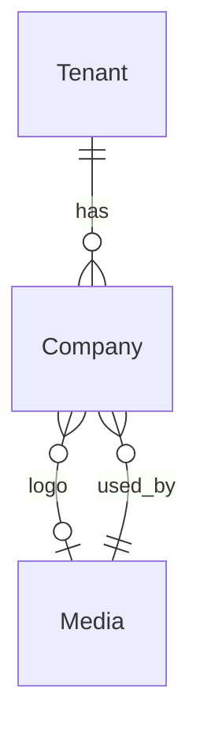
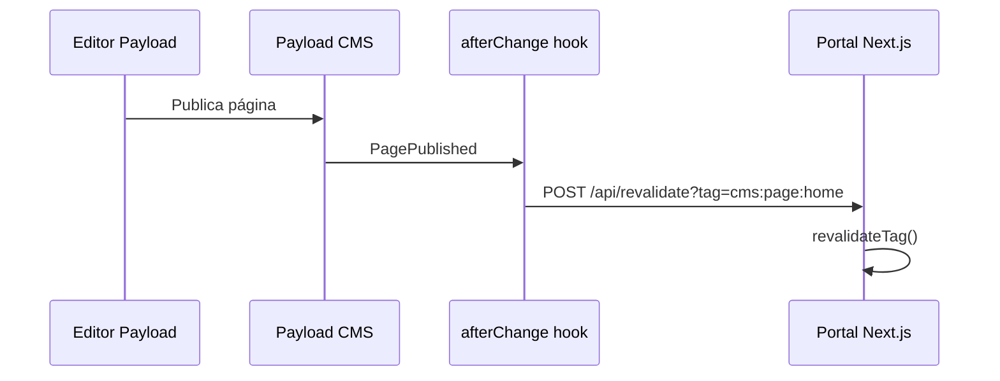
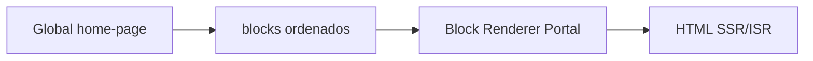
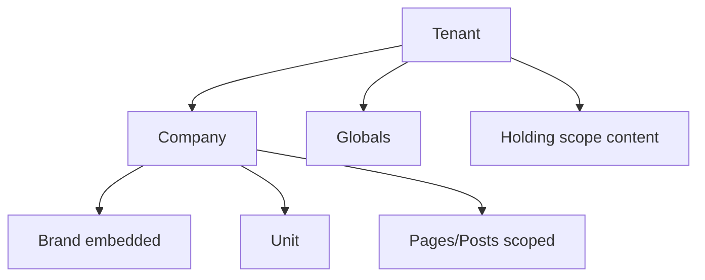
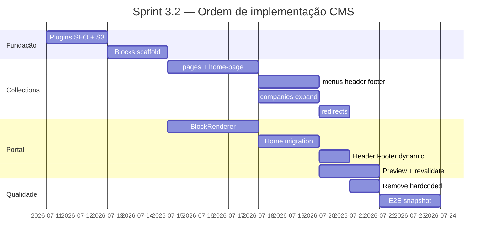

# Sprint 3.1 — Fundação CMS (Especificação Oficial)

> **Versão:** 1.0  
> **Data:** 2026-07-10  
> **Tipo:** Auditoria + especificação — **sem implementação**  
> **Sprint de referência:** Sprint 2 concluída → fundação para Sprint 3  
> **Princípio:** CMS-First (ADR-004)  
> **Documentos base:** `PRODUCT_MASTER_V2.md`, `DOMAIN_MODEL_V2.md`, `MASTER_ROADMAP_V2.md`, `BACKLOG_V2.md`, `PRODUCT_REVIEW_V2.md`

---

## Sumário

1. [Estado atual do CMS](#1-estado-atual-do-cms)
2. [Arquitetura CMS-First](#2-arquitetura-cms-first)
3. [Collections necessárias](#3-collections-necessárias)
4. [Globals necessários](#4-globals-necessários)
5. [Page Builder](#5-page-builder)
6. [Home totalmente editável](#6-home-totalmente-editável)
7. [Empresas da Holding](#7-empresas-da-holding)
8. [Multiempresa e conteúdo](#8-multiempresa-e-conteúdo)
9. [Media Library](#9-media-library)
10. [SEO](#10-seo)
11. [Conteúdo hardcoded](#11-conteúdo-hardcoded)
12. [Critérios de aceite](#12-critérios-de-aceite-da-fundação-cms)
13. [Dependências e riscos](#13-dependências-e-riscos)
14. [Relatório final da auditoria](#14-relatório-final-da-auditoria)

---

## 1. Estado atual do CMS

### 1.1 Configuração Payload (`apps/admin/payload.config.ts`)

| Aspecto                     | Estado atual                                      |
| --------------------------- | ------------------------------------------------- |
| **Adapter DB**              | `@payloadcms/db-postgres` via `DATABASE_URL`      |
| **Editor**                  | Lexical (`@payloadcms/richtext-lexical`)          |
| **Collections registradas** | `users`, `tenants`, `companies`, `media`          |
| **Globals registrados**     | `global-settings`                                 |
| **Plugins**                 | Nenhum (sem SEO, sem S3, sem multi-tenant plugin) |
| **CORS**                    | `NEXT_PUBLIC_APP_URL` (portal)                    |
| **TypeScript types**        | Gerados em `src/payload-types.ts`                 |
| **Migrations**              | `src/migrations/20260709_181730.ts` versionada    |
| **Storage plugin**          | Não configurado — upload local                    |

### 1.2 Collections existentes

#### `users` (`apps/admin/src/collections/Users.ts`)

| Campo   | Tipo            | Obrigatório             | Notas               |
| ------- | --------------- | ----------------------- | ------------------- |
| `email` | auth (built-in) | Sim                     | Título no admin     |
| `name`  | text            | Não                     |                     |
| `role`  | select          | Não (default: `editor`) | `admin` \| `editor` |

| Aspecto                    | Estado                       |
| -------------------------- | ---------------------------- |
| Auth                       | ✅ Payload auth nativo       |
| Access control customizado | ❌ Ausente (default Payload) |
| Versions / drafts          | ❌                           |
| Relacionamento tenant      | ❌                           |
| Grupo admin                | Sistema                      |

#### `tenants` (`apps/admin/src/collections/Tenants.ts`)

| Campo         | Tipo     | Obrigatório             | Notas                  |
| ------------- | -------- | ----------------------- | ---------------------- |
| `name`        | text     | Sim                     |                        |
| `slug`        | text     | Sim, unique             | Ex: `omnia-holding`    |
| `description` | textarea | Não                     |                        |
| `status`      | select   | Sim (default: `active`) | `active` \| `inactive` |

| Aspecto           | Estado       |
| ----------------- | ------------ |
| Access control    | ❌ Ausente   |
| Versions / drafts | ❌           |
| Grupo admin       | Multiempresa |

#### `companies` (`apps/admin/src/collections/Companies.ts`)

| Campo              | Tipo                     | Obrigatório             | Notas                           |
| ------------------ | ------------------------ | ----------------------- | ------------------------------- |
| `tenant`           | relationship → `tenants` | Não                     | FK `tenant_id`                  |
| `name`             | text                     | Sim                     |                                 |
| `slug`             | text                     | Sim, unique             |                                 |
| `shortDescription` | textarea                 | Sim                     | Usado no portal                 |
| `fullDescription`  | richText (Lexical)       | Não                     | Não consumido pelo portal ainda |
| `logo`             | upload → `media`         | Não                     | FK `logo_id`                    |
| `externalSite`     | text                     | Não                     |                                 |
| `ecosystemRole`    | text                     | Sim                     | Ex: Holding, Serviços           |
| `displayOrder`     | number                   | Sim (default: 0)        | Ordenação portal                |
| `status`           | select                   | Sim (default: `active`) | `active` \| `inactive`          |

| Aspecto                   | Estado       |
| ------------------------- | ------------ |
| Access control            | ❌ Ausente   |
| Versions / drafts         | ❌           |
| SEO fields                | ❌           |
| Capa, manifesto, contatos | ❌           |
| Grupo admin               | Multiempresa |

#### `media` (`apps/admin/src/collections/Media.ts`)

| Campo           | Tipo | Notas                                                   |
| --------------- | ---- | ------------------------------------------------------- |
| `alt`           | text | Texto alternativo                                       |
| `caption`       | text | Legenda                                                 |
| Upload built-in | —    | `url`, `filename`, `mimeType`, `width`, `height`, sizes |

| Aspecto       | Estado                                                |
| ------------- | ----------------------------------------------------- |
| Storage       | Local: `apps/admin/media/`                            |
| MIME types    | Apenas `image/*`                                      |
| Image sizes   | `thumbnail` (400×300), `card` (768×512)               |
| Access read   | `() => true` (público)                                |
| Pastas / tags | ❌                                                    |
| Vídeo / PDF   | ❌ Bloqueado por mimeTypes                            |
| MinIO         | Documentado em `src/storage/README.md`, não integrado |
| Grupo admin   | Conteúdo                                              |

### 1.3 Globals existentes

#### `global-settings` (`apps/admin/src/globals/GlobalSettings.ts`)

| Campo          | Tipo     | Default seed       |
| -------------- | -------- | ------------------ |
| `siteName`     | text     | `Omnia Platform`   |
| `tagline`      | text     | Tagline holding    |
| `contactEmail` | email    | —                  |
| `heroTitle`    | text     | Título hero portal |
| `heroSubtitle` | textarea | Subtítulo hero     |
| `ctaLabel`     | text     | Texto CTA hero     |
| `ctaUrl`       | text     | URL CTA hero       |

| Aspecto                 | Estado                        |
| ----------------------- | ----------------------------- |
| Access read             | `() => true`                  |
| Versions / drafts       | ❌                            |
| Escopo tenant           | ❌ (global único)             |
| SEO / analytics / legal | ❌ Misturado com hero da home |

### 1.4 Relacionamentos atuais



- `companies.tenant` → `tenants` (opcional no schema, preenchido no seed)
- `companies.logo` → `media`
- Nenhum outro relacionamento de conteúdo

### 1.5 Permissões atuais

| Coleção/Global  | read                  | create      | update        | delete      |
| --------------- | --------------------- | ----------- | ------------- | ----------- |
| users           | Payload auth default  | Autenticado | Próprio/admin | Admin       |
| tenants         | Default (autenticado) | Autenticado | Autenticado   | Autenticado |
| companies       | Default               | Autenticado | Autenticado   | Autenticado |
| media           | **Público**           | Autenticado | Autenticado   | Autenticado |
| global-settings | **Público**           | Autenticado | Autenticado   | —           |

**Limitações:**

- Sem RBAC por tenant/company
- Sem papéis `marketing`, `publisher`, `company_editor` (planejados em PRODUCT §5.4)
- Qualquer editor autenticado pode alterar qualquer empresa
- Leitura pública de media e globals sem filtro de ambiente

### 1.6 Versionamento e drafts

| Recurso           | Versions | Drafts | Scheduled publish |
| ----------------- | -------- | ------ | ----------------- |
| Todas collections | ❌       | ❌     | ❌                |
| Globals           | ❌       | ❌     | ❌                |

Payload 3 suporta `versions: { drafts: true }` — **não habilitado em nenhuma entidade**.

### 1.7 Upload atual

| Item           | Valor                                                   |
| -------------- | ------------------------------------------------------- |
| Destino        | Filesystem local `apps/admin/media/`                    |
| MinIO (Docker) | Disponível, variáveis em `@omnia/config` → `storage`    |
| Adapter S3     | Não instalado                                           |
| Transformação  | Apenas `thumbnail` e `card` para imagens                |
| CDN            | Não                                                     |
| Staging        | URLs relativas ao admin (`admin.dev.omniafrigo.com.br`) |

### 1.8 Integração com o portal

**Arquivo central:** `apps/web/src/lib/cms.ts`

| Função                  | Endpoint                                                                             | Cache                | Fallback |
| ----------------------- | ------------------------------------------------------------------------------------ | -------------------- | -------- |
| `fetchCompanies()`      | `GET /api/companies?where[status][equals]=active&sort=displayOrder&limit=20&depth=1` | ISR `revalidate: 60` | `[]`     |
| `fetchGlobalSettings()` | `GET /api/globals/global-settings`                                                   | ISR `revalidate: 60` | `null`   |

**Princípios respeitados (ADR-004):**

- Portal **não** importa Payload
- Consumo via REST do admin (`NEXT_PUBLIC_ADMIN_URL`)
- Tipos locais (`CmsCompany`, `CmsGlobalSettings`) — não usa `payload-types`

**Não implementado:**

- Preview com token
- Draft mode Next.js
- On-demand revalidation (`revalidatePath`/`revalidateTag`)
- Tratamento diferenciado de erro (só try/catch → vazio)
- Páginas dinâmicas, menus, footer via CMS

### 1.9 Conteúdo hardcoded (resumo)

Ver [Seção 11](#11-conteúdo-hardcoded) para inventário completo.

| Componente                  | Origem CMS           | Hardcoded                  |
| --------------------------- | -------------------- | -------------------------- |
| Hero título/subtítulo/CTA   | ✅ `global-settings` | Fallbacks + badge Sprint 2 |
| Empresas cards              | ✅ `companies`       | Títulos da seção           |
| Ecossistema                 | ❌                   | 100% hardcoded             |
| CTA final                   | ❌                   | 100% hardcoded             |
| Header                      | ❌                   | 100% hardcoded             |
| Footer                      | ❌                   | 100% hardcoded             |
| Metadata SEO (`layout.tsx`) | ❌                   | 100% hardcoded             |

### 1.10 Limitações atuais (consolidado)

1. Apenas 4 collections + 1 global — insuficiente para CMS-First
2. Home é composição fixa de componentes React, não Page Builder
3. Sem páginas dinâmicas (`/empresas/[slug]`, `/[slug]`)
4. Sem menus/footer administráveis
5. Sem SEO por entidade
6. Sem preview/drafts/versionamento
7. Media restrita a imagens, storage local
8. `Companies` subdimensionada para conteúdo institucional completo
9. `global-settings` acumula responsabilidades que deveriam ser globals separados
10. Neurofrigo no seed = `"Neurofrigo"` vs documentação `"Neurofrigo Command IA"`
11. Sem plugin `@payloadcms/plugin-seo`
12. Sem access control multiempresa

---

## 2. Arquitetura CMS-First

### 2.1 Princípio reafirmado

```
Código (apps/web)     → Estrutura, layout, componentes, comportamento
Payload (apps/admin)  → Conteúdo, ordem, visibilidade, publicação, SEO, mídia
```

Exceções permitidas (código fixo): labels de acessibilidade, mensagens de erro técnicas, lógica de apresentação, contratos de API.

### 2.2 Portal → CMS: REST API (não Local API)

| Decisão                                  | Justificativa                                                   |
| ---------------------------------------- | --------------------------------------------------------------- |
| **REST API do admin**                    | ADR-004: portal e admin são apps separados; deploy independente |
| **Não usar Local API no portal**         | Evita acoplamento, permite CDN/edge no portal                   |
| **Não importar `payload` em `apps/web`** | Mantém bundle leve e fronteira clara                            |

**Padrão de consumo:**

```typescript
// apps/web/src/lib/cms.ts (evolução Sprint 3)
const res = await fetch(`${adminUrl}/api/{collection|globals}/{slug}`, {
  headers: { 'Content-Type': 'application/json' },
  next: { revalidate: 60, tags: ['cms:pages', 'cms:home'] },
});
```

**APIs internas futuras (`/api/v1/*`):** Proxy ou BFF no admin para agregação — não substituem REST Payload para conteúdo CMS puro.

### 2.3 Cache e revalidação

| Camada               | Estratégia                                                   | TTL alvo                                    |
| -------------------- | ------------------------------------------------------------ | ------------------------------------------- |
| **Next.js ISR**      | `revalidate` por tipo de conteúdo                            | Home/globals: 60s; páginas: 300s; blog: 60s |
| **Cache tags**       | `cms:page:{slug}`, `cms:global:{slug}`, `cms:company:{slug}` | On-demand invalidation                      |
| **Redis (opcional)** | Cache de respostas agregadas (mapa, home VM)                 | Sprint 7+                                   |
| **CDN**              | Assets media via MinIO + CDN                                 | Sprint 3+ com MinIO                         |

**Invalidação (Sprint 3):**



### 2.4 Preview

| Aspecto       | Especificação                                          |
| ------------- | ------------------------------------------------------ |
| **Ambiente**  | Staging (`dev.omniafrigo.com.br`)                      |
| **Mecanismo** | Payload drafts + `?preview=true&token={jwt}`           |
| **Token**     | JWT assinado com `PAYLOAD_SECRET`, expiração 1h        |
| **Next.js**   | `draftMode()` habilitado via route `/api/preview`      |
| **Escopo**    | Pages, landing-pages, globals (home), posts (Sprint 4) |

### 2.5 Drafts e publicação

| Status      | Comportamento portal                                |
| ----------- | --------------------------------------------------- |
| `draft`     | Visível apenas em preview                           |
| `published` | Visível publicamente                                |
| `scheduled` | Publicado após `_status` + `publishedAt` (Sprint 4) |

**Workflow editorial (Sprint 4):** `draft` → `review` → `published` (roles `editor` → `reviewer` → `publisher`).

### 2.6 Fallback e indisponibilidade

| Cenário          | Comportamento                                                                     |
| ---------------- | --------------------------------------------------------------------------------- |
| CMS offline      | Portal renderiza último cache ISR; se expirado, fallbacks mínimos (não marketing) |
| Collection vazia | Mensagem amigável (padrão `CompanyCards`)                                         |
| Global ausente   | Fallbacks técnicos em código (apenas strings de sistema)                          |
| Media 404        | Placeholder `@omnia/ui`                                                           |
| Timeout fetch    | 5s timeout; log estruturado; retry 1x                                             |

**Regra:** Fallbacks de marketing (títulos, descrições, CTAs) devem ser **eliminados** após Sprint 3 — CMS é source of truth.

### 2.7 Versionamento

- Habilitar `versions: { drafts: true, maxPerDoc: 50 }` em: `pages`, `landing-pages`, `posts`, `companies` (conteúdo expandido)
- Globals com versão: `home-page`, `header`, `footer` (Sprint 3.2+)
- Histórico acessível no admin; rollback manual

### 2.8 Relacionamentos multiempresa

Todo conteúdo editorial carrega:

| Campo     | Obrigatório | Descrição                               |
| --------- | ----------- | --------------------------------------- |
| `tenant`  | Sim         | FK → `tenants`                          |
| `company` | Condicional | FK → `companies`; null = escopo holding |
| `scope`   | Sim         | `holding` \| `company` \| `workspace`   |

**Filtro portal:** API queries incluem `where[tenant][equals]={tenantId}`; company resolvida por domínio/subpath (futuro) ou parâmetro.

---

## 3. Collections necessárias

> **Nota:** Proposta de especificação — **não implementar nesta etapa**.  
> Legenda: ✅ existe | 🔄 expandir | 🆕 nova | ⏳ sprint futura

### 3.1 Resumo

| Collection         | Status | Sprint alvo | Persistência                   |
| ------------------ | ------ | ----------- | ------------------------------ |
| `users`            | ✅     | —           | Payload (CMS editors)          |
| `tenants`          | ✅     | —           | Payload                        |
| `companies`        | 🔄     | 3           | Payload                        |
| `media`            | 🔄     | 3           | Payload                        |
| `pages`            | 🆕     | 3           | Payload                        |
| `landing-pages`    | 🆕     | 3           | Payload                        |
| `menus`            | 🆕     | 3           | Payload                        |
| `posts`            | 🆕     | 4           | Payload                        |
| `categories`       | 🆕     | 4           | Payload                        |
| `tags`             | 🆕     | 4           | Payload                        |
| `authors`          | 🆕     | 4           | Payload                        |
| `downloads`        | 🆕     | 4           | Payload                        |
| `events`           | 🆕     | 4           | Payload                        |
| `case-studies`     | 🆕     | 4–5         | Payload                        |
| `faqs`             | 🆕     | 3–4         | Payload                        |
| `testimonials`     | 🆕     | 3           | Payload                        |
| `banners`          | 🆕     | 3           | Payload                        |
| `forms`            | 🆕     | 5           | Payload (definição)            |
| `form-submissions` | 🆕     | 5           | Payload ou Drizzle*            |
| `services`         | 🆕     | 5           | Payload                        |
| `courses`          | 🆕     | 8           | Payload (vitrine)              |
| `partners`         | 🆕     | 7           | Payload (perfil público)       |
| `redirects`        | 🆕     | 3           | Payload                        |
| `units`            | 🆕     | 5+          | Drizzle**                      |
| `brands`           | 🆕     | 6+          | Payload embedded ou collection |

\* `form-submissions` processadas no Drizzle CRM conforme DOMAIN §8; Payload armazena definição do form.  
\** `units`/`branches` são operacionais (DOMAIN §3.2); referência CMS via relationship opcional.

---

### 3.2 `pages` 🆕 Sprint 3

| Aspecto             | Definição                                                             |
| ------------------- | --------------------------------------------------------------------- |
| **Finalidade**      | Páginas institucionais com Page Builder                               |
| **Slug**            | Único por tenant; path `/[slug]` ou `/empresas/[company-slug]/[slug]` |
| **Status**          | `draft` \| `published` \| `scheduled`                                 |
| **Versions/Drafts** | ✅ Sim                                                                |
| **Indexação**       | `slug`, `tenant`, `company`, `status`, `publishedAt`                  |

**Campos principais:**

| Campo           | Tipo                | Notas                                        |
| --------------- | ------------------- | -------------------------------------------- |
| `title`         | text                | H1, admin title                              |
| `slug`          | text                | Auto-gerado                                  |
| `tenant`        | relationship        | Obrigatório                                  |
| `company`       | relationship        | Opcional                                     |
| `scope`         | select              | holding/company                              |
| `layout`        | select              | `default`, `full-width`, `landing`           |
| `blocks`        | blocks[]            | Page Builder — ver §5                        |
| `featuredImage` | upload              | OG fallback                                  |
| `meta`          | group ou plugin SEO | title, description, image, robots, canonical |
| `publishedAt`   | date                | Agendamento                                  |
| `_status`       | draft/published     | Payload drafts                               |

**Relacionamentos:** tenant, company, media, blocks → collections relacionadas (cards, feeds).

**Permissões:** `editor` CRU; `marketing`/`publisher` publish; `company_editor` apenas sua company.

---

### 3.3 `landing-pages` 🆕 Sprint 3

Igual a `pages` com diferenças:

| Campo extra      | Descrição                         |
| ---------------- | --------------------------------- |
| `campaign`       | text — identificador UTM/campanha |
| `conversionGoal` | select — lead, signup, download   |
| `hideNavigation` | checkbox                          |
| `hideFooter`     | checkbox                          |

**Rota portal:** `/lp/[slug]`

---

### 3.4 `posts` 🆕 Sprint 4

| Campo                                           | Tipo                              |
| ----------------------------------------------- | --------------------------------- |
| `title`, `slug`, `excerpt`, `content` (Lexical) |                                   |
| `type`                                          | select: `blog`, `article`, `news` |
| `tenant`, `company`, `author`                   | relationships                     |
| `categories`, `tags`                            | relationship hasMany              |
| `featuredImage`                                 | upload (alt obrigatório)          |
| `meta`                                          | SEO plugin                        |
| `publishedAt`, `_status`                        |                                   |

**Rota:** `/blog/[slug]`, `/artigos/[slug]`, `/noticias/[slug]`

---

### 3.5 `categories` 🆕 Sprint 4

| Campo                         | Tipo                            |
| ----------------------------- | ------------------------------- |
| `name`, `slug`, `description` |                                 |
| `parent`                      | self-relationship (hierárquico) |
| `tenant`, `company`           |                                 |
| `meta`                        | SEO                             |

---

### 3.6 `tags` 🆕 Sprint 4

| Campo          | Tipo |
| -------------- | ---- |
| `name`, `slug` |      |
| `tenant`       |      |

---

### 3.7 `authors` 🆕 Sprint 4

| Campo                                     | Tipo                                |
| ----------------------------------------- | ----------------------------------- |
| `name`, `slug`, `bio` (Lexical), `avatar` |                                     |
| `social`                                  | group: linkedin, twitter, instagram |
| `company`                                 | relationship                        |
| `tenant`                                  |                                     |

---

### 3.8 `services` 🆕 Sprint 5

| Campo                                                       | Tipo                         |
| ----------------------------------------------------------- | ---------------------------- |
| `name`, `slug`, `shortDescription`, `description` (Lexical) |                              |
| `icon`, `coverImage`                                        | upload                       |
| `company`                                                   | relationship — RR, CTE, etc. |
| `tenant`                                                    |                              |
| `features`                                                  | array de text                |
| `cta`                                                       | group: label, url            |
| `meta`                                                      | SEO                          |
| `displayOrder`, `status`                                    |                              |

**Uso:** ServiceGrid block, páginas de empresa, marketplace futuro.

---

### 3.9 `courses` 🆕 Sprint 8 (vitrine)

| Campo                                               | Tipo                                           |
| --------------------------------------------------- | ---------------------------------------------- |
| `title`, `slug`, `excerpt`, `description` (Lexical) |                                                |
| `company`                                           | FDFA, CES                                      |
| `level`                                             | select: beginner, intermediate, advanced       |
| `duration`, `price` (display only)                  |                                                |
| `instructors`                                       | relationship → authors ou instructors          |
| `featuredImage`, `trailer`                          | upload                                         |
| `modules`                                           | array resumo (vitrine; detalhe no Drizzle LMS) |
| `meta`                                              | SEO                                            |
| `status`, `publishedAt`                             |                                                |

---

### 3.10 `partners` 🆕 Sprint 7

Perfil público CMS (transacional no Drizzle). Campos principais conforme PRODUCT §7.2 + PRODUCT_REVIEW lacunas.

| Grupo           | Campos                                                             |
| --------------- | ------------------------------------------------------------------ |
| Identidade      | name, slug, logo, cover, descriptions                              |
| Documentos      | cnpj (encrypted field), certifications[]                           |
| Contato         | address, city, state, cep, phone, whatsapp, email, website, social |
| Geo             | latitude, longitude, radiusKm, cities[], states[]                  |
| Operação        | status, plan, specialties[], equipment[], brands[]                 |
| Mídia           | gallery[]                                                          |
| SEO             | meta group                                                         |
| Relacionamentos | tenant, company (RR default)                                       |

---

### 3.11 `testimonials` 🆕 Sprint 3

| Campo                                                | Tipo       |
| ---------------------------------------------------- | ---------- |
| `quote`, `authorName`, `authorRole`, `authorCompany` |            |
| `avatar`, `company`                                  |            |
| `rating`                                             | number 1–5 |
| `featured`, `displayOrder`                           |            |
| `tenant`                                             |            |

---

### 3.12 `case-studies` 🆕 Sprint 4–5

| Campo                                                         | Tipo         |
| ------------------------------------------------------------- | ------------ |
| `title`, `slug`, `client`, `challenge`, `solution`, `results` | Lexical/text |
| `company`, `services[]`, `featuredImage`, `gallery[]`         |              |
| `meta`, `tenant`, `status`                                    |              |

---

### 3.13 `events` 🆕 Sprint 4

| Campo                                          | Tipo |
| ---------------------------------------------- | ---- |
| `title`, `slug`, `description`                 |      |
| `startDate`, `endDate`, `location`, `isOnline` |      |
| `registrationUrl`, `company`                   |      |
| `meta`, `tenant`                               |      |

---

### 3.14 `downloads` 🆕 Sprint 4

| Campo                          | Tipo              |
| ------------------------------ | ----------------- |
| `title`, `slug`, `description` |                   |
| `file`                         | upload (PDF, ZIP) |
| `requiresLead`                 | checkbox          |
| `company`, `category`          |                   |
| `meta`, `tenant`               |                   |

---

### 3.15 `faqs` 🆕 Sprint 3–4

| Campo                          | Tipo                 |
| ------------------------------ | -------------------- |
| `question`, `answer` (Lexical) |                      |
| `category`                     | text ou relationship |
| `company`, `displayOrder`      |                      |
| `tenant`                       |                      |

---

### 3.16 `forms` 🆕 Sprint 5

| Campo                           | Tipo                                                  |
| ------------------------------- | ----------------------------------------------------- |
| `name`, `slug`                  |                                                       |
| `fields`                        | blocks: text, email, phone, select, textarea, consent |
| `submitLabel`, `successMessage` |                                                       |
| `crmConfig`                     | group: company, pipeline, assignTo                    |
| `lgpdConsent`                   | group: text, required, policyUrl                      |
| `tenant`                        |                                                       |

---

### 3.17 `form-submissions` 🆕 Sprint 5

| Campo           | Tipo                         |
| --------------- | ---------------------------- |
| `form`          | relationship                 |
| `data`          | json                         |
| `source`, `utm` |                              |
| `status`        | new, processed, spam         |
| `leadId`        | text (ref Drizzle após sync) |

**Nota:** Avaliar se permanece no Payload ou sync imediato para Drizzle CRM.

---

### 3.18 `menus` 🆕 Sprint 3

| Campo          | Tipo                                                                                       |
| -------------- | ------------------------------------------------------------------------------------------ |
| `name`, `slug` | Ex: `main`, `footer`, `mobile`                                                             |
| `items`        | array nested: label, url, type (internal/external), page ref, children[], icon, visibility |
| `company`      | opcional — menu por empresa                                                                |
| `tenant`       |                                                                                            |

---

### 3.19 `redirects` 🆕 Sprint 3

| Campo    | Tipo                       |
| -------- | -------------------------- |
| `from`   | text — path origem         |
| `to`     | text — path destino ou URL |
| `type`   | 301, 302                   |
| `tenant` |                            |
| `active` | checkbox                   |

**Consumo:** Middleware Next.js em `apps/web` lê via API ou build-time fetch.

---

### 3.20 `banners` 🆕 Sprint 3

| Campo                                | Tipo |
| ------------------------------------ | ---- |
| `title`, `image`, `link`, `position` |      |
| `startDate`, `endDate`               |      |
| `company`, `segment`                 |      |
| `tenant`, `status`                   |      |

---

### 3.21 `companies` 🔄 Expandir Sprint 3

**Campos adicionais propostos** (manter existentes):

| Campo          | Tipo           | Finalidade                             |
| -------------- | -------------- | -------------------------------------- |
| `coverImage`   | upload         | Capa página empresa                    |
| `manifesto`    | richText       | Manifesto institucional                |
| `tagline`      | text           | Slogan                                 |
| `contacts`     | group          | phone, email, whatsapp, address        |
| `social`       | group          | redes sociais                          |
| `team`         | array          | name, role, photo, bio                 |
| `units`        | relationship[] | → units (quando existir)               |
| `primaryCta`   | group          | label, url                             |
| `secondaryCta` | group          | label, url                             |
| `pageContent`  | blocks[]       | Page Builder página `/empresas/[slug]` |
| `meta`         | SEO plugin     |                                        |
| `scope`        | select         | holding/company                        |

---

### 3.22 `units` 🆕 Sprint 5+ (primário Drizzle)

| Campo                           | Tipo |
| ------------------------------- | ---- |
| `name`, `slug`, `company`       |      |
| `region`, `address`, `geoPoint` |      |
| `phone`, `manager`              |      |
| `tenant`                        |      |

**CMS:** Referência read-only ou sync; conteúdo de unidade via blocks em `companies`.

---

### 3.23 `brands` 🆕 Sprint 6+

| Campo                                          | Tipo                  |
| ---------------------------------------------- | --------------------- |
| `name`, `slug`                                 |                       |
| `logo`, `colors` (primary, secondary), `fonts` |                       |
| `voice`                                        | textarea — tom de voz |
| `company`                                      |                       |

Pode ser **embedded group** em `companies` inicialmente para evitar collection extra.

---

### 3.24 `media` 🔄 Expandir Sprint 3

Ver [Seção 9](#9-media-library).

---

### 3.25 SEO metadata (abordagem)

**Não é collection separada** — usar `@payloadcms/plugin-seo` em:

- `pages`, `landing-pages`, `posts`, `companies`, `courses`, `partners`, `case-studies`, `events`, `downloads`

**Global `seo-settings`** para defaults (ver §4).

---

## 4. Globals necessários

### 4.1 Resumo

| Global            | Slug proposto        | Status               | Sprint |
| ----------------- | -------------------- | -------------------- | ------ |
| GlobalSettings    | `global-settings`    | ✅ Existe (expandir) | 3      |
| Header            | `header`             | 🆕                   | 3      |
| Footer            | `footer`             | 🆕                   | 3      |
| Navigation        | `navigation`         | 🆕                   | 3*     |
| HomePage          | `home-page`          | 🆕                   | 3      |
| ContactSettings   | `contact-settings`   | 🆕                   | 3      |
| SocialSettings    | `social-settings`    | 🆕                   | 3      |
| SEOSettings       | `seo-settings`       | 🆕                   | 3      |
| AnalyticsSettings | `analytics-settings` | 🆕                   | 4      |
| ThemeSettings     | `theme-settings`     | 🆕                   | 6      |
| LegalSettings     | `legal-settings`     | 🆕                   | 4      |
| ChatSettings      | `chat-settings`      | 🆕                   | 11     |

\* `navigation` pode ser substituído por collection `menus` com slug `main` — **decisão pendente** (§14).

---

### 4.2 `global-settings` 🔄

**Finalidade:** Identidade do site, defaults operacionais.

| Campo                                             | Manter | Migrar para              |
| ------------------------------------------------- | ------ | ------------------------ |
| `siteName`, `tagline`                             | ✅     | —                        |
| `contactEmail`                                    |        | `contact-settings`       |
| `heroTitle`, `heroSubtitle`, `ctaLabel`, `ctaUrl` |        | `home-page` (bloco Hero) |

**Vínculo tenant:** Adicionar `tenant` relationship (default: omnia-holding).

---

### 4.3 `header` 🆕

| Campo                  | Tipo                                |
| ---------------------- | ----------------------------------- |
| `logo`                 | upload                              |
| `logoAlt`              | text                                |
| `menu`                 | relationship → `menus` (slug: main) |
| `ctaButton`            | group: label, url, variant          |
| `showLanguageSwitcher` | checkbox (futuro i18n)              |
| `tenant`               |                                     |

| Aspecto | Valor                                     |
| ------- | ----------------------------------------- |
| Escopo  | Por tenant; override por company (futuro) |
| Cache   | ISR 300s; tag `cms:global:header`         |
| Preview | ✅ Draft mode                             |

---

### 4.4 `footer` 🆕

| Campo       | Tipo                                       |
| ----------- | ------------------------------------------ |
| `columns`   | array: title, links[] (label, url)         |
| `copyright` | text                                       |
| `cnpj`      | text                                       |
| `menu`      | relationship → menus (footer)              |
| `social`    | relationship → social-settings ou embedded |
| `tenant`    |                                            |

---

### 4.5 `home-page` 🆕

**Finalidade:** Composição completa da home via blocos ordenados.

| Campo     | Tipo                   |
| --------- | ---------------------- |
| `title`   | text — admin only      |
| `blocks`  | blocks[] — ver §5 e §6 |
| `meta`    | SEO plugin             |
| `tenant`  |                        |
| `_status` | draft/published        |

**Escopo:** Global único por tenant (holding home). Companies têm home via `companies.pageContent` ou `pages` com slug `home-{company}`.

| Cache                               | Preview                |
| ----------------------------------- | ---------------------- |
| ISR 60s; tag `cms:global:home-page` | ✅ Obrigatório staging |

---

### 4.6 `contact-settings` 🆕

| Campo                        | Tipo                                     |
| ---------------------------- | ---------------------------------------- |
| `email`, `phone`, `whatsapp` |                                          |
| `address`                    | group: street, city, state, cep, country |
| `businessHours`              | array: day, open, close                  |
| `mapEmbed`                   | textarea — iframe ou coords              |
| `tenant`                     |                                          |

---

### 4.7 `social-settings` 🆕

| Campo                                                     | Tipo      |
| --------------------------------------------------------- | --------- |
| `instagram`, `facebook`, `linkedin`, `youtube`, `twitter` | text URLs |
| `tenant`                                                  |           |

---

### 4.8 `seo-settings` 🆕

| Campo                                  | Tipo                        |
| -------------------------------------- | --------------------------- |
| `defaultTitle`, `titleTemplate`        | text — `%s \| Omnia`        |
| `defaultDescription`, `defaultOgImage` |                             |
| `robots`, `googleSiteVerification`     |                             |
| `twitterHandle`                        |                             |
| `organizationSchema`                   | json — Organization JSON-LD |
| `tenant`                               |                             |

---

### 4.9 `analytics-settings` 🆕 Sprint 4

| Campo                                     | Tipo                  |
| ----------------------------------------- | --------------------- |
| `googleAnalyticsId`, `googleTagManagerId` |                       |
| `facebookPixelId`                         |                       |
| `hotjarId`                                |                       |
| `enabled`                                 | checkbox por ambiente |
| `tenant`                                  |                       |

---

### 4.10 `theme-settings` 🆕 Sprint 6

| Campo                         | Tipo                          |
| ----------------------------- | ----------------------------- |
| `primaryColor`, `accentColor` | — override tokens `@omnia/ui` |
| `fontHeading`, `fontBody`     |                               |
| `darkModeEnabled`             | checkbox                      |
| `tenant`                      |                               |

---

### 4.11 `legal-settings` 🆕 Sprint 4

| Campo               | Tipo                 |
| ------------------- | -------------------- |
| `privacyPolicyPage` | relationship → pages |
| `termsPage`         | relationship → pages |
| `cookieBannerText`  | richText             |
| `cookiePolicyPage`  | relationship         |
| `tenant`            |                      |

---

### 4.12 `chat-settings` 🆕 Sprint 11

| Campo                       | Tipo |
| --------------------------- | ---- |
| `enabled`, `widgetPosition` |      |
| `welcomeMessage`            | text |
| `offlineMessage`            | text |
| `tenant`                    |      |

---

## 5. Page Builder

### 5.1 Arquitetura

```
apps/admin/src/blocks/          → Definição Payload blocks
apps/web/src/components/blocks/ → Renderers React (1:1 slug)
apps/web/src/lib/blocks-map.ts  → Registry slug → component
```

**Princípios:**

- Cada bloco é um `Block` Payload com `slug` único
- Renderer no portal é componente React puro — recebe `data` tipado
- Blocos podem ter `variants` via campo select
- Validação no admin; sanitização no render (XSS)

### 5.2 Blocos mínimos — especificação

#### `hero`

| Campo                                | Tipo          | Variações                                  |
| ------------------------------------ | ------------- | ------------------------------------------ |
| `variant`                            | select        | `default`, `centered`, `split`, `video-bg` |
| `title`, `subtitle`                  | text/textarea |                                            |
| `badge`                              | text          | opcional                                   |
| `backgroundImage`, `backgroundVideo` | upload        |                                            |
| `overlay`                            | select        | none, dark, gradient                       |
| `cta`                                | group         | primary + secondary (label, url, style)    |
| `alignment`                          | select        | left, center                               |

Validações: title obrigatório; alt em imagem. A11y: H1 único por página. SEO: title alimenta meta se página sem override.

---

#### `rich-text`

| Campo      | Tipo                          |
| ---------- | ----------------------------- |
| `content`  | Lexical richText              |
| `maxWidth` | select: narrow, default, wide |

A11y: headings hierárquicos; links com texto descritivo.

---

#### `image`

| Campo     | Tipo                     |
| --------- | ------------------------ |
| `image`   | upload (alt obrigatório) |
| `caption` | text                     |
| `variant` | full, contained, rounded |
| `link`    | text opcional            |

---

#### `video`

| Campo                  | Tipo                           |
| ---------------------- | ------------------------------ |
| `source`               | select: upload, youtube, vimeo |
| `video` / `embedUrl`   |                                |
| `poster`               | upload                         |
| `autoplay`, `controls` | checkbox                       |

SEO: schema VideoObject quando embed.

---

#### `cta`

| Campo                  | Tipo                     |
| ---------------------- | ------------------------ |
| `variant`              | banner, inline, floating |
| `title`, `description` |                          |
| `button`               | group                    |
| `background`           | color/image              |

---

#### `cards`

| Campo                             | Tipo                                  |
| --------------------------------- | ------------------------------------- |
| `variant`                         | 2-col, 3-col, 4-col                   |
| `items`                           | array: icon, title, description, link |
| `sectionTitle`, `sectionSubtitle` |                                       |

Substitui `EcosystemSection` hardcoded.

---

#### `company-grid`

| Campo                             | Tipo                          |
| --------------------------------- | ----------------------------- |
| `source`                          | select: all, curated, by-role |
| `companies`                       | relationship[] quando curated |
| `showRole`, `showDescription`     | checkbox                      |
| `sectionTitle`, `sectionSubtitle` |                               |
| `columns`                         | 2, 3, 4                       |

---

#### `service-grid`

| Campo                     | Tipo                                |
| ------------------------- | ----------------------------------- |
| `services`                | relationship[] ou filter by company |
| `company`                 | relationship                        |
| `columns`, `sectionTitle` |                                     |

---

#### `course-grid`

| Campo              | Tipo                       |
| ------------------ | -------------------------- |
| `courses`          | relationship[] ou latest N |
| `company`          | filter                     |
| `limit`, `columns` |                            |

---

#### `partner-grid`

| Campo      | Tipo                       |
| ---------- | -------------------------- |
| `partners` | relationship[] ou featured |
| `limit`    |                            |

---

#### `testimonials`

| Campo          | Tipo                   |
| -------------- | ---------------------- |
| `source`       | curated / latest       |
| `testimonials` | relationship[]         |
| `variant`      | carousel, grid, single |

---

#### `faq`

| Campo          | Tipo                         |
| -------------- | ---------------------------- |
| `source`       | inline / collection          |
| `items`        | array ou relationship → faqs |
| `sectionTitle` |                              |

SEO: FAQPage schema quando inline.

---

#### `form`

| Campo                         | Tipo                 |
| ----------------------------- | -------------------- |
| `form`                        | relationship → forms |
| `sectionTitle`, `description` |                      |

---

#### `gallery`

| Campo     | Tipo                  |
| --------- | --------------------- |
| `images`  | upload[]              |
| `variant` | grid, masonry, slider |
| `columns` |                       |

---

#### `stats`

| Campo          | Tipo                                |
| -------------- | ----------------------------------- |
| `items`        | array: value, label, prefix, suffix |
| `sectionTitle` |                                     |

---

#### `timeline`

| Campo   | Tipo                                  |
| ------- | ------------------------------------- |
| `items` | array: date, title, description, icon |

---

#### `team`

| Campo     | Tipo                                  |
| --------- | ------------------------------------- |
| `members` | array: name, role, photo, bio, social |
| `variant` | grid, list                            |

---

#### `logos`

| Campo       | Tipo                          |
| ----------- | ----------------------------- |
| `logos`     | upload[] ou array com alt     |
| `title`     | text — "Parceiros e clientes" |
| `grayscale` | checkbox                      |

---

#### `map`

| Campo                          | Tipo                  |
| ------------------------------ | --------------------- |
| `variant`                      | embed, partner-search |
| `defaultCenter`, `defaultZoom` |                       |
| `company`                      | filter parceiros      |
| `height`                       | number                |

---

#### `downloads`

| Campo          | Tipo           |
| -------------- | -------------- |
| `downloads`    | relationship[] |
| `sectionTitle` |                |

---

#### `blog-highlights`

| Campo             | Tipo                       |
| ----------------- | -------------------------- |
| `posts`           | relationship[] ou latest N |
| `company`, `type` | filter                     |
| `limit`           |                            |

---

#### `case-highlights`

| Campo     | Tipo           |
| --------- | -------------- |
| `cases`   | relationship[] |
| `company` | filter         |

---

#### `contact-section`

| Campo             | Tipo                                  |
| ----------------- | ------------------------------------- |
| `showForm`        | checkbox                              |
| `form`            | relationship                          |
| `showMap`         | checkbox                              |
| `showContactInfo` | checkbox — pull from contact-settings |

---

#### `pricing`

| Campo      | Tipo                                                     |
| ---------- | -------------------------------------------------------- |
| `plans`    | array: name, price, period, features[], cta, highlighted |
| `currency` | BRL                                                      |

---

#### `comparison`

| Campo     | Tipo                      |
| --------- | ------------------------- |
| `columns` | array: header, features[] |
| `rows`    | array: label, values[]    |

---

#### `custom-embed`

| Campo            | Tipo              |
| ---------------- | ----------------- |
| `html`           | code — sanitizado |
| `height`         |                   |
| `allowedDomains` | array — whitelist |

Segurança: sanitização DOMPurify; CSP compatible.

---

### 5.3 Registro de blocos Sprint 3 (MVP)

Prioridade Must (Sprint 3.2 implementação):

1. `hero`
2. `rich-text`
3. `cards`
4. `company-grid`
5. `cta`
6. `testimonials`
7. `faq`
8. `form` (placeholder até Sprint 5)
9. `image`

Should (Sprint 3.3 ou 4):

10. `blog-highlights`, `stats`, `gallery`, `video`, `contact-section`

Could (Sprint 4+):

Demais blocos conforme necessidade de conteúdo.

---

## 6. Home totalmente editável

### 6.1 Modelo alvo

A home **não** é mais composição fixa em `page.tsx`. Fluxo:



`apps/web/src/app/page.tsx` evolui para:

```typescript
const home = await fetchHomePage(); // global home-page published
return <BlockRenderer blocks={home.blocks} />;
```

### 6.2 Seções da home (todas via blocos)

| Seção            | Bloco                            | Fonte de dados                              |
| ---------------- | -------------------------------- | ------------------------------------------- |
| Hero             | `hero`                           | Campos do bloco (migrar de global-settings) |
| Ecossistema      | `cards` ou `rich-text` + `cards` | CMS — elimina hardcode                      |
| Empresas Holding | `company-grid`                   | `companies` collection                      |
| Serviços         | `service-grid`                   | `services` (Sprint 5) ou cards inline       |
| Cursos           | `course-grid`                    | `courses` (Sprint 8)                        |
| Parceiros        | `partner-grid`                   | `partners` (Sprint 7)                       |
| Números          | `stats`                          | Campos editáveis                            |
| Cases            | `case-highlights`                | `case-studies`                              |
| Depoimentos      | `testimonials`                   | `testimonials`                              |
| Artigos          | `blog-highlights`                | `posts` (Sprint 4)                          |
| CTA final        | `cta`                            | Campos do bloco                             |
| Formulário       | `form`                           | `forms`                                     |
| Mapa             | `map`                            | Sprint 7                                    |
| Chat             | Widget via `chat-settings`       | Sprint 11                                   |

### 6.3 Controles editoriais

| Controle             | Implementação                                            |
| -------------------- | -------------------------------------------------------- |
| **Ordem das seções** | Ordem do array `blocks` — drag & drop no admin           |
| **Ativar/desativar** | Remover bloco ou campo `enabled` por bloco               |
| **Agendamento**      | Global `home-page` com `publishedAt` + scheduled publish |
| **Preview**          | Draft mode + URL staging                                 |
| **A/B futuro**       | Could — banners com segmento                             |

### 6.4 Migração desde Sprint 2

| Componente atual       | Bloco destino        |
| ---------------------- | -------------------- |
| `Hero.tsx`             | `hero` block         |
| `EcosystemSection.tsx` | `cards` block        |
| `CompanyCards.tsx`     | `company-grid` block |
| `CtaSection.tsx`       | `cta` block          |

Componentes React tornam-se **renderers**, não definem conteúdo.

---

## 7. Empresas da Holding

### 7.1 Confirmação das 6 empresas

| Empresa                      | Slug seed                      | Nome documentação          | Status seed |
| ---------------------------- | ------------------------------ | -------------------------- | ----------- |
| Omnia Frigo Holding          | `omnia-frigo-holding`          | ✅                         | Ativo       |
| Renovação Refrigeração       | `renovacao-refrigeracao`       | ✅                         | Ativo       |
| Neurofrigo Command IA        | `neurofrigo`                   | ⚠️ Seed: "Neurofrigo"      | Ativo       |
| Fred do Frio Academy         | `fred-do-frio-academy`         | ✅                         | Ativo       |
| CTE                          | `cte`                          | ⚠️ Seed sem nome expandido | Ativo       |
| Centro Educacional Sapientia | `centro-educacional-sapientia` | ✅                         | Ativo       |

**Ação Sprint 3.2:** Atualizar seed/nomes via CMS admin (sem alterar slugs).

### 7.2 Conteúdo administrável por empresa

| Conteúdo      | Collection/Campo                      | Sprint    |
| ------------- | ------------------------------------- | --------- |
| Logo          | `companies.logo`                      | ✅ Existe |
| Capa          | `companies.coverImage`                | 3         |
| Descrição     | `shortDescription`, `fullDescription` | ✅ / 🔄   |
| Manifesto     | `companies.manifesto`                 | 3         |
| Serviços      | `services` filtrado por company       | 5         |
| Produtos      | `products` (marketplace Sprint 10)    | 10        |
| Equipe        | `companies.team[]`                    | 3         |
| Unidades      | `units` relationship                  | 5+        |
| Contatos      | `companies.contacts`                  | 3         |
| Redes sociais | `companies.social`                    | 3         |
| Páginas       | `pages` ou `companies.pageContent`    | 3         |
| Cursos        | `courses` por company                 | 8         |
| Artigos       | `posts` por company                   | 4         |
| Cases         | `case-studies` por company            | 4–5       |
| SEO           | plugin SEO em `companies`             | 3         |
| CTAs          | `primaryCta`, `secondaryCta`          | 3         |

**Rota:** `/empresas/[slug]` renderiza `companies.pageContent` blocks ou page relationship.

---

## 8. Multiempresa e conteúdo

### 8.1 Hierarquia



### 8.2 Escopos de conteúdo

| Escopo      | `company` field        | Exemplo                       |
| ----------- | ---------------------- | ----------------------------- |
| `holding`   | null                   | Home, política privacidade    |
| `company`   | preenchido             | Blog RR, landing FDFA         |
| `workspace` | + workspaceId (futuro) | CRM interno — não CMS público |

### 8.3 Herança de configurações

| Config            | Herança                                         |
| ----------------- | ----------------------------------------------- |
| `seo-settings`    | Tenant → fallback global                        |
| `theme-settings`  | Tenant → company override (futuro)              |
| `header`/`footer` | Tenant default; company pode override           |
| Menus             | Menu `main` holding; menu `main-rr` por company |

### 8.4 Permissões admin (alvo Sprint 3)

| Papel            | Escopo                     |
| ---------------- | -------------------------- |
| `admin`          | Tudo                       |
| `holding_editor` | Todo tenant                |
| `company_editor` | Apenas `company` atribuída |
| `editor`         | CRU sem publish            |
| `publisher`      | Publish                    |

**Filtro admin:** `where[company][equals]=user.company` para company_editor.

### 8.5 Isolamento

- Slug único: `{tenant}:{slug}` lógico; constraint unique por tenant (não global)
- API portal sempre filtra `tenant` + `status=published`
- Media: campo `tenant` + pastas por tenant

---

## 9. Media Library

### 9.1 Estado atual vs alvo

| Aspecto | Sprint 2         | Sprint 3 alvo                                    |
| ------- | ---------------- | ------------------------------------------------ |
| Storage | Local filesystem | MinIO via `@payloadcms/storage-s3`               |
| MIME    | `image/*`        | `image/*`, `video/*`, `application/pdf`, PPT     |
| Sizes   | thumbnail, card  | + `hero` (1920), `og` (1200×630), `avatar` (200) |
| Pastas  | ❌               | Campo `folder` ou taxonomy                       |
| Tags    | ❌               | `tags[]` text                                    |
| Tenant  | ❌               | relationship `tenant`                            |

### 9.2 Campos propostos (expandir `media`)

| Campo          | Tipo         | Obrigatório                            |
| -------------- | ------------ | -------------------------------------- |
| `alt`          | text         | **Sim para imagens**                   |
| `caption`      | text         | Não                                    |
| `credit`       | text         | Não                                    |
| `copyright`    | text         | Não                                    |
| `folder`       | select/text  | Não                                    |
| `tags`         | text[]       | Não                                    |
| `tenant`       | relationship | Sim                                    |
| `company`      | relationship | Não                                    |
| `documentType` | select       | image, video, pdf, presentation, other |

### 9.3 Limites e segurança

| Regra                | Valor                                     |
| -------------------- | ----------------------------------------- |
| Max file size imagem | 10 MB                                     |
| Max file size vídeo  | 500 MB (ou URL externa)                   |
| Max PDF              | 50 MB                                     |
| Scan vírus           | Hook `MediaUploaded` → queue (Sprint 6)   |
| URLs                 | Signed URLs MinIO para downloads privados |
| Alt obrigatório      | Validação `beforeChange`                  |

### 9.4 Transformação e otimização

- Next.js `Image` no portal com `remotePatterns` para domínio MinIO/CDN
- Payload image sizes automáticos
- WebP generation (Payload 3 native ou sharp)
- Vídeo: preferir embed YouTube/Vimeo; upload para MinIO com streaming Sprint 8

---

## 10. SEO

### 10.1 Plugin `@payloadcms/plugin-seo`

Campos padrão por entidade:

| Campo              | Descrição                               |
| ------------------ | --------------------------------------- |
| `meta.title`       | Max 60 chars; fallback título documento |
| `meta.description` | Max 160 chars                           |
| `meta.image`       | OG image 1200×630                       |
| `meta.canonical`   | URL canônica                            |
| `meta.robots`      | index/noindex, follow/nofollow          |
| `meta.schema`      | JSON-LD override opcional               |

### 10.2 Schema.org por tipo

| Página    | Schema                | Gerado                       |
| --------- | --------------------- | ---------------------------- |
| Home      | Organization, WebSite | `seo-settings` + home blocks |
| Empresa   | Organization          | `companies`                  |
| Blog post | Article, BlogPosting  | `posts`                      |
| Curso     | Course                | `courses`                    |
| Evento    | Event                 | `events`                     |
| Parceiro  | LocalBusiness         | `partners`                   |
| FAQ       | FAQPage               | `faq` block                  |
| Vídeo     | VideoObject           | `video` block                |

### 10.3 Sitemap e robots

| Rota                   | Sprint                         |
| ---------------------- | ------------------------------ |
| `/sitemap.xml`         | 4                              |
| `/sitemap-pages.xml`   | 3                              |
| `/robots.txt`          | 3 — dinâmico de `seo-settings` |
| `redirects` collection | 3 — middleware                 |

### 10.4 Preview social

Admin: preview OG com `@payloadcms/plugin-seo` UI integrada.

### 10.5 SEO por empresa

- `companies.meta` — páginas `/empresas/[slug]`
- Posts/courses filtrados em sitemaps por `company`
- `titleTemplate` por company em theme/seo override (futuro)

---

## 11. Conteúdo hardcoded

### 11.1 Inventário completo

| #   | Arquivo                                             | Conteúdo hardcoded                                           | Destino CMS                                    | Prioridade | Risco                      |
| --- | --------------------------------------------------- | ------------------------------------------------------------ | ---------------------------------------------- | ---------- | -------------------------- |
| 1   | `apps/web/src/components/home/EcosystemSection.tsx` | Título, subtítulo, 3 cards (Multiempresa, CMS, Design)       | `home-page` → bloco `cards`                    | 🔴 Must    | Alto — viola regra de ouro |
| 2   | `apps/web/src/components/layout/Header.tsx`         | "Omnia Platform", links #ecossistema, #empresas, botão admin | `header` global + `menus`                      | 🔴 Must    | Alto                       |
| 3   | `apps/web/src/components/layout/Footer.tsx`         | Nome, tagline, copyright                                     | `footer` global                                | 🔴 Must    | Alto                       |
| 4   | `apps/web/src/components/home/CtaSection.tsx`       | Título, descrição, botão admin                               | `home-page` → bloco `cta`                      | 🔴 Must    | Médio                      |
| 5   | `apps/web/src/components/home/CompanyCards.tsx`     | Títulos seção "Empresas do ecossistema"                      | `company-grid` block config                    | 🟠 Should  | Médio                      |
| 6   | `apps/web/src/components/home/Hero.tsx`             | Badge "Sprint 2 — Platform Base"                             | Remover ou `hero.badge` CMS                    | 🟠 Should  | Baixo                      |
| 7   | `apps/web/src/components/home/Hero.tsx`             | Fallbacks title/subtitle/CTA                                 | `home-page` hero — remover fallbacks marketing | 🟠 Should  | Médio                      |
| 8   | `apps/web/src/app/layout.tsx`                       | `metadata.title`, `metadata.description`                     | `seo-settings` global                          | 🔴 Must    | Alto — SEO                 |
| 9   | `apps/web/src/app/page.tsx`                         | Ordem fixa de seções                                         | `home-page` blocks order                       | 🔴 Must    | Alto                       |
| 10  | `apps/admin/src/app/(frontend)/page.tsx`            | Textos dashboard Sprint 2                                    | Admin dashboard — não é portal público         | 🟢 Low     | Nenhum para CMS            |
| 11  | `apps/web/src/components/home/CompanyCards.tsx`     | Mensagem empty state                                         | Label de sistema — OK manter                   | 🟢 Low     | Nenhum                     |

### 11.2 Fallbacks técnicos aceitáveis (pós-migração)

Apenas em `cms.ts` para erro de rede:

- Log de erro estruturado
- Componente `<CmsUnavailable />` sem copy de marketing
- Retry automático

---

## 12. Critérios de aceite da fundação CMS

### 12.1 Must — Sprint 3.2 (implementação)

| ID    | Critério                                            | Verificação                                                                           |
| ----- | --------------------------------------------------- | ------------------------------------------------------------------------------------- |
| AC-01 | Zero conteúdo marketing hardcoded na home           | Audit grep + review visual                                                            |
| AC-02 | Home renderizada 100% via `home-page` global blocks | `page.tsx` só chama BlockRenderer                                                     |
| AC-03 | Header e footer consumidos de globals CMS           | Fetch + ISR                                                                           |
| AC-04 | `pages` collection com Page Builder funcional       | Criar página teste `/sobre`                                                           |
| AC-05 | Drafts + preview em staging                         | Editor vê draft; visitante não                                                        |
| AC-06 | Plugin SEO em pages, companies, home                | Meta tags no HTML                                                                     |
| AC-07 | `redirects` funcionando via middleware              | 301 teste                                                                             |
| AC-08 | Media em MinIO staging                              | Upload persiste no bucket                                                             |
| AC-09 | `companies` expandida com SEO + pageContent         | `/empresas/[slug]` live                                                               |
| AC-10 | Portal consome REST apenas (ADR-004)                | Sem import payload em web                                                             |
| AC-11 | Revalidação on-publish                              | Hook dispara tag invalidation                                                         |
| AC-12 | 9 blocos MVP renderizando                           | hero, rich-text, cards, company-grid, cta, testimonials, faq, image, form-placeholder |

### 12.2 Should — Sprint 3.3

| ID     | Critério                                      |
| ------ | --------------------------------------------- |
| AC-S01 | `landing-pages` com hide nav/footer           |
| AC-S02 | `testimonials`, `banners`, `faqs` collections |
| AC-S03 | `menus` collection com nested items           |
| AC-S04 | `robots.txt` dinâmico                         |
| AC-S05 | Alt text obrigatório em media                 |
| AC-S06 | Tenant field em todo conteúdo                 |

### 12.3 Não escopo Sprint 3.1

- Auth/RBAC Drizzle (Sprint 3 paralelo — fora desta spec de implementação CMS)
- Blog, CRM, partners (Sprints 4–7)
- Access control granular (depende RBAC)

---

## 13. Dependências e riscos

### 13.1 Dependências técnicas

| Dependência                          | Necessária para    | Sprint |
| ------------------------------------ | ------------------ | ------ |
| `@payloadcms/plugin-seo`             | SEO fields         | 3      |
| `@payloadcms/storage-s3`             | MinIO media        | 3      |
| `@payloadcms/live-preview` ou custom | Preview            | 3      |
| Payload `versions.drafts`            | Drafts             | 3      |
| Next.js `draftMode()`                | Preview portal     | 3      |
| `revalidateTag` API route            | Cache invalidation | 3      |
| MinIO bucket `omnia-media`           | Storage staging    | 3      |
| `generate:importmap` CI              | Novos blocks admin | 3      |
| `@omnia/ui` block wrappers           | Renderers          | 3      |

### 13.2 Impactos

| Área             | Impacto                                                                      |
| ---------------- | ---------------------------------------------------------------------------- |
| **Portal**       | Refatoração home, header, footer, novo `BlockRenderer`, middleware redirects |
| **Admin**        | +collections, +globals, +blocks, +plugins, migrations                        |
| **Banco**        | Novas tabelas Payload (migrations automáticas)                               |
| **Multi-tenant** | Campos `tenant` em todas entidades; filtros API                              |
| **SEO**          | Metadata dinâmica; sitemap pages                                             |
| **Docker**       | Env MinIO no staging; sem alteração compose nesta etapa                      |

### 13.3 Riscos

| ID   | Risco                                            | Prob. | Impacto | Mitigação                                 |
| ---- | ------------------------------------------------ | ----- | ------- | ----------------------------------------- |
| R-01 | Schema excessivo (muitas collections de uma vez) | Média | Alto    | Fases 3.2 → 3.3 → 4; MVP blocos           |
| R-02 | Duplicação global-settings vs home-page          | Alta  | Médio   | Migração clara §4.2; deprecar campos hero |
| R-03 | Permissões incorretas multiempresa               | Média | Alto    | Access hooks + testes; RBAC Sprint 3      |
| R-04 | Performance home com muitos blocks               | Baixa | Médio   | ISR 60s; lazy load below-fold             |
| R-05 | Preview token leakage                            | Baixa | Alto    | JWT curto; staging only                   |
| R-06 | MinIO URLs quebradas no portal                   | Média | Alto    | `remotePatterns`; CDN path consistente    |
| R-07 | Block renderer drift admin↔portal                | Média | Alto    | Registry tipado; testes snapshot          |
| R-08 | Slug collision cross-tenant                      | Baixa | Médio   | Unique compound tenant+slug               |
| R-09 | Media alt vazio — a11y/SEO                       | Alta  | Médio   | Validação obrigatória                     |
| R-10 | menus global vs collection duplicado             | Média | Baixo   | Decisão única §14                         |

---

## 14. Relatório final da auditoria

### 14.1 Arquivos analisados

| Caminho                                        | Propósito            |
| ---------------------------------------------- | -------------------- |
| `apps/admin/payload.config.ts`                 | Config Payload       |
| `apps/admin/src/collections/Users.ts`          | Collection users     |
| `apps/admin/src/collections/Tenants.ts`        | Collection tenants   |
| `apps/admin/src/collections/Companies.ts`      | Collection companies |
| `apps/admin/src/collections/Media.ts`          | Collection media     |
| `apps/admin/src/collections/README.md`         | Doc collections      |
| `apps/admin/src/globals/GlobalSettings.ts`     | Global settings      |
| `apps/admin/src/storage/README.md`             | Storage MinIO        |
| `apps/admin/src/seed/index.ts`                 | Seed runner          |
| `apps/admin/src/seed/holding-companies.ts`     | Seed data            |
| `apps/admin/src/migrations/20260709_181730.ts` | Schema DB            |
| `apps/admin/src/app/(payload)/layout.tsx`      | Payload layout       |
| `apps/admin/src/app/(frontend)/page.tsx`       | Admin dashboard      |
| `apps/web/src/lib/cms.ts`                      | Integração CMS       |
| `apps/web/src/app/page.tsx`                    | Home portal          |
| `apps/web/src/app/layout.tsx`                  | Layout + metadata    |
| `apps/web/src/components/home/*`               | Componentes home     |
| `apps/web/src/components/layout/*`             | Header/Footer        |
| `packages/config/src/*`                        | Config runtime       |
| `packages/ui/src/*`                            | Design system        |
| `docs/00-product/PRODUCT_MASTER_V2.md`         | Produto              |
| `docs/00-product/DOMAIN_MODEL_V2.md`           | Domínio              |
| `docs/00-product/MASTER_ROADMAP_V2.md`         | Roadmap              |
| `docs/00-product/BACKLOG_V2.md`                | Backlog              |
| `docs/00-product/PRODUCT_REVIEW_V2.md`         | Revisão lacunas      |

### 14.2 Collections existentes (4)

`users`, `tenants`, `companies`, `media`

### 14.3 Globals existentes (1)

`global-settings`

### 14.4 Conteúdo hardcoded encontrado (11 itens)

Ver [Seção 11.1](#111-inventário-completo) — **6 Must**, **3 Should**, **2 Low**

### 14.5 Collections propostas (22 novas + 2 expandir)

**Novas:** pages, landing-pages, posts, categories, tags, authors, services, courses, partners, testimonials, case-studies, events, downloads, faqs, forms, form-submissions, menus, redirects, banners, units, brands

**Expandir:** companies, media

### 14.6 Globals propostos (11 novos + 1 expandir)

**Novos:** header, footer, navigation, home-page, contact-settings, social-settings, seo-settings, analytics-settings, theme-settings, legal-settings, chat-settings

**Expandir:** global-settings

### 14.7 Blocks propostos (26)

hero, rich-text, image, video, cta, cards, company-grid, service-grid, course-grid, partner-grid, testimonials, faq, form, gallery, stats, timeline, team, logos, map, downloads, blog-highlights, case-highlights, contact-section, pricing, comparison, custom-embed

**MVP Sprint 3.2:** 9 blocos (§5.3)

### 14.8 Riscos principais

R-01 schema excessivo, R-02 duplicação globals, R-03 permissões, R-07 block drift, R-06 MinIO URLs

### 14.9 Dependências principais

`@payloadcms/plugin-seo`, `@payloadcms/storage-s3`, Payload drafts, Next.js draftMode + revalidateTag, MinIO bucket

### 14.10 Decisões pendentes

| #    | Decisão                                            | Opções                     | Recomendação                                             |
| ---- | -------------------------------------------------- | -------------------------- | -------------------------------------------------------- |
| D-01 | Menus: global `navigation` vs collection `menus`   | Global / Collection        | **Collection `menus`** — mais flexível multi-company     |
| D-02 | Home: global `home-page` vs page slug `home`       | Global / Page              | **Global `home-page`** — semântica clara                 |
| D-03 | Company page: expand company vs pages relationship | Embedded blocks / FK       | **Embedded `pageContent` blocks** + optional page FK     |
| D-04 | Form submissions: Payload vs Drizzle               | Payload / Drizzle / hybrid | **Hybrid** — Payload capture, Drizzle CRM                |
| D-05 | Brands: collection vs embedded in companies        | Collection / embedded      | **Embedded Sprint 3**; collection Sprint 6 se necessário |
| D-06 | SEO: plugin vs custom fields                       | Plugin / custom            | **@payloadcms/plugin-seo**                               |
| D-07 | Storage: MinIO Sprint 3.2 ou 3.3                   | 3.2 / 3.3                  | **3.2 staging** — DEBT-009 backlog                       |
| D-08 | Neurofrigo nome no seed                            | Atualizar seed / só CMS    | **Atualizar via admin** — não quebrar slug               |

### 14.11 Recomendação para Etapa 3.2 (implementação)

**Ordem sugerida de implementação** (sem iniciar nesta etapa):



**Fase 3.2 — Entregáveis:**

1. Plugins SEO + S3 MinIO
2. Blocks MVP (9) + BlockRenderer
3. Collections: `pages`, `menus`, `redirects`, `testimonials`, `faqs`, `banners`
4. Globals: `home-page`, `header`, `footer`, `seo-settings`, `contact-settings`, `social-settings`
5. Expand: `companies`, `media`
6. Portal: home dinâmica, header/footer CMS, `/empresas/[slug]`, preview staging
7. Eliminar hardcoded Must (§11)
8. Migrations + seed complementar home blocks
9. Testes E2E home + preview

**Não iniciar na 3.2:** Auth Drizzle, blog, CRM, partners — conforme escopo Sprint 3.1.

**Gate humano:** Revisão e aprovação deste documento antes de qualquer código na 3.2.

---

_Omnia Platform — Sprint 3.1 CMS Foundation Audit © 2026_  
_Aguardando revisão humana._
