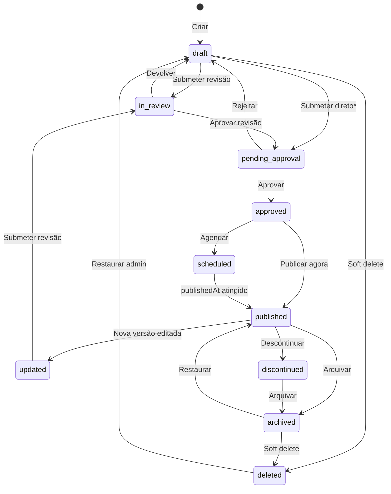
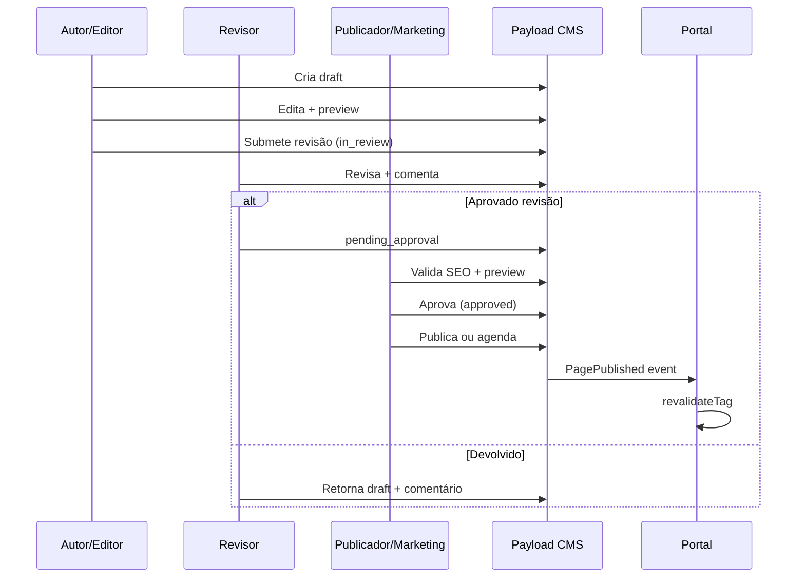
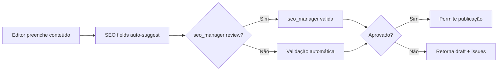
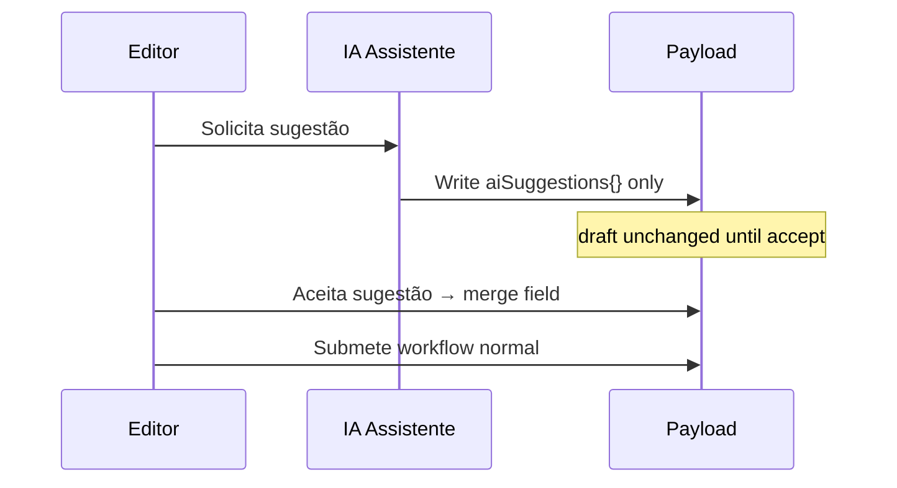

# Sprint 3.3B — Governança Editorial do CMS

> **Versão:** 1.0  
> **Data:** 2026-07-10  
> **Tipo:** Especificação de governança — **sem implementação**  
> **Escopo:** Workflow, papéis, versionamento, preview, SEO, IA, auditoria, multiempresa  
> **Autoridade:** Referência obrigatória para toda implementação futura do Payload CMS  
> **Documentos base:**
>
> - `docs/00-product/PRODUCT_MASTER_V2.md`
> - `docs/00-product/DOMAIN_MODEL_V2.md`
> - `docs/00-product/MASTER_ROADMAP_V2.md`
> - `docs/00-product/BACKLOG_V2.md`
> - `docs/00-product/PRODUCT_REVIEW_V2.md`
> - `docs/01-specifications/S03_CMS_FOUNDATION.md`
> - `docs/01-specifications/S03_PORTAL_ARCHITECTURE.md`
> - `docs/01-specifications/S03_MULTISITE_BRANDING.md`

---

## Sumário

1. [Ciclo de vida do conteúdo](#1-ciclo-de-vida-do-conteúdo)
2. [Workflow editorial](#2-workflow-editorial)
3. [Papéis editoriais](#3-papéis-editoriais)
4. [Versionamento](#4-versionamento)
5. [Preview](#5-preview)
6. [Publicação programada](#6-publicação-programada)
7. [Conteúdo multiempresa](#7-conteúdo-multiempresa)
8. [Traduções](#8-traduções)
9. [SEO editorial](#9-seo-editorial)
10. [IA editorial](#10-ia-editorial)
11. [Auditoria](#11-auditoria)
12. [Conteúdo relacionado](#12-conteúdo-relacionado)
13. [Critérios de aceite](#13-critérios-de-aceite)
14. [Riscos](#14-riscos)
15. [Relatório final](#15-relatório-final)

---

## Princípios fundamentais

| #   | Princípio                                                                           |
| --- | ----------------------------------------------------------------------------------- |
| G1  | **CMS-First** — todo conteúdo de marketing/institucional passa pelo Payload         |
| G2  | **Nenhuma publicação sem humano** — IA sugere; humano aprova                        |
| G3  | **Multiempresa por padrão** — todo conteúdo tem escopo explícito                    |
| G4  | **Rastreabilidade total** — quem, quando, o quê, por quê                            |
| G5  | **SEO não é opcional** — validação antes de publicar                                |
| G6  | **Preview obrigatório** — conteúdo relevante deve ser visualizado antes de produção |
| G7  | **Separação de deveres** — quem cria ≠ quem aprova (quando configurado)             |
| G8  | **Soft delete** — exclusão recuperável com auditoria                                |

---

## Estado atual (baseline Sprint 2)

| Capacidade                 | Status                                         |
| -------------------------- | ---------------------------------------------- |
| Drafts / versions Payload  | ❌ Não habilitado                              |
| Workflow editorial         | ❌ Apenas `admin` \| `editor` em Payload users |
| Preview portal             | ❌                                             |
| Publicação programada      | ❌                                             |
| SEO plugin                 | ❌                                             |
| Auditoria editorial        | ❌                                             |
| Escopo company em conteúdo | ❌ Parcial em `companies`                      |
| i18n                       | ❌                                             |

Este documento define o **alvo** para implementação progressiva (Sprint 3.4+).

---

## 1. Ciclo de vida do conteúdo

### 1.1 Estados oficiais

| Estado                   | Slug               | Descrição                                            | Visível no portal público       |
| ------------------------ | ------------------ | ---------------------------------------------------- | ------------------------------- |
| **Draft**                | `draft`            | Rascunho em elaboração                               | Não                             |
| **Em revisão**           | `in_review`        | Submetido para revisão editorial                     | Não (preview revisores)         |
| **Aguardando aprovação** | `pending_approval` | Revisão OK; aguarda aprovação final                  | Não                             |
| **Aprovado**             | `approved`         | Aprovado; pronto para publicar ou agendar            | Não                             |
| **Agendado**             | `scheduled`        | Aprovado com `publishedAt` futuro                    | Não até data/hora               |
| **Publicado**            | `published`        | Live no portal                                       | Sim                             |
| **Atualizado**           | `updated`          | Publicado com draft pendente (versão nova em edição) | Sim (versão publicada anterior) |
| **Arquivado**            | `archived`         | Retirado do portal; preservado para histórico        | Não                             |
| **Descontinuado**        | `discontinued`     | Conteúdo obsoleto; redirect ou 410                   | Não                             |
| **Excluído**             | `deleted`          | Soft delete; recuperável por admin                   | Não                             |

### 1.2 Mapeamento técnico Payload

| Campo             | Uso                                     |
| ----------------- | --------------------------------------- |
| `_status`         | `draft` \| `published` (Payload native) |
| `editorialStatus` | Estados estendidos §1.1 (select custom) |
| `publishedAt`     | Data/hora publicação ou agendamento     |
| `unpublishedAt`   | Despublicação programada                |
| `archivedAt`      | Timestamp arquivamento                  |
| `deletedAt`       | Soft delete                             |

**Regra:** Portal público só serve documentos onde `_status = published` AND `editorialStatus ∈ {published, updated}` AND `deletedAt` is null AND `publishedAt ≤ now` AND (`unpublishedAt` is null OR `unpublishedAt > now`).

### 1.3 Diagrama de estados



\* Submissão direta permitida apenas para papéis `marketing`, `publisher`, `company_admin` em conteúdo de baixo risco (configurável por collection).

### 1.4 Regras de transição

| De → Para                         | Quem pode                           | Condição                                 |
| --------------------------------- | ----------------------------------- | ---------------------------------------- |
| `draft` → `in_review`             | editor, author, instructor          | Campos obrigatórios preenchidos          |
| `in_review` → `pending_approval`  | reviewer                            | Checklist revisão OK                     |
| `in_review` → `draft`             | reviewer                            | Comentário obrigatório                   |
| `pending_approval` → `approved`   | publisher, marketing, company_admin | SEO validado                             |
| `pending_approval` → `draft`      | publisher                           | Motivo obrigatório                       |
| `approved` → `published`          | publisher, marketing                | Preview confirmado (checkbox)            |
| `approved` → `scheduled`          | publisher, marketing                | `publishedAt` futuro + timezone          |
| `published` → `updated`           | editor                              | Nova versão draft criada automaticamente |
| `published` → `archived`          | company_admin, holding_admin        | Motivo opcional                          |
| `published` → `discontinued`      | company_admin + seo_manager         | Redirect definido                        |
| `*` → `deleted`                   | company_admin, holding_admin        | Soft delete; motivo obrigatório          |
| `deleted` → `draft`               | holding_admin, super_admin          | Restauração auditada                     |
| `published` → `draft` (unpublish) | publisher, holding_admin            | Motivo obrigatório; emergência           |

### 1.5 Estados por tipo de conteúdo

| Collection                     | Workflow completo        | Publicação simplificada                    |
| ------------------------------ | ------------------------ | ------------------------------------------ |
| `pages`, `landing-pages`       | ✅ Completo              | —                                          |
| `posts`, `case-studies`        | ✅ Completo              | —                                          |
| `companies` (pageContent)      | ✅ Completo              | —                                          |
| `courses` (vitrine)            | ✅ Completo              | —                                          |
| `partners` (perfil público)    | ✅ + aprovação comercial | —                                          |
| `faqs`, `testimonials`         | Simplificado             | editor → published com aprovação marketing |
| `banners`                      | Simplificado             | marketing publica direto                   |
| `menus`, `redirects`           | Médio                    | site_manager aprova                        |
| `media`                        | Upload → published       | media_manager                              |
| `forms`                        | Médio                    | company_admin + LGPD check                 |
| `global-settings`, `home-page` | ✅ Completo              | holding_admin only                         |

---

## 2. Workflow editorial

### 2.1 Fluxo padrão (conteúdo institucional)



### 2.2 Responsabilidades por ação

| Ação                    | Papéis primários                      | Papéis secundários      | Notas                            |
| ----------------------- | ------------------------------------- | ----------------------- | -------------------------------- |
| **Criar**               | editor, author, marketing, instructor | partner*                | *conteúdo restrito ao parceiro   |
| **Editar**              | editor, author, marketing             | company_admin           | Escopo company                   |
| **Submeter revisão**    | editor, author                        | instructor              | Auto-check campos                |
| **Revisar**             | reviewer                              | seo_manager (check SEO) | Não pode ser o autor*            |
| **Aprovar**             | publisher, marketing, company_admin   | holding_admin           | Separação de deveres             |
| **Publicar**            | publisher, marketing                  | company_admin           | Checkbox "preview visto"         |
| **Agendar**             | publisher, marketing                  | —                       | Timezone America/Sao_Paulo       |
| **Despublicar**         | publisher, holding_admin              | company_admin           | Motivo obrigatório               |
| **Arquivar**            | company_admin, holding_admin          | —                       | Retira do portal                 |
| **Restaurar**           | holding_admin, super_admin            | company_admin           | De archived/deleted              |
| **Desfazer publicação** | publisher, holding_admin              | —                       | Volta para `approved` ou `draft` |
| **Rollback versão**     | publisher, holding_admin              | —                       | Restaura versão anterior         |

\* **Separação de deveres:** quando `enforceSeparationOfDuties = true` (default holding), revisor e aprovador não podem ser o mesmo usuário que criou a última versão significativa.

### 2.3 Workflows alternativos

#### Fast-track (banners, urgências)

```
draft → published (marketing | publisher)
```

Requer: `workflowType: fast` no documento ou collection config.

#### Partner content

```
draft (partner) → in_review (editor) → pending_approval (comercial) → published
```

#### Academic content (professor)

```
draft (instructor) → in_review (company_admin FDFA) → published
```

#### IA-assisted

```
draft (IA preenche) → in_review (editor obrigatório) → ... fluxo padrão
```

IA **nunca** transiciona para `published`.

### 2.4 Notificações no workflow

| Evento               | Destinatário         | Canal           |
| -------------------- | -------------------- | --------------- |
| Submetido revisão    | Revisores da company | In-app + e-mail |
| Devolvido            | Autor                | In-app + e-mail |
| Aguardando aprovação | Publishers           | In-app          |
| Publicado            | Autor + marketing    | In-app          |
| Agendado publicado   | Autor                | In-app          |
| Rejeitado SEO        | Autor + seo_manager  | In-app          |

Implementação: Sprint 6 notificações; hooks Payload desde Sprint 3.4.

---

## 3. Papéis editoriais

### 3.1 Separação Payload CMS vs App

| Sistema         | Usuários                   | Papéis                                   |
| --------------- | -------------------------- | ---------------------------------------- |
| **Payload CMS** | `apps/admin` Payload users | Editoriais abaixo                        |
| **App Drizzle** | Portal autenticado         | student, partner, instructor operacional |

Este documento foca **papéis editoriais CMS** + interfaces com papéis app.

### 3.2 Catálogo de papéis

| Papel                     | Slug                  | Escopo         | Responsabilidades                                  |
| ------------------------- | --------------------- | -------------- | -------------------------------------------------- |
| **Super Admin Holding**   | `super_admin_holding` | Tenant         | Tudo; restaura deleted; configura workflow         |
| **Administrador Holding** | `holding_admin`       | Tenant         | Globals holding; aprova conteúdo holding; usuários |
| **Administrador Empresa** | `company_admin`       | Company        | Aprova/publica conteúdo da empresa; equipe         |
| **Gestor de Site**        | `site_manager`        | Site           | Menus, redirects, config site                      |
| **Marketing**             | `marketing`           | Company        | Publica campanhas, LPs, banners; fast-track        |
| **SEO**                   | `seo_manager`         | Company/Tenant | Meta, redirects, sitemaps; valida antes publish    |
| **Editor**                | `editor`              | Company        | Cria/edita; submete revisão; não publica           |
| **Revisor**               | `reviewer`            | Company        | Revisa qualidade, tom, compliance                  |
| **Publicador**            | `publisher`           | Company        | Aprova final; publica; agenda; unpublish           |
| **Autor**                 | `author`              | Company        | Cria posts próprios; edita apenas os seus          |
| **Professor / Instrutor** | `instructor`          | Company/LMS    | Conteúdo educacional; materiais curso              |
| **Parceiro**              | `partner`             | Partner        | Edita perfil próprio (draft); não publica          |
| **Suporte**               | `support`             | Read           | Visualiza conteúdo para tickets; não edita         |
| **Auditor**               | `auditor`             | Tenant         | Read-only + logs; compliance                       |
| **IA Assistente**         | `ai_assistant`        | Sistema        | Sugere campos; **sem** write direto em published   |

### 3.3 Mapeamento produtores de conteúdo → papéis

| Produtor             | Papel CMS típico           | Collections                             |
| -------------------- | -------------------------- | --------------------------------------- |
| Holding              | holding_admin, editor      | globals, pages holding                  |
| Empresas (RR, FDFA…) | company_admin, editor      | companies, services                     |
| Marketing            | marketing, publisher       | LPs, banners, campaigns                 |
| Comercial            | editor (forms), reviewer   | cases, testimonials                     |
| Engenharia (CTE)     | author, editor             | artigos técnicos, downloads             |
| Professores          | instructor, author         | courses vitrine, posts                  |
| Alunos               | — (app only)               | comunidade futura — moderado por editor |
| Parceiros            | partner                    | partners (perfil)                       |
| IA                   | ai_assistant               | sugestões em draft only                 |
| Administradores      | super_admin, holding_admin | tudo                                    |

### 3.4 Matriz de permissões editorial (resumo)

| Ação             | super_admin | holding_admin | company_admin | marketing  | editor     | reviewer | publisher | author | partner | seo  |
| ---------------- | ----------- | ------------- | ------------- | ---------- | ---------- | -------- | --------- | ------ | ------- | ---- |
| Criar draft      | ✅          | ✅            | ✅            | ✅         | ✅         | —        | —         | ✅ own | ✅ own  | —    |
| Editar qualquer  | ✅          | ✅ tenant     | ✅ company    | ✅ company | ✅ company | R        | R         | own    | own     | R    |
| Submeter revisão | ✅          | ✅            | ✅            | ✅         | ✅         | —        | —         | ✅     | ✅      | —    |
| Revisar          | ✅          | ✅            | ✅            | —          | —          | ✅       | —         | —      | —       | R    |
| Aprovar          | ✅          | ✅            | ✅            | ✅         | —          | —        | ✅        | —      | —       | —    |
| Publicar         | ✅          | ✅            | ✅            | ✅         | —          | —        | ✅        | —      | —       | —    |
| Agendar          | ✅          | ✅            | ✅            | ✅         | —          | —        | ✅        | —      | —       | —    |
| Unpublish        | ✅          | ✅            | ✅            | ✅         | —          | —        | ✅        | —      | —       | —    |
| Arquivar         | ✅          | ✅            | ✅            | —          | —          | —        | —         | —      | —       | —    |
| Soft delete      | ✅          | ✅            | ✅            | —          | —          | —        | —         | —      | —       | —    |
| SEO edit         | ✅          | ✅            | ✅            | RU         | R          | RU       | R         | R own  | —       | CRUD |
| Globals holding  | ✅          | ✅            | R             | R          | R          | R        | R         | —      | —       | RU   |

### 3.5 Papéis mínimos Sprint 3.4 (MVP)

Implementar primeiro: `holding_admin`, `company_admin`, `editor`, `marketing` (como publisher), `seo_manager` (read+meta).

Adiar: `reviewer` separado (marketing faz ambos no MVP), `partner` CMS, `ai_assistant`.

---

## 4. Versionamento

### 4.1 Configuração Payload

| Collection           | `versions.drafts` | `maxPerDoc` | Autosave |
| -------------------- | ----------------- | ----------- | -------- |
| pages, landing-pages | ✅                | 50          | 30s      |
| posts, case-studies  | ✅                | 50          | 30s      |
| companies            | ✅                | 30          | 60s      |
| courses              | ✅                | 30          | 60s      |
| home-page (global)   | ✅                | 30          | 60s      |
| partners             | ✅                | 20          | —        |
| menus, banners       | ✅                | 20          | —        |
| media                | ❌                | —           | —        |
| redirects            | ✅                | 10          | —        |

### 4.2 Metadados por versão

| Campo             | Descrição                                                 |
| ----------------- | --------------------------------------------------------- |
| `versionAuthor`   | User ID que salvou                                        |
| `versionMessage`  | Comentário opcional ("Corrigido CTA", "Revisão jurídica") |
| `versionType`     | minor, major, editorial                                   |
| `createdAt`       | Timestamp                                                 |
| `editorialStatus` | Status no momento do save                                 |

### 4.3 Histórico

- Admin UI: lista cronológica de versões
- Cada versão: autor, data, diff summary, status
- Retenção: 50 versões ou 24 meses (o que vier primeiro) — versões antigas arquivadas em cold storage (futuro)

### 4.4 Rollback

| Nível                  | Quem                     | Ação                                          |
| ---------------------- | ------------------------ | --------------------------------------------- |
| **Restaurar versão**   | publisher, holding_admin | Cria nova versão baseada na antiga            |
| **Rollback publicado** | holding_admin            | Restaura versão N como published (emergência) |

Rollback gera evento `ContentRolledBack` com motivo obrigatório.

### 4.5 Comparação de versões

| Feature              | Sprint     |
| -------------------- | ---------- |
| Diff texto (Lexical) | 3.4 Should |
| Diff SEO fields      | 3.4        |
| Diff blocks (JSON)   | 4 Could    |
| Side-by-side preview | 4 Could    |

### 4.6 Aprovação vinculada a versão

- Aprovação referencia `versionId` específica
- Edições após aprovação invalidam aprovação → volta `draft` ou `updated`
- Campo `approvedVersionId` no documento

---

## 5. Preview

### 5.1 Princípios

| Regra | Descrição                                  |
| ----- | ------------------------------------------ |
| P1    | Preview disponível em **staging** sempre   |
| P2    | Preview em produção requer token + role    |
| P3    | Preview reflete draft atual, não published |
| P4    | Preview inclui tema brand/site correto     |
| P5    | Preview SEO mostra OG simulado             |

### 5.2 Mecanismo técnico

```
URL: {portal_staging}/{path}?preview=true&token={jwt}&locale=pt-BR

JWT payload: { docId, collection, versionId, siteId, exp: 1h }
Portal: /api/preview → draftMode.enable()
Fetch: ?draft=true na API Payload
```

### 5.3 Preview por tipo

| Tipo              | URL preview                   | Particularidades                    |
| ----------------- | ----------------------------- | ----------------------------------- |
| **Páginas**       | `/[slug]?preview`             | Blocks renderizados                 |
| **Posts**         | `/blog/[slug]?preview`        | Schema Article preview              |
| **Cursos**        | `/cursos/[slug]?preview`      | Vitrine only                        |
| **Landing pages** | `/lp/[slug]?preview`          | hideNav/footer respeitado           |
| **Empresas**      | `/empresas/[slug]?preview`    | Brand theme aplicado                |
| **Blocos**        | Preview inline no admin       | Live Preview Payload 3              |
| **Menus**         | Preview com header temporário | Staging only                        |
| **SEO**           | Painel admin plugin           | OG card simulado                    |
| **Globals home**  | `/?preview`                   | Global draft                        |
| **Partners**      | `/parceiros/[slug]?preview`   | Só após aprovação comercial em prod |

### 5.4 Live Preview (Payload 3)

- Habilitar `@payloadcms/live-preview` para pages, posts, companies
- Split view admin: editor | iframe portal staging
- Atualização em tempo real com debounce 500ms

### 5.5 Checklist pré-publicação (preview)

Editor/publicador confirma no admin:

- [ ] Visualizado desktop e mobile
- [ ] Links funcionam
- [ ] Imagens com alt
- [ ] CTAs corretos
- [ ] Company/site corretos
- [ ] SEO preview OK
- [ ] Sem lorem ipsum / placeholder

Campo: `previewConfirmedAt`, `previewConfirmedBy`

---

## 6. Publicação programada

### 6.1 Campos

| Campo           | Tipo     | Obrigatório                 |
| --------------- | -------- | --------------------------- |
| `publishedAt`   | datetime | Se scheduled                |
| `unpublishedAt` | datetime | Opcional — despublicação    |
| `timezone`      | select   | Default `America/Sao_Paulo` |
| `campaign`      | text     | Opcional — LPs              |
| `expiresAt`     | datetime | Opcional — auto-arquivar    |

### 6.2 Regras

| Regra | Descrição                                                  |
| ----- | ---------------------------------------------------------- |
| S1    | `publishedAt` futuro → `editorialStatus = scheduled`       |
| S2    | Job cron verifica a cada 1 min (queue `@omnia/queue`)      |
| S3    | Ao publicar: `PagePublished` event + revalidate            |
| S4    | `unpublishedAt` atingido → `archived` + revalidate         |
| S5    | `expiresAt` → `discontinued` ou `archived` conforme config |
| S6    | Timezone sempre explícito; UI mostra hora local SP         |

### 6.3 Campanhas

| Elemento            | Governança                                                      |
| ------------------- | --------------------------------------------------------------- |
| LP campanha         | `campaign` ID + UTM defaults                                    |
| Banner              | `startDate`/`endDate`                                           |
| Coordinated publish | Múltiplos docs mesmo `publishedAt` — evento `CampaignPublished` |
| Encerramento        | Auto `unpublishedAt` + redirect para página institucional       |

### 6.4 Despublicação

| Tipo       | Comportamento                              |
| ---------- | ------------------------------------------ |
| Manual     | publisher → `archived`; motivo obrigatório |
| Programada | `unpublishedAt` → archived automático      |
| Emergência | holding_admin unpublish imediato           |
| Legal/LGPD | super_admin + auditor notificado           |

---

## 7. Conteúdo multiempresa

### 7.1 Escopos (alinhado S03_MULTISITE)

| Escopo                | `company` | `site`   | Quem edita                     | Exemplos                              |
| --------------------- | --------- | -------- | ------------------------------ | ------------------------------------- |
| **Global Holding**    | null      | hub      | holding_admin, holding editor  | Home hub, políticas, menus principais |
| **Exclusivo empresa** | ✅        | hub path | company_admin, editors company | Blog RR, página `/empresas/rr`        |
| **Exclusivo marca**   | ✅        | any      | brand_manager                  | Theme, logos                          |
| **Exclusivo Site**    | opt       | ✅       | site_manager                   | Menu site futuro próprio              |
| **Compartilhado**     | null      | all      | holding_admin                  | Assets holding, design guidelines     |
| **Regional**          | ✅ + unit | —        | company_admin regional         | Conteúdo por filial                   |
| **Sincronizado**      | ✅        | external | editor + sync job              | Logo, nome — unidirecional            |
| **Reutilizável**      | null      | —        | holding_admin                  | Blocks templates, FAQs genéricos      |

### 7.2 Regras de visibilidade

```typescript
// Query portal pública — conceitual
where: {
  and: [
    { tenant: { equals: tenantId } },
    { _status: { equals: 'published' } },
    { editorialStatus: { in: ['published', 'updated'] } },
    { deletedAt: { exists: false } },
    {
      or: [
        { scope: { equals: 'holding' } },
        {
          and: [
            { scope: { equals: 'company' } },
            { company: { equals: resolvedCompany } }, // se contexto empresa
          ],
        },
        { site: { in: [siteId, null] } },
      ],
    },
  ];
}
```

### 7.3 Prevenção cross-company

| Risco                         | Controle                            |
| ----------------------------- | ----------------------------------- |
| Editor RR edita FDFA          | Access control `company` filter     |
| Post publicado no site errado | Campo `site` validation hook        |
| Slug duplicado                | Unique `{tenant}:{site}:{slug}`     |
| Vazamento preview             | Token inclui `companyId`; validação |

### 7.4 Conteúdo da Holding vs empresas filhas

- **Omnia Frigo Holding** não é filha de si mesma
- Conteúdo holding: `company = omnia-frigo-holding` OR `scope = holding` com `company = null`
- Seção ecossistema: 5 empresas operacionais — não incluir holding como card filho

---

## 8. Traduções

### 8.1 Estratégia (MVP pt-BR, arquitetura i18n-ready)

| Fase       | Escopo                                         |
| ---------- | ---------------------------------------------- |
| **MVP**    | pt-BR apenas; campos `locale` default `pt-BR`  |
| **Fase 2** | en — conteúdo selecionado (holding, top pages) |
| **Fase 3** | es — mercado LATAM futuro                      |

### 8.2 Abordagem técnica

**Opção recomendada:** Payload localization plugin ou field-level `localized: true`

| Collection | Campos localizados                        |
| ---------- | ----------------------------------------- |
| pages      | title, blocks (parcial), meta             |
| posts      | title, content, excerpt, meta             |
| companies  | name (display), descriptions, pageContent |
| courses    | title, description, meta                  |
| menus      | labels                                    |
| globals    | siteName, tagline, footer                 |

### 8.3 Workflow por locale

- Cada locale tem `editorialStatus` independente
- Publicar pt-BR não publica en automaticamente
- Fallback: se locale ausente, mostrar pt-BR com banner `data-fallback-locale`
- hreflang gerado automaticamente quando ≥2 locales publicados

### 8.4 Governança tradução

| Papel               | Responsabilidade                          |
| ------------------- | ----------------------------------------- |
| editor              | Conteúdo pt-BR                            |
| marketing           | Aprova pt-BR                              |
| translator (futuro) | en, es                                    |
| IA                  | Sugere tradução; humano aprova por locale |
| seo_manager         | hreflang, meta por locale                 |

### 8.5 URLs (futuro)

| Padrão  | Exemplo                        |
| ------- | ------------------------------ |
| Subpath | `/en/about`, `/es/nosotros`    |
| Domain  | `en.omniafrigo.com.br` (Could) |

---

## 9. SEO editorial

### 9.1 Fluxo SEO no workflow



### 9.2 Campos SEO obrigatórios antes de publicar

| Campo              | Validação                           | Bloqueante         |
| ------------------ | ----------------------------------- | ------------------ |
| `meta.title`       | 30–60 chars; não vazio              | Sim                |
| `meta.description` | 70–160 chars                        | Sim                |
| `meta.image`       | 1200×630 recomendado; alt se imagem | Warning se ausente |
| `meta.canonical`   | URL válida ou auto                  | Sim se duplicado   |
| `meta.robots`      | enum válido                         | Sim                |
| H1 único           | 1 por página                        | Sim                |
| `slug`             | único no escopo                     | Sim                |
| Imagens body       | alt obrigatório                     | Sim                |

### 9.3 Open Graph e Twitter

- Gerados de meta fields
- Preview no admin antes de publish
- `og:locale` = `pt_BR`
- Twitter `summary_large_image` default

### 9.4 JSON-LD

| Tipo conteúdo   | Schema                | Quem configura       |
| --------------- | --------------------- | -------------------- |
| Home            | Organization, WebSite | seo_manager template |
| Empresa         | Organization          | Auto + override      |
| Post            | Article               | Auto                 |
| Curso           | Course                | Auto + manual offers |
| FAQ             | FAQPage               | Auto from block      |
| Produto (Carga) | SoftwareApplication   | seo_manager          |

Override manual: `meta.schema` JSON — validação schema.org syntax.

### 9.5 Robots e sitemap

| Ação              | Responsável | Trigger                 |
| ----------------- | ----------- | ----------------------- |
| robots.txt        | seo_manager | Global seo-settings     |
| sitemap inclusion | Automático  | `published` only        |
| sitemap exclusion | seo_manager | `noindex` ou `archived` |
| Redirects         | seo_manager | redirects collection    |

### 9.6 Redirects no workflow

- Descontinuar conteúdo → **obrigatório** redirect 301 ou 410
- seo_manager aprova redirect
- Evento `RedirectCreated` + cache invalidation

### 9.7 Checklist SEO publicação

- [ ] Title único no site
- [ ] Description não duplicada
- [ ] Canonical correto
- [ ] OG image presente
- [ ] Schema válido
- [ ] Slug legível
- [ ] Links internos mínimos (3)
- [ ] Não compete com site externo oficial (canonical strategy S03_MULTISITE)

---

## 10. IA editorial

### 10.1 Princípio inviolável

> **A IA nunca publica automaticamente.**  
> Toda sugestão IA entra como draft ou campo `aiSuggested*` pendente de aceite humano.

### 10.2 Capacidades permitidas

| Capacidade            | Agente           | Output                      | Aprovação             |
| --------------------- | ---------------- | --------------------------- | --------------------- |
| Sugerir textos        | editor-assistant | Campo sugestão side-by-side | Editor aceita/rejeita |
| Corrigir gramática    | editor-assistant | Diff proposto               | Editor aceita         |
| Gerar títulos         | seo-assistant    | 3 opções meta.title         | Editor/SEO escolhe    |
| Gerar SEO description | seo-assistant    | meta.description sugestão   | SEO aprova            |
| Gerar FAQ             | educational      | Array FAQ draft             | Editor + revisão      |
| Resumir artigos       | editor-assistant | excerpt sugestão            | Autor aceita          |
| Traduzir              | i18n-assistant   | Locale field sugestão       | Translator aprova     |
| Tags/categorias       | editor-assistant | Sugestão relacionamentos    | Editor aceita         |

### 10.3 Capacidades proibidas

| Proibido                                     | Motivo            |
| -------------------------------------------- | ----------------- |
| Publicar direto                              | G1, G2            |
| Alterar `editorialStatus`                    | Governança humana |
| Deletar conteúdo                             | Segurança         |
| Alterar permissões                           | Segurança         |
| Modificar redirects em prod                  | SEO risk          |
| Indexar conteúdo não aprovado no RAG público | Qualidade         |

### 10.4 Fluxo IA-assisted



### 10.5 Campos técnicos

| Campo                | Descrição                                 |
| -------------------- | ----------------------------------------- |
| `aiSuggestions`      | JSON pendente — não renderizado no portal |
| `aiGeneratedPercent` | 0–100 — disclosure interno                |
| `aiLastAssistedAt`   | Timestamp                                 |
| `aiAssistedBy`       | agentType                                 |

### 10.6 Auditoria IA

- Log prompt hash + modelo + tokens (sem PII no log)
- LGPD: dados pessoais em conteúdo não enviados a IA sem consent
- Rate limit por tenant/user

### 10.7 Sprint alvo

IA editorial assistiva: Sprint 12 (após conteúdo estável).  
MVP 3.4: desabilitar `ai_assistant` role; arquitetura de campos preparada.

---

## 11. Auditoria

### 11.1 Eventos auditados

| Evento                   | Dados registrados                                |
| ------------------------ | ------------------------------------------------ |
| `ContentCreated`         | userId, collection, docId, tenant, company, site |
| `ContentUpdated`         | + changedFields[], versionId                     |
| `ContentSubmittedReview` | + comment                                        |
| `ContentReviewed`        | + approve/reject, comment                        |
| `ContentApproved`        | + approvedVersionId                              |
| `ContentPublished`       | + publishedAt                                    |
| `ContentScheduled`       | + scheduledAt                                    |
| `ContentUnpublished`     | + reason                                         |
| `ContentArchived`        | + reason                                         |
| `ContentDeleted`         | + reason (soft)                                  |
| `ContentRestored`        | + fromStatus                                     |
| `ContentRolledBack`      | + targetVersionId, reason                        |
| `SeoValidated`           | + issues[]                                       |
| `AiSuggestionAccepted`   | + field, agentType                               |

### 11.2 Entidade AuditLog (conceitual)

| Campo            | Tipo                    |
| ---------------- | ----------------------- |
| `id`             | uuid                    |
| `timestamp`      | datetime                |
| `action`         | enum                    |
| `userId`         | relationship            |
| `userEmail`      | text (denormalized)     |
| `userRole`       | text                    |
| `collection`     | text                    |
| `documentId`     | text                    |
| `versionId`      | text                    |
| `tenantId`       | text                    |
| `companyId`      | text                    |
| `siteId`         | text                    |
| `ipAddress`      | text (quando aplicável) |
| `userAgent`      | text                    |
| `reason`         | text                    |
| `metadata`       | json                    |
| `previousStatus` | text                    |
| `newStatus`      | text                    |

**Persistência:** Drizzle `audit_logs` — Sprint 3.4 prep; Payload hooks emit → `@omnia/events`.

### 11.3 Retenção

| Tipo                | Retenção            |
| ------------------- | ------------------- |
| Editorial audit     | 7 anos (compliance) |
| IA prompts          | 90 dias (LGPD)      |
| Preview access logs | 30 dias             |

### 11.4 Acesso aos logs

| Papel         | Acesso                 |
| ------------- | ---------------------- |
| auditor       | Read all tenant        |
| holding_admin | Read all tenant        |
| company_admin | Read own company       |
| editor        | Read own actions       |
| support       | Read related to ticket |

---

## 12. Conteúdo relacionado

### 12.1 Relacionamentos manuais (CMS fields)

| Collection   | Campos `related*`                                                                                       |
| ------------ | ------------------------------------------------------------------------------------------------------- |
| posts        | relatedCourses, relatedServices, relatedPartners, relatedDownloads, relatedPosts, relatedCases, company |
| courses      | relatedPosts, relatedServices, relatedPartners, company                                                 |
| companies    | services, courses (via query), partners                                                                 |
| case-studies | company, services, relatedPosts                                                                         |
| events       | company, relatedCourses                                                                                 |
| services     | company, relatedCourses, relatedCases                                                                   |
| partners     | company (credenciadora), relatedServices                                                                |
| products     | company, relatedCourses, relatedServices                                                                |
| pages        | relatedPages (opcional)                                                                                 |

### 12.2 Relacionamentos automáticos (portal)

| Contexto | Algoritmo                                    | Max items |
| -------- | -------------------------------------------- | --------- |
| Post     | Mesma company + tags overlap                 | 4         |
| Curso    | Mesma company + categoria                    | 3         |
| Empresa  | services, courses, posts filtered by company | config    |
| Serviço  | cases same company                           | 3         |
| Case     | services + company posts                     | 3         |
| Parceiro | services same specialty                      | 4         |
| Download | posts same topic                             | 3         |

### 12.3 IA e relacionamentos

- Agente pode **sugerir** `related*` — editor confirma
- RAG usa relacionamentos para contexto — só conteúdo `published`
- Evento `RelatedContentSuggested` → analytics

### 12.4 Componente portal

`RelatedContentSection` — renderiza cards por tipo com analytics `related_click`.

---

## 13. Critérios de aceite

Governança editorial considerada **pronta para produção** quando:

| ID    | Critério                                                          |
| ----- | ----------------------------------------------------------------- |
| GA-01 | Estados §1.1 implementados em `editorialStatus` + `_status`       |
| GA-02 | Workflow padrão draft→review→approve→publish funcional em `pages` |
| GA-03 | Mínimo 5 papéis CMS MVP §3.5 configurados com access control      |
| GA-04 | Versions + drafts habilitados em pages, posts, companies          |
| GA-05 | Rollback para versão anterior testado                             |
| GA-06 | Preview staging com token JWT funcional                           |
| GA-07 | Live Preview admin para pages                                     |
| GA-08 | Publicação programada com job queue                               |
| GA-09 | SEO validation bloqueia publish sem title/description             |
| GA-10 | AuditLog registra create, update, publish, unpublish              |
| GA-11 | Separação company em access control — editor não cruza empresas   |
| GA-12 | Soft delete com restauração holding_admin                         |
| GA-13 | `previewConfirmedBy` obrigatório para publish em staging→prod     |
| GA-14 | IA role desabilitada ou suggestion-only (sem auto-publish)        |
| GA-15 | Documentação admin: guia workflow em `docs/`                      |
| GA-16 | E2E: fluxo completo editor→publisher em staging                   |
| GA-17 | Notificação e-mail submit review (pode ser Sprint 6)              |
| GA-18 | Campos locale preparados (default pt-BR)                          |

**Gate MVP (Sprint 3.4):** GA-01 a GA-12 obrigatórios.

---

## 14. Riscos

### 14.1 Riscos editoriais

| ID    | Risco                                        | Prob. | Impacto | Mitigação                              |
| ----- | -------------------------------------------- | ----- | ------- | -------------------------------------- |
| RE-01 | Workflow complexo demais para equipe pequena | Alta  | Médio   | MVP simplificado; fast-track marketing |
| RE-02 | Gargalo em revisor único                     | Média | Alto    | Delegação; notificações; SLA revisão   |
| RE-03 | Conteúdo obsoleto não arquivado              | Alta  | Médio   | `expiresAt`; auditoria trimestral      |
| RE-04 | Publicação sem preview                       | Média | Alto    | `previewConfirmed` obrigatório         |
| RE-05 | Versões conflitantes                         | Média | Médio   | Lock otimista; aviso concurrent edit   |

### 14.2 Riscos LGPD

| ID    | Risco                                | Mitigação                             |
| ----- | ------------------------------------ | ------------------------------------- |
| RL-01 | Dados pessoais em conteúdo publicado | Checklist revisão; treinamento        |
| RL-02 | Logs com PII excessivo               | Mascarar IP; retenção limitada        |
| RL-03 | IA processa dados sensíveis          | Policy: não enviar PII a LLM          |
| RL-04 | Conteúdo aluno em CMS                | Alunos não publicam direto; moderação |

### 14.3 Riscos SEO

| ID    | Risco                             | Mitigação                |
| ----- | --------------------------------- | ------------------------ |
| RS-01 | Publicar sem meta                 | Validação bloqueante     |
| RS-02 | Conteúdo duplicado multi-site     | Canonical strategy       |
| RS-03 | Redirect quebrado ao descontinuar | Obrigatório redirect/410 |
| RS-04 | Slug alterado pós-publicação      | Auto-redirect 301        |

### 14.4 Riscos operacionais

| ID    | Risco                            | Mitigação                              |
| ----- | -------------------------------- | -------------------------------------- |
| RO-01 | Publicação empresa errada        | Access control + site validation       |
| RO-02 | Aprovação indevida (mesmo autor) | Separation of duties                   |
| RO-03 | Soft delete acidental            | Confirmação dupla; restauração 30 dias |
| RO-04 | Agendamento timezone errado      | TZ explícito; UI SP                    |
| RO-05 | IA publica por bug               | Role sem publish; code review          |

### 14.5 Riscos multiempresa

| ID    | Risco                                | Mitigação                   |
| ----- | ------------------------------------ | --------------------------- |
| RM-01 | Vazamento conteúdo RR em FDFA        | company filter API + access |
| RM-02 | Globals holding sobrescrevem empresa | Escopo explícito            |
| RM-03 | Partner edita além do perfil         | Field-level access partner  |

---

## 15. Relatório final

### 15.1 Fluxos definidos

| #   | Fluxo                                        | Seção     |
| --- | -------------------------------------------- | --------- |
| 1   | Ciclo de vida completo (10 estados)          | §1        |
| 2   | Workflow padrão draft→review→approve→publish | §2.1      |
| 3   | Fast-track marketing                         | §2.3      |
| 4   | Partner content approval                     | §2.3      |
| 5   | Academic instructor content                  | §2.3      |
| 6   | IA-assisted (suggest only)                   | §2.3, §10 |
| 7   | Publicação programada + despublicação        | §6        |
| 8   | SEO validation gate                          | §9        |
| 9   | Preview staging + live preview               | §5        |
| 10  | Rollback e restauração                       | §4, §1    |
| 11  | Soft delete e restore                        | §1        |
| 12  | Tradução por locale (futuro)                 | §8        |
| 13  | Relacionamentos manuais + automáticos        | §12       |

**Total fluxos documentados:** 13

### 15.2 Papéis editoriais

| #   | Papel                 | Slug                  |
| --- | --------------------- | --------------------- |
| 1   | Super Admin Holding   | `super_admin_holding` |
| 2   | Administrador Holding | `holding_admin`       |
| 3   | Administrador Empresa | `company_admin`       |
| 4   | Gestor de Site        | `site_manager`        |
| 5   | Marketing             | `marketing`           |
| 6   | SEO                   | `seo_manager`         |
| 7   | Editor                | `editor`              |
| 8   | Revisor               | `reviewer`            |
| 9   | Publicador            | `publisher`           |
| 10  | Autor                 | `author`              |
| 11  | Professor/Instrutor   | `instructor`          |
| 12  | Parceiro              | `partner`             |
| 13  | Suporte               | `support`             |
| 14  | Auditor               | `auditor`             |
| 15  | IA Assistente         | `ai_assistant`        |

**MVP Sprint 3.4:** papéis 2, 3, 5, 6, 7 (+ marketing como publisher).

### 15.3 Estados do conteúdo

| #   | Estado           |
| --- | ---------------- |
| 1   | draft            |
| 2   | in_review        |
| 3   | pending_approval |
| 4   | approved         |
| 5   | scheduled        |
| 6   | published        |
| 7   | updated          |
| 8   | archived         |
| 9   | discontinued     |
| 10  | deleted (soft)   |

### 15.4 Decisões pendentes

| #     | Decisão                                          | Opções                   | Recomendação                       |
| ----- | ------------------------------------------------ | ------------------------ | ---------------------------------- |
| ED-01 | Campo `editorialStatus` separado de `_status`?   | Sim / só `_status`       | **Sim** — estados estendidos       |
| ED-02 | Revisor obrigatório ou opcional MVP?             | Obrigatório / opcional   | **Opcional** MVP; marketing aprova |
| ED-03 | Separation of duties enforcement?                | Strict / warn / off      | **Warn** MVP; strict produção      |
| ED-04 | `previewConfirmed` obrigatório?                  | Sim / não                | **Sim** para pages, posts, LPs     |
| ED-05 | AuditLog em Drizzle ou Payload?                  | Drizzle / Payload plugin | **Drizzle** + hooks                |
| ED-06 | Localization plugin vs fields manuais?           | Plugin / manual          | **Plugin** Payload quando i18n     |
| ED-07 | Fast-track collections list?                     | Config / hardcoded       | **Config** por collection          |
| ED-08 | Partner publica perfil após aprovação comercial? | Sim                      | **Sim** — workflow §2.3            |
| ED-09 | Retenção versões: 50 ou 24 meses?                | Ambos                    | **50 versões** cap                 |
| ED-10 | Aluno pode criar conteúdo CMS?                   | Não / moderado           | **Não** direto; moderação editor   |
| ED-11 | seo_manager bloqueia publish globalmente?        | Sim / por company        | **Por company**                    |
| ED-12 | Auto-redirect em slug change?                    | Sim / manual             | **Sim** automático                 |

### 15.5 Riscos (resumo)

| Categoria    | Quantidade |
| ------------ | ---------- |
| Editoriais   | 5          |
| LGPD         | 4          |
| SEO          | 4          |
| Operacionais | 5          |
| Multiempresa | 3          |
| **Total**    | **21**     |

### 15.6 Recomendações para Sprint 3.4

**Sprint 3.4 — Implementação governança editorial (MVP):**

1. **Habilitar** `versions.drafts` em `pages`, `companies`, `landing-pages`
2. **Adicionar** campo `editorialStatus` + hooks transição
3. **Implementar** papéis Payload: `holding_admin`, `company_admin`, `editor`, `marketing`, `seo_manager`
4. **Access control** por `company` em collections de conteúdo
5. **Preview** `/api/preview` + draftMode + token JWT
6. **SEO plugin** + validation hook bloqueante title/description
7. **AuditLog** schema Drizzle + hooks `afterChange`/`afterDelete`
8. **Publicação programada** job básico `@omnia/queue`
9. **Soft delete** `deletedAt` + restore admin
10. **Guia admin** workflow 1 página em `docs/06-ux/` (documentação)
11. **E2E** fluxo editor cria → marketing publica
12. **Não implementar** IA editorial, i18n completo, reviewer separado — Sprint 4+

**Dependências 3.4:**

- S03_CMS_FOUNDATION collections pages/globals implementadas (3.3B código)
- S03_MULTISITE companies expand com `company` scope
- ADR-009 dual users se auth CMS integrado

**Ordem sugerida:**

```
1. editorialStatus + versions
2. roles + access control
3. SEO plugin + validation
4. preview API
5. audit hooks
6. scheduled publish job
7. E2E + guia
```

### 15.7 Alinhamento documental

| Documento               | Relação                                                          |
| ----------------------- | ---------------------------------------------------------------- |
| S03_CMS_FOUNDATION      | Collections, drafts, preview — **implementar conforme este doc** |
| S03_PORTAL_ARCHITECTURE | draftMode, published-only público                                |
| S03_MULTISITE_BRANDING  | Escopo company/site, permissões §9                               |
| DOMAIN_MODEL_V2         | RBAC §4 — expandir papéis                                        |
| PRODUCT_MASTER_V2       | Workflow editorial §5.3 — detalhado aqui                         |
| BACKLOG_V2              | CMS-S04 workflow revisor → publicador                            |

---

_Omnia Platform — Sprint 3.3B Editorial Governance © 2026_  
_Documentação apenas — aguardando revisão humana antes da Sprint 3.4._
