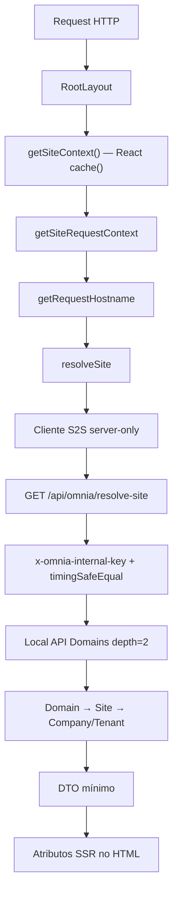

# Sprint 03 — CMS and Multisite Foundation Completion

| Campo                     | Valor                                     |
| ------------------------- | ----------------------------------------- |
| Data de encerramento      | 2026-07-14                                |
| Status                    | Foundation complete — ready for PR review |
| Branch                    | `feature/sprint-03-cms-foundation`        |
| Baseline técnico validado | `f1989ae`                                 |
| Baseline Prettier         | `baeab1d`                                 |
| Versão do monorepo        | `0.3.0` (`package.json`)                  |

- Baseline Prettier: `baeab1d`
- Baseline operacional validado em CI e staging: `f1989ae`

`f1989ae` não é o baseline Prettier. O commit deste documento é exclusivamente documental e não altera esses baselines.

---

## 1. Resumo executivo

A Sprint 03 entregou a **fundação CMS, multisite, resolução Server-to-Server (S2S) e SSR contextual** da Omnia Platform.

O Admin (Payload CMS) passou a modelar Sites e Domains com migrations e seeds reproduzíveis de Sites/Companies/Tenant. O Portal resolve o contexto do host via endpoint interno autenticado por segredo, sem acesso direto ao banco, e materializa o resultado em atributos SSR no `RootLayout`.

A fundação foi validada em staging (`dev.omniafrigo.com.br` / `admin.dev.omniafrigo.com.br`) para resolução de site, proteção REST anônima de Companies/Tenants, health HTTP, containers e CI. A branch de fechamento está pronta para revisão de PR.

---

## 2. Escopo entregue

Derivado do código e da configuração do monorepo:

| Área                      | Entrega                                                                                                     |
| ------------------------- | ----------------------------------------------------------------------------------------------------------- |
| Monorepo                  | Workspace `apps/*` + `packages/*`; Node `22` (`.nvmrc`); `pnpm@9.15.0` (`packageManager`)                   |
| Payload CMS               | `apps/admin/payload.config.ts` — Users, Tenants, Companies, Sites, Domains, Media; global `global-settings` |
| Collections Sites/Domains | Acesso autenticado explícito; drafts/versions em Sites                                                      |
| Migrations                | `20260709_181730`, `20260713_142511_sites`, `20260713_174436_domains`                                       |
| Seeds                     | Tenant holding, 6 Companies, 6 Sites, Global Settings (`apps/admin/src/seed`)                               |
| Hostname helpers          | `@omnia/shared`: `normalizeHostname`, `isValidHostname`, `getRootDomain`, `buildCanonicalUrl`               |
| Contratos S2S             | Espelhados Admin ↔ Web (`site-resolver/contracts`)                                                          |
| Endpoint S2S              | `GET /api/omnia/resolve-site` (`apps/admin/src/endpoints/resolve-site.ts`)                                  |
| Cliente Portal            | `apps/web/src/lib/site-resolver` (`resolveSite`, `fetchSiteResolution`, CLI smoke)                          |
| Request context           | `getRequestHostname`, `getSiteRequestContext`                                                               |
| Site context              | `getSiteContext` memoizado com React `cache()`                                                              |
| SSR                       | `apps/web/src/app/layout.tsx` — `data-site-*` / `data-company-slug` / `data-tenant-slug`                    |
| Config interna            | `getInternalApiConfig()` → `OMNIA_INTERNAL_API_SECRET`                                                      |
| Docker staging            | `docker/compose/staging.yml` + `docker/staging/DEPLOY.md`                                                   |
| CI                        | `.github/workflows/ci.yml` — Quality Checks + Build; pnpm via `packageManager`                              |

---

## 3. Fora do escopo da Sprint 03

Não entregue nesta sprint (e não bloqueia o fechamento da fundação):

- Pages
- Home administrável
- Page Builder
- Blocks
- Menus
- Header/Footer dinâmicos
- SEO por página
- Preview editorial
- Theme Provider em runtime
- Cache avançado
- Marketplace
- Áreas autenticadas do Portal
- LMS, CRM e IA operacional

---

## 4. Arquitetura final

### Fluxo de resolução (runtime)

```text
Request HTTP
→ RootLayout
→ getSiteContext() — React cache()
→ getSiteRequestContext()
→ getRequestHostname()
→ resolveSite()
→ cliente S2S server-only
→ GET /api/omnia/resolve-site
→ autenticação x-omnia-internal-key
→ Payload Local API Domains depth=2
→ Domain → Site → Company/Tenant
→ DTO mínimo
→ atributos SSR no HTML
```

### Diagrama



### Princípios

- **`cache()`** deduplica `getSiteContext()` **dentro da renderização RSC atual**.
- **Não** é cache persistente.
- **Não** é cache compartilhado entre requisições.
- Resolução **somente server-side**; o cliente HTTP do resolver não é exposto ao browser.
- O Portal **não acessa diretamente Postgres/Payload**.
- Resposta S2S usa **DTO mínimo** — campos operacionais mínimos necessários à resolução do site.
- `OMNIA_INTERNAL_API_SECRET` permanece **apenas no servidor** (Admin/Web/compose).
- Comparação do header usa **`timingSafeEqual`**.

---

## 5. Estado do CMS

| Collection / Global | Finalidade          | Access de leitura                        | Migration                 | Seed                         | Estado final                                  |
| ------------------- | ------------------- | ---------------------------------------- | ------------------------- | ---------------------------- | --------------------------------------------- |
| `users`             | Auth Admin          | Default Payload 3 (sem `access` custom)  | Base `20260709_181730`    | —                            | Operacional                                   |
| `tenants`           | Multi-tenant        | Default Payload 3 = autenticado          | Base                      | Seed holding                 | Operacional; REST anônimo **403** em staging  |
| `companies`         | Empresas do holding | Default Payload 3 = autenticado          | Base                      | Seed (6)                     | Operacional; REST anônimo **403** em staging  |
| `sites`             | Sites multisite     | `authenticated`                          | `20260713_142511_sites`   | Seed (6)                     | Operacional                                   |
| `domains`           | Hostnames → Site    | `authenticated`                          | `20260713_174436_domains` | Seed: **pendente Sprint 04** | Operacional em staging (cadastro operacional) |
| `media`             | Mídia               | `read: () => true` (público intencional) | Base                      | —                            | Operacional                                   |
| `global-settings`   | Settings do portal  | `read: () => true` (público intencional) | Base                      | Seed                         | Operacional                                   |

**Importante:** Companies e Tenants **não** são públicos. Não possuem `access` personalizado; no Payload 3 o default exige usuário autenticado. Staging confirmou `403` para `GET` anônimo.

---

## 6. Migrations e dados

### Migrations (evidência do código/repositório)

- `apps/admin/src/migrations/20260709_181730.ts` (+ `.json`)
- `apps/admin/src/migrations/20260713_142511_sites.ts` (+ `.json`)
- `apps/admin/src/migrations/20260713_174436_domains.ts` (+ `.json`)
- `apps/admin/src/migrations/index.ts`
- Seed de Sites: seis Sites em `apps/admin/src/seed/sites.ts`
- Seed de Domains: **não existe** no repositório (pendente Sprint 04)

### Evidência operacional (VPS/staging)

| Fato                            | Registro auditável                                                                                   |
| ------------------------------- | ---------------------------------------------------------------------------------------------------- |
| Migration Sites                 | Confirmada operacionalmente em staging **antes** do deploy final de `f1989ae`                        |
| Migration Domains               | Confirmada operacionalmente em staging **antes** do deploy final de `f1989ae`                        |
| Tabelas PostgreSQL              | `sites`, `_sites_v` e `domains` confirmadas no PostgreSQL de staging durante a validação operacional |
| Deploy final `f1989ae`          | Essas migrations **não** foram reaplicadas porque não existiam migrations novas nessa atualização    |
| Domínio `dev.omniafrigo.com.br` | Cadastrado operacionalmente e vinculado a `omnia-hub`                                                |
| SSR posterior                   | Confirmou o vínculo (`data-site-slug="omnia-hub"` / resolução `resolved`)                            |
| Seed reproduzível de Domains    | Continua pendente                                                                                    |

Sem IP, credenciais, strings de conexão ou valores de ambiente neste documento.

---

## 7. Segurança S2S

| Controle       | Implementação                                                                         |
| -------------- | ------------------------------------------------------------------------------------- |
| Header interno | `x-omnia-internal-key`                                                                |
| Secret         | `OMNIA_INTERNAL_API_SECRET` via `getInternalApiConfig()` (obrigatório, min. 32 chars) |
| Sem credencial | **401** `UNAUTHORIZED`                                                                |
| Comparação     | `timingSafeEqual`                                                                     |
| Local API      | Domains `depth=2` com `overrideAccess: true` somente no endpoint interno              |
| Browser        | nenhum secret enviado ao client bundle do Portal                                      |
| Payload        | DTO mínimo — campos operacionais mínimos necessários à resolução do site              |

Valor do secret: **não documentado**. Endpoint interno: o DTO **não** é superfície pública.

---

## 8. Validação real de staging

### Referências confirmadas

| Item                              | Valor / estado                                                                    |
| --------------------------------- | --------------------------------------------------------------------------------- |
| Baseline Prettier                 | `baeab1d`                                                                         |
| Baseline operacional (CI/staging) | `f1989ae` (código/tooling validado; este documento não altera o baseline técnico) |
| CI GitHub Actions                 | Aprovado na interface para `f1989ae`                                              |
| Quality Checks                    | Aprovado                                                                          |
| Build CI                          | Aprovado                                                                          |
| Web HTTP                          | **200** (`https://dev.omniafrigo.com.br/`)                                        |
| Admin HTTP                        | **200** (`https://admin.dev.omniafrigo.com.br/`)                                  |
| Containers Web/Admin              | **healthy** após o deploy                                                         |
| Atualização staging               | Fast-forward de `dd926e2` até `f1989ae`                                           |
| Rebuild nessa atualização         | Somente o serviço **Web** foi reconstruído e recriado                             |
| Admin                             | Permaneceu em execução                                                            |
| Migrations / seed / bootstrap     | Nenhuma executada nessa atualização                                               |
| Arquivos operacionais             | Quatro arquivos/áreas não rastreados preservados sem colisão (nomes não listados) |

Os estados de CI, banco, containers e deploy descritos nesta seção correspondem às evidências registradas nos checkpoints operacionais da Sprint 03. Não representam uma nova inspeção independente realizada no momento da redação deste documento.

### Runtime Web

- Build do Web concluído com sucesso.
- Web iniciou com **Next.js 15.5.20**.
- Smoke SSR permaneceu `resolved`.
- Nos logs, os cinco matches de `ERROR` correspondiam a respostas de acesso negado dos testes **403/401** — não a exceptions, fatal errors ou regressões do Portal.

### SSR observado (smoke público)

```text
data-site-resolution="resolved"
data-site-hostname="dev.omniafrigo.com.br"
data-site-slug="omnia-hub"
data-company-slug="omnia-frigo-holding"
data-tenant-slug="omnia-holding"
```

### Segurança REST / S2S (smoke anônimo)

| Endpoint                                 | Resultado |
| ---------------------------------------- | --------- |
| `GET /api/companies?limit=1&depth=0`     | **403**   |
| `GET /api/tenants?limit=1&depth=0`       | **403**   |
| `GET /api/omnia/resolve-site` sem secret | **401**   |

Mensagens `You are not allowed to perform this action.` nos logs do Admin, quando presentes, são coerentes com esses smokes e **esperadas**.

---

## 9. Gates de qualidade

| Gate                             | Resultado                                    |
| -------------------------------- | -------------------------------------------- |
| `pnpm install --frozen-lockfile` | Aprovado                                     |
| `pnpm format:check`              | Aprovado (após baseline + ignore de gerados) |
| `pnpm lint`                      | Aprovado                                     |
| `pnpm typecheck`                 | Aprovado                                     |
| `pnpm build`                     | Aprovado (exit 0)                            |
| GitHub Actions                   | Aprovado                                     |
| Build CI com PostgreSQL          | Aprovado                                     |
| Staging smoke                    | Aprovado                                     |

Notas:

- **12 warnings** conhecidos de `@typescript-eslint/no-unused-vars` em migrations geradas (`payload` / `req`).
- Build **local** pode registrar `ECONNREFUSED` em `:5432` no prerender do Admin se Postgres local estiver down; exit code permanece 0 (limitação ambiental, não do CI).

---

## 10. Decisões do checkpoint

| Tema                          | Decisão                                                                                     |
| ----------------------------- | ------------------------------------------------------------------------------------------- |
| `payload-generated-schema.ts` | Stale (sem Sites/Domains), sem uso runtime; **ignorado no Git** (`.gitignore`)              |
| Reavaliar schema gerado       | Somente se consultas tipadas diretas via `payload.db`/Drizzle forem adotadas                |
| `importMap.js`                | Continua **versionado** e regenerado pelo Payload (`generate:importmap` / Docker)           |
| ESLint                        | Ignora exclusivamente `src/app/(payload)/admin/importMap.js` no Admin                       |
| Prettier                      | Ignora `importMap.js` e `apps/admin/src/migrations/`                                        |
| Baseline Prettier             | Commit mecânico do repo (`baeab1d`)                                                         |
| CI pnpm                       | Usa exclusivamente `packageManager: pnpm@9.15.0` (sem `version:` duplicado no action-setup) |

---

## 11. Limitações e dívidas conhecidas

| Dívida                                                                  | Severidade        | Destino sugerido                                                                                                                                                                                                                       |
| ----------------------------------------------------------------------- | ----------------- | -------------------------------------------------------------------------------------------------------------------------------------------------------------------------------------------------------------------------------------- |
| Home com lista vazia de Companies (REST exige auth; soft-fail `[]`)     | Média (UX)        | Sprint 04 — endpoint público mínimo                                                                                                                                                                                                    |
| Endpoint público mínimo de Companies                                    | Média             | Sprint 04                                                                                                                                                                                                                              |
| Seed reproduzível de Domains                                            | Média             | Sprint 04                                                                                                                                                                                                                              |
| Theme/Brand não consumidos em runtime                                   | Média             | Sprint 04+                                                                                                                                                                                                                             |
| Pages / blocks / menus / header / footer                                | Alta (produto)    | Sprint 04                                                                                                                                                                                                                              |
| CLI `test:site-resolver`                                                | Baixa             | Não rodou localmente por ausência de `NEXT_PUBLIC_ADMIN_URL`; sem improvisar URL/secret. Fluxo E2E validado via SSR em staging. Follow-up: execução documentada/automatizada com ambiente seguro, sem expor secret                     |
| 12 warnings lint em migrations geradas                                  | Baixa             | Follow-up tooling                                                                                                                                                                                                                      |
| Observabilidade / cache avançados                                       | Baixa             | Sprints posteriores                                                                                                                                                                                                                    |
| `payload-generated-schema` follow-up                                    | Condicional       | Se Drizzle tipado for necessário                                                                                                                                                                                                       |
| Arquivos operacionais não rastreados dentro da pasta de trabalho da VPS | Média operacional | Manter `.env.staging` fora do Git; mover backups para diretório operacional dedicado fora do checkout; formalizar política de ignore/backup; nunca apagar ou versionar esses arquivos sem plano de migração (sem listar nomes/valores) |
| Branch um commit atrás da `main` na UI do GitHub                        | Média (merge)     | Identidade e impacto desse commit ainda precisam ser auditados antes do PR/merge; **não** recomendar rebase ou merge automático; quantidade “ahead” não registrada (pode mudar com o commit documental)                                |

---

## 12. Entrada da Sprint 04

Ordem recomendada:

1. Endpoint público mínimo de Companies
2. Pages
3. Home Page
4. Blocks MVP
5. BlockRenderer
6. Menus
7. Header
8. Footer
9. SEO
10. Preview
11. Substituir Home hardcoded
12. Seção Empresas da Holding
13. Branding básico por empresa

Também:

- Primeiro resultado visual validado em `dev.omniafrigo.com.br`.
- Produção `omniafrigo.com.br` somente após aprovação.
- A identidade visual oficial da Omnia Frigo Holding governa o Portal institucional, mas não substitui as identidades próprias das empresas do ecossistema. Cada empresa deve preservar seus ativos, aplicações e diretrizes oficiais de marca.
- Neuro Frigo Carga: produto externo com link; **não** reconstruir login, cálculos, dashboard ou telemetria. Se permitido tecnicamente, pode ser incorporado (ex.: iframe), sem reconstrução dentro do Portal.
- Iframe opcional somente se permitido tecnicamente.

---

## 13. Critérios de encerramento

- [x] Baseline técnico de fundação validado no commit `f1989ae`; alterações posteriores permitidas apenas para documentação/integração do PR
- [x] CI verde na interface do GitHub
- [x] Staging validado — containers, HTTP, SSR e segurança
- [x] Segurança S2S/REST validada nos smokes anônimos
- [x] Documento de completion criado e incluído no commit documental de encerramento
- [ ] PR pendente
- [ ] Merge pendente
- [x] Branch Sprint 04 ainda não criada

---

## 14. Evidências Git

### Commits de fechamento (mensagens exatas)

| SHA       | Mensagem                                                      |
| --------- | ------------------------------------------------------------- |
| `88c92f7` | `chore(admin): ignore generated Payload database schema`      |
| `107ca2f` | `chore(admin): ignore generated Payload import map in ESLint` |
| `dd03573` | `chore(format): exclude generated Payload artifacts`          |
| `baeab1d` | `style(repo): establish Prettier baseline`                    |
| `f1989ae` | `fix(ci): use packageManager pnpm version`                    |

### Contexto funcional anterior

| SHA       | Mensagem                                                     |
| --------- | ------------------------------------------------------------ |
| `8736f5e` | `feat(web): add memoized site context for server components` |

Specifications relacionadas: `docs/01-specifications/S03_*.md`. Roadmap: `docs/00-product/MASTER_ROADMAP_V2.md`, `docs/13-roadmap/README.md`. Sem arquivo `SPRINT-03-STATUS.md` no repositório na data deste encerramento.

URLs com credenciais ou dados sensíveis: **não incluídos**.

---

## Referências de ambiente (públicas)

| Superfície     | URL                                         |
| -------------- | ------------------------------------------- |
| Portal staging | `https://dev.omniafrigo.com.br`             |
| Admin staging  | `https://admin.dev.omniafrigo.com.br`       |
| Payload Admin  | `https://admin.dev.omniafrigo.com.br/admin` |
