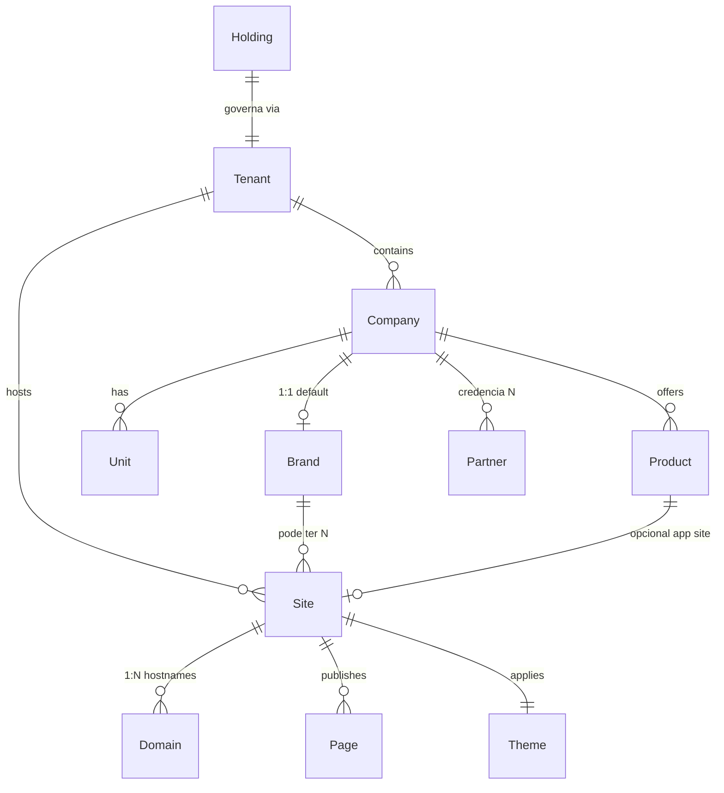
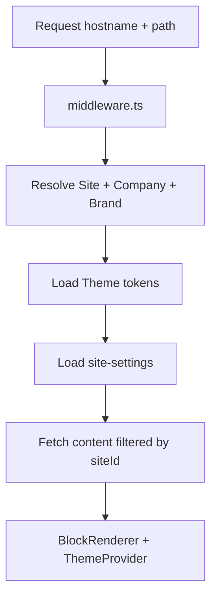
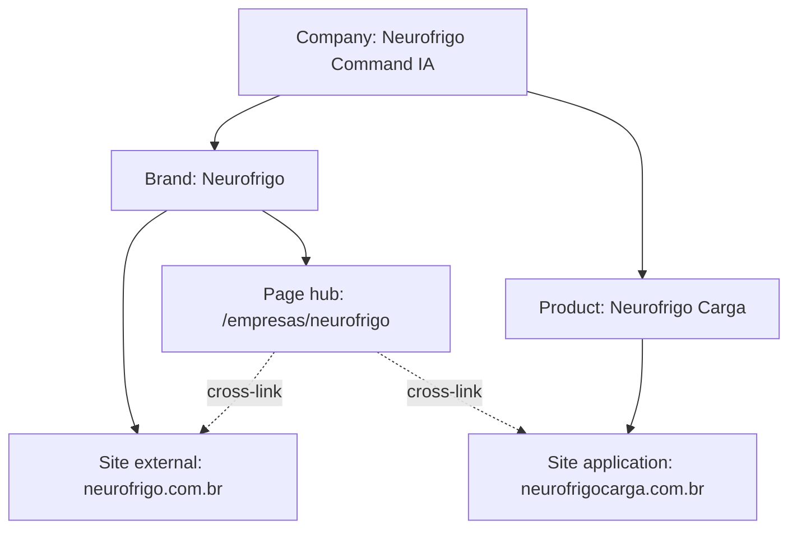
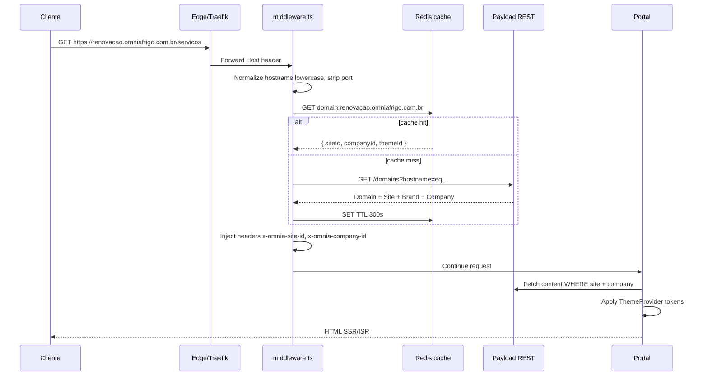

# Sprint 3.3A — Arquitetura Multisite, Multiempresa e Branding

> **Versão:** 1.0  
> **Data:** 2026-07-10  
> **Tipo:** Especificação arquitetural — **sem implementação**  
> **Escopo:** Holding, tenant, empresa, marca, site, domínio, tema, governança  
> **Documentos base:**
>
> - `docs/00-product/PRODUCT_MASTER_V2.md`
> - `docs/00-product/DOMAIN_MODEL_V2.md`
> - `docs/00-product/MASTER_ROADMAP_V2.md`
> - `docs/00-product/BACKLOG_V2.md`
> - `docs/00-product/PRODUCT_REVIEW_V2.md`
> - `docs/01-specifications/S03_CMS_FOUNDATION.md`
> - `docs/01-specifications/S03_PORTAL_ARCHITECTURE.md`

---

## Sumário

1. [Modelo conceitual](#1-modelo-conceitual)
2. [Modelo multisite](#2-modelo-multisite)
3. [Branding por empresa e site](#3-branding-por-empresa-e-site)
4. [Home da Holding — Ecossistema](#4-home-da-holding--empresas-do-ecossistema)
5. [Páginas das empresas no portal Omnia](#5-páginas-das-empresas-dentro-do-portal-omnia)
6. [Sites próprios das empresas](#6-sites-próprios-das-empresas)
7. [Neurofrigo e Neurofrigo Carga](#7-neurofrigo-e-neurofrigo-carga)
8. [CMS e conteúdo](#8-cms-e-conteúdo)
9. [Permissões e governança](#9-permissões-e-governança)
10. [Collections e globals propostos](#10-collections-e-globals-propostos)
11. [Resolução de site por domínio](#11-resolução-de-site-por-domínio)
12. [Design system federado](#12-design-system-federado)
13. [SEO multisite](#13-seo-multisite)
14. [Analytics multisite](#14-analytics-multisite)
15. [Migração futura dos sites](#15-migração-futura-dos-sites)
16. [Decisões pendentes](#16-decisões-pendentes)
17. [Critérios de aceite](#17-critérios-de-aceite)
18. [Riscos](#18-riscos)
19. [Relatório final](#19-relatório-final)

---

## Princípio central

> **A Omnia Frigo Holding é o hub do ecossistema.**  
> Cada empresa mantém identidade, domínio e site oficial próprios.  
> A plataforma central compartilha infraestrutura, CMS, CRM, LMS, IA e governança — **sem substituir automaticamente** os sites existentes.

---

## Estado atual auditado (baseline Sprint 2)

| Área              | Estado                                             | Lacuna multisite            |
| ----------------- | -------------------------------------------------- | --------------------------- |
| `tenants`         | 1 tenant `omnia-holding`                           | Sem multi-tenant externo    |
| `companies`       | 6 empresas; `externalSite` vazio no seed           | Sem brand, site, domínio    |
| `global-settings` | Único global sem escopo site                       | Não multisite               |
| `apps/web`        | Single-site; sem middleware domínio                | Sem resolução hostname      |
| `@omnia/ui`       | Tokens Holding (Montserrat, Inter, cores Omnia)    | Sem brand themes            |
| Seed              | Neurofrigo sem "Command IA"; sites externos vazios | Inconsistência nomenclatura |

**Sites oficiais de referência (não migrados):**

| Empresa                      | Domínio oficial                            |
| ---------------------------- | ------------------------------------------ |
| Fred do Frio Academy         | https://freddofrio.com.br/                 |
| Renovação Refrigeração       | https://renovacaorefrigeracao.com.br/      |
| CTE                          | https://escolacte.com.br/                  |
| Centro Educacional Sapientia | https://centroeducacionalsapientia.com.br/ |
| Neurofrigo Command IA        | https://neurofrigo.com.br/                 |
| Neurofrigo Carga (produto)   | https://www.neurofrigocarga.com.br/        |
| Omnia Platform (hub)         | https://dev.omniafrigo.com.br/ (staging)   |

---

## 1. Modelo conceitual

### 1.1 Glossário e definições

| Termo                   | Definição                                                                      | Exemplo                        | Não confundir com                 |
| ----------------------- | ------------------------------------------------------------------------------ | ------------------------------ | --------------------------------- |
| **Holding**             | Entidade jurídica e estratégica que governa o ecossistema Omnia                | Omnia Frigo Holding            | Tenant, Site                      |
| **Tenant**              | Unidade lógica de isolamento de dados, permissões, billing e políticas LGPD    | `omnia-holding`                | Company, Site                     |
| **Company**             | Empresa real ou unidade empresarial do ecossistema com operação e marca        | Renovação Refrigeração         | Partner, Brand (quando distintos) |
| **Brand**               | Identidade comercial e visual: nome de mercado, logos, paleta, tom de voz      | Neurofrigo Command IA          | Company (pode ser 1:1)            |
| **Site**                | Presença digital administrável na plataforma: conjunto de páginas, tema, menus | Portal Omnia, Site RR futuro   | Domínio, App                      |
| **Domain**              | Hostname (domínio ou subdomínio) que resolve para um Site                      | `omniafrigo.com.br` → Site Hub | URL de página                     |
| **Unit**                | Unidade física: filial, escola, escritório, operação regional                  | RR Sudeste, CTE Unidade SP     | Company                           |
| **Product/Application** | Produto digital vinculado a uma Company; pode ter Site próprio                 | Neurofrigo Carga               | Company separada                  |
| **Partner**             | Ator externo B2B credenciado; não pertence à Holding                           | Instalador credenciado RR      | Company                           |

### 1.2 Diagrama de relacionamentos



### 1.3 Cardinalidades oficiais

| Relacionamento     | Cardinalidade    | Regra                                                  |
| ------------------ | ---------------- | ------------------------------------------------------ |
| Holding → Tenant   | 1:1 (fase atual) | Uma holding, um tenant raiz                            |
| Tenant → Companies | 1:N              | **Recomendado:** N=6+ no tenant `omnia-holding`        |
| Company → Brand    | 1:1 (default)    | Brand separada só se multi-marca na mesma empresa      |
| Brand → Sites      | 1:N              | Hub Omnia + site próprio + LPs + app web               |
| Site → Domains     | 1:N              | www + apex + staging                                   |
| Company → Units    | 1:N              | Opcional; Drizzle operacional                          |
| Company → Products | 1:N              | Neurofrigo Carga é Product de Neurofrigo               |
| Tenant → Sites     | 1:N              | Todos os sites do ecossistema no mesmo tenant (fase 1) |
| Partner → Company  | N:1              | Parceiro vinculado a empresa credenciadora (ex: RR)    |

### 1.4 Holding vs Company — regra especial

| Entidade                    | No ecossistema                          | Na seção "Empresas da Holding"                |
| --------------------------- | --------------------------------------- | --------------------------------------------- |
| **Omnia Frigo Holding**     | Holding + Company `omnia-frigo-holding` | Marca **central** — não é filha de si mesma   |
| **5 empresas operacionais** | Companies filhas                        | Cards obrigatórios na seção ecossistema       |
| **Neurofrigo Carga**        | Product de Neurofrigo                   | Não é Company; pode linkar no card Neurofrigo |

### 1.5 Matriz de desambiguação

| Pergunta                                | Resposta                                                                      |
| --------------------------------------- | ----------------------------------------------------------------------------- |
| Empresa jurídica vs empresa da Holding? | Company = ambos no ecossistema; CNPJ em Drizzle `holdings`/`companies` futuro |
| Marca vs empresa?                       | Brand = identidade visual; Company = entidade de negócio; 1:1 inicialmente    |
| Site vs domínio?                        | Site = entidade CMS; Domain = hostname que aponta ao Site                     |
| Tenant vs empresa?                      | Tenant = isolamento; todas as 6 companies no mesmo tenant (fase 1)            |
| Parceiro vs empresa?                    | Partner = externo; Company = grupo Omnia                                      |
| Produto vs empresa?                     | Product = oferta digital (app, SaaS); Company = dona                          |
| Aplicação vs site?                      | App pode ser Site tipo `application` (Neurofrigo Carga)                       |

### 1.6 Empresas oficiais do ecossistema

| #   | Company                      | Slug                           | Brand            | Site oficial externo              | Papel           |
| --- | ---------------------------- | ------------------------------ | ---------------- | --------------------------------- | --------------- |
| —   | Omnia Frigo Holding          | `omnia-frigo-holding`          | Omnia            | (hub) `omniafrigo.com.br`         | Holding / hub   |
| 1   | Renovação Refrigeração       | `renovacao-refrigeracao`       | Renovação        | renovacaorefrigeracao.com.br      | Serviços        |
| 2   | Fred do Frio Academy         | `fred-do-frio-academy`         | Fred do Frio     | freddofrio.com.br                 | Educação        |
| 3   | CTE                          | `cte`                          | CTE / Escola CTE | escolacte.com.br                  | Engenharia      |
| 4   | Centro Educacional Sapientia | `centro-educacional-sapientia` | Sapientia        | centroeducacionalsapientia.com.br | Educação formal |
| 5   | Neurofrigo Command IA        | `neurofrigo`                   | Neurofrigo       | neurofrigo.com.br                 | Tecnologia/IA   |

---

## 2. Modelo multisite

### 2.1 Tipos de Site

| Tipo            | `siteType`    | Descrição                                | Exemplo                                        |
| --------------- | ------------- | ---------------------------------------- | ---------------------------------------------- |
| **hub**         | `hub`         | Portal central da Holding                | omniafrigo.com.br                              |
| **company**     | `company`     | Site institucional de marca no multisite | rr.omniafrigo.com.br ou futuro domínio próprio |
| **landing**     | `landing`     | Campanhas isoladas                       | lp.omniafrigo.com.br ou path `/lp/*`           |
| **education**   | `education`   | Portal educacional                       | academy.omniafrigo.com.br                      |
| **application** | `application` | App web / ferramenta                     | neurofrigocarga.com.br                         |
| **campaign**    | `campaign`    | Microsite temporário                     | campanha.omniafrigo.com.br                     |
| **external**    | `external`    | Site fora da plataforma (registro only)  | renovacaorefrigeracao.com.br                   |

### 2.2 Sites previstos (inventário conceitual)

| Site                           | Tipo        | Company    | Domínio(s)                                | Status fase 1     |
| ------------------------------ | ----------- | ---------- | ----------------------------------------- | ----------------- |
| Omnia Hub                      | hub         | Holding    | dev.omniafrigo.com.br, omniafrigo.com.br  | Ativo staging     |
| RR Institucional Omnia         | company     | RR         | `/empresas/renovacao-refrigeracao` no hub | Sprint 3.3B       |
| FDFA Institucional Omnia       | company     | FDFA       | path no hub                               | Sprint 3.3B       |
| CTE Institucional Omnia        | company     | CTE        | path no hub                               | Sprint 3.3B       |
| CES Institucional Omnia        | company     | CES        | path no hub                               | Sprint 3.3B       |
| Neurofrigo Institucional Omnia | company     | Neurofrigo | path no hub                               | Sprint 3.3B       |
| RR Site próprio                | external    | RR         | renovacaorefrigeracao.com.br              | Externo integrado |
| FDFA Site próprio              | external    | FDFA       | freddofrio.com.br                         | Externo integrado |
| CTE Site próprio               | external    | CTE        | escolacte.com.br                          | Externo integrado |
| CES Site próprio               | external    | CES        | centroeducacionalsapientia.com.br         | Externo integrado |
| Neurofrigo Site próprio        | external    | Neurofrigo | neurofrigo.com.br                         | Externo integrado |
| Neurofrigo Carga App           | application | Neurofrigo | neurofrigocarga.com.br                    | Externo; Product  |
| Admin                          | internal    | Holding    | admin.dev.omniafrigo.com.br               | `apps/admin`      |

### 2.3 Entidade Site — atributos obrigatórios

| Grupo             | Campos                                                                        |
| ----------------- | ----------------------------------------------------------------------------- |
| **Identidade**    | `name`, `slug`, `siteType`, `status` (draft, active, maintenance, archived)   |
| **Vínculos**      | `tenant`, `company`, `brand`, `product` (opcional)                            |
| **Domínios**      | `primaryDomain`, `domains[]` (relationship)                                   |
| **Ambiente**      | `environment` (production, staging, development)                              |
| **Locale**        | `defaultLocale` (pt-BR), `supportedLocales[]`, `timezone` (America/Sao_Paulo) |
| **Tema**          | `theme` (relationship ou embedded)                                            |
| **Branding**      | `logo`, `favicon`, overrides limitados                                        |
| **Layout**        | `header`, `footer`, `menus[]` (relationships)                                 |
| **SEO**           | `defaultSeo` (group ou plugin)                                                |
| **Analytics**     | `analyticsId`, pixels (group)                                                 |
| **Integrações**   | `integrations` (chat, CRM default company, etc.)                              |
| **Conteúdo raiz** | `homePage` (relationship page/global)                                         |
| **Editorial**     | `editorialPolicy` (richText — guidelines)                                     |
| **Contato**       | `contacts`, `social` (groups ou relationships)                                |

### 2.4 Arquitetura multisite no CMS



**Fase 1 (Sprint 3.3B):** Site único implícito (`omnia-hub`); campos `site` preparados mas default.  
**Fase 2 (Sprint 6+):** Resolução por domínio; subdomínios por empresa.  
**Fase 3 (Future):** Sites próprios servidos pela plataforma com domínio custom.

### 2.5 Convivência path-based vs domain-based

| Modo                | URL exemplo                                         | Quando                     |
| ------------------- | --------------------------------------------------- | -------------------------- |
| **Path no hub**     | `omniafrigo.com.br/empresas/renovacao-refrigeracao` | Fase 1 — imediato          |
| **Subpath empresa** | `omniafrigo.com.br/rr/...`                          | Fase 2 — COULD-020         |
| **Subdomínio**      | `renovacao.omniafrigo.com.br`                       | Fase 2                     |
| **Domínio próprio** | `renovacaorefrigeracao.com.br`                      | Fase 3 — migração opcional |
| **LP**              | `omniafrigo.com.br/lp/campanha`                     | Sprint 3                   |

---

## 3. Branding por empresa e site

### 3.1 Identidade da Holding (referência oficial)

| Token              | Valor      | Uso                          |
| ------------------ | ---------- | ---------------------------- |
| Verde esmeralda    | `#0A5A47`  | Primary, CTAs institucionais |
| Azul profundo      | `#0E2D4D`  | Secondary, headers           |
| Cobre premium      | `#C7783D`  | Accent, destaques            |
| Grafite claro      | `#8E969E`  | Texto secundário, bordas     |
| Branco puro        | `#FFFFFF`  | Backgrounds                  |
| Grafite escuro     | `#11161B`  | Texto principal, footer      |
| Tipografia títulos | Montserrat | Headings                     |
| Tipografia corpo   | Inter      | Body                         |

**Estado `@omnia/ui`:** Montserrat + Inter e cores emerald/deep-blue/copper/graphite-dark implementados. **Grafite claro `#8E969E` ainda não tokenizado** — usar `--omnia-graphite-light` na Sprint 3.3B.

### 3.2 Hierarquia de tokens (design system federado)

```
Layer 0: Core DS (@omnia/ui)     → componentes, anatomia, acessibilidade
Layer 1: Holding tokens         → --omnia-* defaults
Layer 2: Brand tokens           → --brand-primary, etc.
Layer 3: Site overrides         → limitados (accent, hero bg)
```

### 3.3 Brand theme — campos configuráveis (sem CSS arbitrário)

| Categoria          | Campos                                                               | Validação                                               |
| ------------------ | -------------------------------------------------------------------- | ------------------------------------------------------- |
| **Logos**          | primary, horizontal, vertical, symbol, light, dark                   | upload SVG/PNG; max 500KB                               |
| **Favicon**        | favicon, appleTouchIcon                                              | ICO/PNG 32×32, 180×180                                  |
| **Cores**          | primary, secondary, accent, neutral-50..900, success, warning, error | HEX regex; contraste AA automático                      |
| **Gradientes**     | primaryGradient (from/to)                                            | Apenas 2 stops pré-definidos                            |
| **Tipografia**     | fontHeading, fontBody                                                | Whitelist: Montserrat, Inter, Plus Jakarta Sans, system |
| **Ícones**         | iconStyle (outline, solid)                                           | enum                                                    |
| **Imagens**        | imageStyle (rounded, sharp), overlayOpacity                          | ranges numéricos                                        |
| **Banners**        | bannerStyle (full, contained)                                        | enum                                                    |
| **Shape**          | borderRadius (sm, md, lg), shadow (none, sm, md)                     | enum — mapeia Tailwind                                  |
| **Botões**         | buttonVariant default                                                | enum shadcn                                             |
| **Cards**          | cardStyle                                                            | enum                                                    |
| **Fundos**         | defaultBackground, alternateBackground                               | HEX ou preset                                           |
| **Acessibilidade** | minContrastRatio (4.5 ou 7)                                          | validação em save hook                                  |

**Proibido no Admin:** campo `customCss`, `inlineStyles` livres, `<script>` — apenas tokens validados.

### 3.4 Herança e override

| Propriedade   | Herança         | Override Site |
| ------------- | --------------- | ------------- |
| fontHeading   | Brand → Holding | Não (fase 1)  |
| primary color | Brand           | accent only   |
| logo          | Brand           | Não           |
| footer style  | Site            | Sim           |
| hero gradient | Site            | Sim           |
| button radius | Brand           | Não           |

### 3.5 Preview visual

- Admin: painel split "Preview marca" com componentes sample (button, card, hero)
- Staging: `?site={slug}&previewTheme=true`
- Export: JSON tokens para documentação marca

### 3.6 Brand themes por empresa (inventário inicial)

| Company                | Primary sugerido            | Notas                             |
| ---------------------- | --------------------------- | --------------------------------- |
| Omnia Holding          | #0A5A47 (emerald)           | Tema base já em `@omnia/ui`       |
| Renovação Refrigeração | A definir com brand book RR | Site externo como referência      |
| Fred do Frio Academy   | A definir                   | freddofrio.com.br                 |
| CTE                    | A definir                   | escolacte.com.br                  |
| Sapientia              | A definir                   | centroeducacionalsapientia.com.br |
| Neurofrigo             | A definir                   | neurofrigo.com.br — tech/IA       |

> **Ação Sprint 3.3B:** Auditoria visual dos 5 sites externos; extrair tokens para seed `brand-themes`.

---

## 4. Home da Holding — Empresas do ecossistema

### 4.1 Seção obrigatória

**Nome editável:** "Empresas da Holding" | "Nosso Ecossistema" | custom  
**Bloco CMS:** `company-grid` (variant `ecosystem`) ou bloco dedicado `ecosystem-section`

### 4.2 Campos da seção (global `home-page` block)

| Campo                      | Tipo                                    | Obrigatório        |
| -------------------------- | --------------------------------------- | ------------------ |
| `sectionTitle`             | text                                    | Sim                |
| `sectionSubtitle`          | textarea                                | Não                |
| `description`              | richText                                | Não                |
| `enabled`                  | checkbox                                | Sim (default true) |
| `displayOrder`             | number                                  | Via ordem blocks   |
| `layout`                   | select: grid, carousel, featured-first  | Sim                |
| `background`               | select: default, muted, image, gradient | Não                |
| `backgroundImage`          | upload                                  | Condicional        |
| `source`                   | all-ecosystem, curated, by-role         | Sim                |
| `companies`                | relationship[]                          | Se curated         |
| `excludeHoldingAsChild`    | checkbox default true                   | Sim                |
| `featuredCompany`          | relationship                            | Não                |
| `showOfficialSiteLink`     | checkbox default true                   | Sim                |
| `showInternalPageLink`     | checkbox default true                   | Sim                |
| `showRoleBadge`            | checkbox                                | Sim                |
| `showSlogan`               | checkbox                                | Não                |
| `accentColorPerCompany`    | checkbox — usa brand primary            | Não                |
| `publishedAt` / scheduling | via global home                         | Sim                |

### 4.3 Card por empresa — conteúdo

| Elemento          | Fonte                                         |
| ----------------- | --------------------------------------------- |
| Logo              | `companies.logo` ou `brand.logo`              |
| Nome              | `companies.name`                              |
| Slogan            | `companies.tagline`                           |
| Descrição curta   | `companies.shortDescription`                  |
| Área de atuação   | `companies.ecosystemRole`                     |
| Cor destaque      | `brand.theme.primary`                         |
| CTA interno       | "Conheça" → `/empresas/[slug]`                |
| Link site oficial | `companies.officialSiteUrl` → `target=_blank` |
| Imagem/vídeo card | `companies.coverImage` ou override no block   |
| Analytics         | `data-analytics="ecosystem-card-{slug}"`      |

### 4.4 Empresas obrigatórias no grid

1. Renovação Refrigeração
2. Fred do Frio Academy
3. CTE
4. Centro Educacional Sapientia
5. Neurofrigo Command IA

**Omnia Frigo Holding:** aparece no hero/narrativa central — **não** como card filho no grid (flag `excludeHoldingAsChild`).

### 4.5 Responsividade e analytics

| Breakpoint | Layout                                |
| ---------- | ------------------------------------- |
| Mobile     | 1 col; carousel swipe se >3           |
| Tablet     | 2 col                                 |
| Desktop    | 3 col; featured span 2 se configurado |

**Eventos analytics:** `ecosystem_section_view`, `ecosystem_card_click`, `official_site_click`

---

## 5. Páginas das empresas dentro do portal Omnia

### 5.1 Princípio

Páginas em `/empresas/[slug]` são **vitirine institucional no hub Omnia**.  
**Não substituem** sites oficiais. Devem exibir banner/link prominente: "Visite o site oficial".

### 5.2 Template de página empresa

| Seção            | Bloco / Campo               | Relacionamentos            |
| ---------------- | --------------------------- | -------------------------- |
| Hero             | `hero`                      | coverImage, tagline, logo  |
| Identidade       | `rich-text` + logos         | brand                      |
| Slogan           | `hero.badge` ou text        | tagline                    |
| História         | `rich-text`                 | fullDescription            |
| Missão / Visão   | `cards` 3-col               | campos dedicados companies |
| Manifesto        | `rich-text`                 | manifesto                  |
| Áreas de atuação | `cards`                     | ecosystemRole, services    |
| Serviços         | `service-grid`              | `services` where company   |
| Produtos         | `cards`                     | `products` where company   |
| Cursos           | `course-grid`               | `courses` where company    |
| Equipe           | `team`                      | companies.team[]           |
| Unidades         | `cards` + map               | `units`                    |
| Cases            | `case-highlights`           | `case-studies`             |
| Clientes         | `logos`                     | curated media              |
| Parceiros        | `partner-grid`              | partners by company        |
| Conteúdos        | `blog-highlights`           | `posts`                    |
| Downloads        | `downloads`                 | `downloads`                |
| Vídeos           | `video`                     | media                      |
| Contatos         | `contact-section`           | contacts group             |
| Redes sociais    | footer inline               | social group               |
| CTA              | `cta`                       | primaryCta, secondaryCta   |
| Mapa             | `map`                       | units geo                  |
| Site oficial     | `cta` variant link-external | officialSiteUrl            |
| SEO              | meta plugin                 | Organization schema        |

### 5.3 Relacionamentos de conteúdo

Todo conteúdo relacionado filtra `company = {slug}`:

- `services`, `courses`, `posts`, `case-studies`, `events`, `downloads`, `partners`, `forms`, `banners` (campaign)

### 5.4 Cross-link site oficial

```html
<!-- Padrão visual obrigatório -->
<aside data-component="official-site-banner">
  <p>Este é o perfil da {company} no ecossistema Omnia.</p>
  <a href="{officialSiteUrl}" rel="noopener">Acesse o site oficial →</a>
</aside>
```

---

## 6. Sites próprios das empresas

### 6.1 Princípio

A plataforma **não apaga nem substitui** automaticamente os sites existentes.

### 6.2 Opções arquiteturais

#### Opção A — Externos integrados (recomendado fase 1)

| Aspecto           | Detalhe                                                                                                    |
| ----------------- | ---------------------------------------------------------------------------------------------------------- |
| **Descrição**     | Sites permanecem onde estão; Omnia hub linka e agrega                                                      |
| **Benefícios**    | Zero risco migração; SEO preservado; time-to-market                                                        |
| **Riscos**        | Conteúdo duplicado se copiar texto; inconsistência marca                                                   |
| **SEO**           | Canonical nos sites oficiais; páginas Omnia com `rel=canonical` opcional para externo ou `noindex` se thin |
| **Domínio**       | Cada empresa mantém domínio                                                                                |
| **Analytics**     | Propriedades separadas; dashboard holding consolidado via API                                              |
| **Auth**          | Independente até SSO futuro                                                                                |
| **Sincronização** | Manual ou feed seletivo (título, logo)                                                                     |
| **Governança**    | Marketing de cada empresa dona do site externo                                                             |

#### Opção B — Conteúdo compartilhado (headless)

| Aspecto           | Detalhe                                           |
| ----------------- | ------------------------------------------------- |
| **Descrição**     | Sites externos consomem API/CMS Omnia para blocos |
| **Benefícios**    | Single source of truth; atualização central       |
| **Riscos**        | Dependência API; latência; versão CMS             |
| **SEO**           | Conteúdo no domínio externo — canonical local     |
| **Auth**          | API keys por site                                 |
| **Sincronização** | Real-time REST                                    |
| **Governança**    | Omnia CMS aprova publicação                       |

#### Opção C — Migração para multisite Omnia

| Aspecto        | Detalhe                                         |
| -------------- | ----------------------------------------------- |
| **Descrição**  | Domínio aponta para `apps/web` com Site entity  |
| **Benefícios** | Unificação total; design system; CRM/LMS nativo |
| **Riscos**     | SEO migration; redirects; retrabalho            |
| **SEO**        | Plano 301; Search Console                       |
| **Auth**       | Unificado                                       |
| **Governança** | Omnia central                                   |

#### Opção D — Híbrido (estratégia aprovada macro)

| Fase            | Modelo                                                   |
| --------------- | -------------------------------------------------------- |
| **Agora**       | Opção A — externos + hub Omnia                           |
| **Médio prazo** | Opção B — compartilhar assets, logos, posts selecionados |
| **Longo prazo** | Opção C — migração empresa a empresa se ROI positivo     |

**Não assumir migração imediata.**

### 6.3 Registro de sites externos no CMS

Collection `sites` com `siteType: external`:

- `officialSiteUrl` sincronizado com `companies.externalSite`
- `domain` registrado para analytics e cross-link
- `integrationMode: external | headless | hosted`

---

## 7. Neurofrigo e Neurofrigo Carga

### 7.1 Modelo oficial

| Entidade                   | Tipo                       | Slug/domínio                               |
| -------------------------- | -------------------------- | ------------------------------------------ |
| **Neurofrigo Command IA**  | Company + Brand            | `neurofrigo`, neurofrigo.com.br            |
| **Neurofrigo (site)**      | Site external + página hub | neurofrigo.com.br                          |
| **Neurofrigo Carga**       | **Product** (não Company)  | `neurofrigo-carga`, neurofrigocarga.com.br |
| **Neurofrigo Carga (app)** | Site type `application`    | neurofrigocarga.com.br                     |

### 7.2 Regras

1. **Uma única Company** `neurofrigo` — não criar Company para Carga
2. **Product** `neurofrigo-carga` vinculado a Company Neurofrigo
3. **Brand compartilhada** — Carga usa sub-marca (logo variant, cores derivadas)
4. **Domínio próprio** do app registrado em `domains` do Site application
5. **Cross-link:** página Neurofrigo no hub linka Carga; app linka site Neurofrigo
6. **Auth futura:** usuário Neurofrigo Carga = `customer` ou `student` com `productEntitlement`
7. **Cálculos/dimensionamentos:** lógica no app — fora do CMS
8. **CMS:** vitrine do produto Carga como `products` ou page blocks na empresa Neurofrigo

### 7.3 Diagrama



### 7.4 Seed correction (futuro)

- Renomear display `Neurofrigo` → `Neurofrigo Command IA`
- Preencher `externalSite`: `https://neurofrigo.com.br`
- Adicionar Product seed `neurofrigo-carga` com URL `https://www.neurofrigocarga.com.br`

---

## 8. CMS e conteúdo

### 8.1 Matriz de escopo de conteúdo

| Escopo                | `tenant` | `company` | `brand` | `site`   | Exemplos                                      |
| --------------------- | -------- | --------- | ------- | -------- | --------------------------------------------- |
| **Global Holding**    | ✅       | null      | null    | hub      | Home hub, políticas holding, menus principais |
| **Exclusivo empresa** | ✅       | ✅        | opt     | hub path | Posts RR, serviços RR                         |
| **Exclusivo marca**   | ✅       | ✅        | ✅      | any      | Tema, logos                                   |
| **Exclusivo Site**    | ✅       | opt       | ✅      | ✅       | Menus site próprio futuro                     |
| **Compartilhado**     | ✅       | null      | null    | all      | Design system docs, assets holding            |
| **Regional**          | ✅       | ✅        | —       | —        | Units, parceiros por cidade                   |
| **Reutilizável**      | ✅       | —         | —       | —        | Blocks, FAQs genéricos                        |
| **Sincronizado**      | ✅       | ✅        | —       | external | Logo, nome — sync unidirecional               |
| **Externo**           | —        | —         | —       | external | HTML no site legado — não no CMS              |

### 8.2 Campos obrigatórios em entidades de conteúdo

| Campo         | Obrigatório   | Descrição                       |
| ------------- | ------------- | ------------------------------- |
| `tenant`      | Sim           | Isolamento                      |
| `company`     | Condicional   | Null = holding scope            |
| `brand`       | Não           | Default from company            |
| `site`        | Fase 2+       | Null = todos os sites do tenant |
| `locale`      | Default pt-BR | i18n futuro                     |
| `_status`     | Sim           | draft/published                 |
| `publishedAt` | Se scheduled  |                                 |
| `meta`        | Sim (SEO)     | plugin SEO                      |
| `visibility`  | Sim           | public, private, authenticated  |
| `owner`       | Sim           | user/team responsável           |
| `scope`       | Sim           | holding, company, site          |

### 8.3 Prevenção de problemas

| Problema                      | Mitigação                                                   |
| ----------------------------- | ----------------------------------------------------------- |
| **Duplicação**                | Relacionamentos `related*`; não copy-paste; reusable blocks |
| **Vazamento entre empresas**  | Access control `company`; API filter obrigatório            |
| **Publicação no Site errado** | Campo `site` required em pages; validação hook              |
| **Inconsistência visual**     | Brand theme enforced; no custom CSS                         |
| **Conflito slug**             | Unique compound: `{tenant}:{site}:{slug}`                   |
| **Conflito domínio**          | Unique `domains.hostname` global                            |
| **Conteúdo duplicado SEO**    | Canonical tags; `syndicationMode` field                     |

### 8.4 Slug e domínio — regras

```
Página:  tenant + site + slug único
Empresa: tenant + slug único (global no tenant)
Domínio: hostname único na plataforma
URL hub: /empresas/{company-slug}  (não /empresa/)
```

---

## 9. Permissões e governança

### 9.1 Papéis mínimos (extensão DOMAIN_MODEL §4)

| Papel                 | Slug                  | Escopo                    |
| --------------------- | --------------------- | ------------------------- |
| Superadmin Holding    | `super_admin_holding` | Tenant inteiro            |
| Administrador Holding | `holding_admin`       | Tenant; não deleta tenant |
| Administrador empresa | `company_admin`       | Uma company               |
| Gestor de marca       | `brand_manager`       | Brand + theme             |
| Gestor de Site        | `site_manager`        | Um site                   |
| Editor                | `editor`              | CRU conteúdo scoped       |
| Marketing             | `marketing`           | Publica campanhas, LPs    |
| SEO                   | `seo_manager`         | Meta, redirects, sitemaps |
| Auditor               | `auditor`             | Read-only + audit logs    |

### 9.2 Matriz de edição

| Recurso         | super_admin | holding_admin | company_admin | site_manager | editor | seo  |
| --------------- | ----------- | ------------- | ------------- | ------------ | ------ | ---- |
| Holding globals | CRUD        | CRUD          | R             | R            | R      | RU   |
| Company page    | CRUD        | CRUD          | CRUD          | R            | CRU    | RU   |
| Brand theme     | CRUD        | CRUD          | CRU           | R            | —      | R    |
| Site config     | CRUD        | CRUD          | R             | CRUD         | R      | RU   |
| Pages scoped    | CRUD        | CRUD          | CRUD company  | CRUD site    | CRU    | RU   |
| LPs campanha    | CRUD        | CRUD          | CRUD          | CRUD         | CRU    | RU   |
| Domains         | CRUD        | CRUD          | —             | R            | —      | —    |
| Redirects       | CRUD        | CRUD          | CRU           | CRU          | R      | CRUD |

### 9.3 Workflow editorial

```
draft → review (opcional) → published
         ↑ editor          ↑ marketing/publisher
```

- Versionamento: 50 revisões por documento
- Rollback: admin restaura versão anterior
- Auditoria: `AuditLog` — who, what, when, site, company

### 9.4 Escopos de filtro Admin Payload

```typescript
// Conceitual — access control
where: {
  and: [
    { tenant: { equals: user.tenant } },
    { company: { in: user.allowedCompanies } }, // se company_admin
    { site: { equals: user.site } }, // se site_manager
  ];
}
```

---

## 10. Collections e globals propostos

> Sem implementar. Priorizar simplicidade — evitar collections desnecessárias.

### 10.1 Resumo

| Entidade          | Tipo                             | Novo/Expandir               | Prioridade |
| ----------------- | -------------------------------- | --------------------------- | ---------- |
| holdings          | Collection ou Drizzle            | Novo (Drizzle preferido)    | Should     |
| companies         | Collection                       | **Expandir** ✅ existe      | Must       |
| brands            | Collection ou group em companies | Group fase 1                | Should     |
| sites             | Collection                       | **Novo**                    | Must       |
| domains           | Collection                       | **Novo**                    | Must       |
| units             | Collection/Drizzle               | Drizzle + ref               | Future     |
| products          | Collection                       | **Novo** (Neurofrigo Carga) | Should     |
| themes            | Collection                       | Novo                        | Must       |
| design-tokens     | Embedded em themes               | Group                       | Must       |
| site-settings     | Global → per-site                | Evoluir                     | Must       |
| site-navigation   | Collection `menus` scoped        | Expand menus                | Must       |
| site-footer       | Global scoped by site            | Novo                        | Must       |
| site-home         | Global `home-page` scoped        | Expand                      | Must       |
| company-pages     | `companies.pageContent`          | Expand companies            | Must       |
| ecosystem-section | Block `ecosystem-section`        | Block                       | Must       |

### 10.2 `sites` (Collection) — NOVO

| Aspecto             | Detalhe                                                         |
| ------------------- | --------------------------------------------------------------- |
| **Objetivo**        | Representar cada presença digital                               |
| **Campos**          | §2.3 completos                                                  |
| **Relacionamentos** | tenant, company, brand, product?, theme, domains[], menus       |
| **Drafts/Versions** | Sim para config editorial                                       |
| **Permissions**     | site_manager, holding_admin                                     |
| **Indexes**         | `slug`, `siteType`, `status`, `tenant`                          |
| **Riscos**          | Over-engineering se prematuramente obrigatório em todo conteúdo |

### 10.3 `domains` (Collection) — NOVO

| Campo         | Tipo                                   |
| ------------- | -------------------------------------- |
| `hostname`    | text unique                            |
| `site`        | relationship sites                     |
| `isPrimary`   | checkbox                               |
| `environment` | production, staging                    |
| `status`      | active, pending, disabled              |
| `tlsStatus`   | pending, active (read-only integração) |
| `redirectTo`  | text — www/non-www                     |

**Indexes:** `hostname` unique  
**Riscos:** DNS manual fora do CMS; documentar runbook

### 10.4 `themes` (Collection) — NOVO

| Campo          | Tipo          |
| -------------- | ------------- |
| `name`, `slug` |               |
| `brand`        | relationship  |
| `tokens`       | group — §3.3  |
| `status`       | draft, active |

**Versions:** Sim — rollback tema  
**Riscos:** Validação contraste; testes visuais

### 10.5 `brands` — Group em `companies` (fase 1)

Evitar collection separada até multi-marca real:

```typescript
// companies.brand (group)
{ logos: {}, colors: {}, typography: {}, voice: textarea }
```

Collection `brands` quando Company 1:N Brand.

### 10.6 `products` (Collection) — NOVO

| Campo                 | Tipo                                   |
| --------------------- | -------------------------------------- |
| `name`, `slug`        |                                        |
| `company`             | relationship                           |
| `productType`         | application, service, physical, course |
| `officialUrl`         | text                                   |
| `site`                | relationship optional                  |
| `description`, `icon` |                                        |
| `relatedProducts[]`   |                                        |

**Exemplo:** Neurofrigo Carga

### 10.7 `companies` — EXPANDIR

Adicionar a `companies` existente:

| Campo                   | Tipo                              |
| ----------------------- | --------------------------------- |
| `tagline`               | text                              |
| `officialSiteUrl`       | text (renomear externalSite)      |
| `brand`                 | group                             |
| `theme`                 | relationship themes               |
| `pageContent`           | blocks[]                          |
| `mission`, `vision`     | textarea                          |
| `manifesto`             | richText                          |
| `contacts`, `social`    | groups                            |
| `team[]`                | array                             |
| `isHolding`             | checkbox                          |
| `showInEcosystem`       | checkbox                          |
| `ecosystemCardOverride` | group (slogan, accent, CTA)       |
| `meta`                  | SEO plugin                        |
| `site`                  | relationship — página hub default |

### 10.8 Globals evoluídos

| Global atual         | Evolução                               |
| -------------------- | -------------------------------------- |
| `global-settings`    | Escopo hub; remover hero → `site-home` |
| `home-page`          | + `site` relationship; blocks          |
| `header`, `footer`   | + `site` relationship                  |
| `seo-settings`       | + `site` relationship                  |
| `analytics-settings` | + `site` relationship                  |

### 10.9 Bloco `ecosystem-section`

Bloco dedicado (alternativa a `company-grid`):

- Campos §4.2 completos
- Validação: mínimo 5 companies ecosystem
- Preview com cards reais

---

## 11. Resolução de site por domínio

### 11.1 Fluxo conceitual



### 11.2 Normalização hostname

1. Lowercase
2. Remover porta (`:443`)
3. Punycode → UTF-8
4. `www.` tratado via redirect rule ou alias

### 11.3 Casos especiais

| Caso                 | Comportamento                              |
| -------------------- | ------------------------------------------ |
| Domínio desconhecido | 404 custom ou redirect hub                 |
| Domínio desativado   | 503 maintenance page CMS                   |
| Site em draft        | 404 público; preview com token             |
| Staging hostname     | `dev.omniafrigo.com.br` → Site hub staging |
| Preview              | Ignora cache; draftMode                    |
| www vs apex          | 301 para primary em `domains.isPrimary`    |
| TLS inválido         | Infra — Traefik; CMS só registra status    |

### 11.4 Cache

| Chave                | TTL  | Invalidação         |
| -------------------- | ---- | ------------------- |
| `domain:{hostname}`  | 300s | DomainUpdated event |
| `site:{id}:theme`    | 600s | ThemeUpdated        |
| `site:{id}:settings` | 300s | SiteSettingsUpdated |

### 11.5 Fallback fase 1

Sem resolução por domínio: **Site implícito `omnia-hub`** para todo tráfego `apps/web`.

---

## 12. Design system federado

### 12.1 Camadas

```
┌─────────────────────────────────────────┐
│  Site Overrides (accent, hero bg)        │
├─────────────────────────────────────────┤
│  Brand Themes (RR, FDFA, NF, CTE, CES)  │
├─────────────────────────────────────────┤
│  Omnia Holding Theme (default)          │
├─────────────────────────────────────────┤
│  Core DS — @omnia/ui components         │
└─────────────────────────────────────────┘
```

### 12.2 Core Design System (`@omnia/ui`)

Componentes compartilhados — anatomia fixa:

| Componente | Varia por marca      | Fixo            |
| ---------- | -------------------- | --------------- |
| button     | cores, radius        | sizes, a11y     |
| input      | border color         | behavior        |
| card       | shadow, radius       | layout          |
| modal      | —                    | focus trap      |
| table      | —                    | structure       |
| header     | logo, menu, colors   | semantics       |
| footer     | columns, colors      | structure       |
| hero       | bg, typography scale | layout variants |
| section    | —                    | spacing scale   |
| grid       | —                    | breakpoints     |
| form       | —                    | validation UX   |
| alert      | semantic colors      | icons           |
| badge      | brand colors         | sizes           |
| tabs       | active color         | keyboard nav    |
| accordion  | —                    | a11y            |
| breadcrumb | —                    | schema          |
| pagination | —                    | behavior        |

### 12.3 ThemeProvider (portal)

```typescript
// Conceitual — apps/web
<ThemeProvider tokens={resolveTheme(site, brand, holding)}>
  {children}
</ThemeProvider>
```

- Injeta CSS variables `--brand-primary`, etc.
- Não permite override arbitrário
- Dark mode: holding default; brand pode desabilitar

### 12.4 O que varia vs permanece consistente

| Varia por marca                  | Consistente na plataforma |
| -------------------------------- | ------------------------- |
| Cores, logos, fontes (whitelist) | Grid system, spacing      |
| Hero estilos                     | Form validation patterns  |
| Card sombras/bordas              | Modal behavior            |
| Tom de imagens                   | A11y focus states         |
| CTAs textuais                    | Breakpoints               |
|                                  | Component API (@omnia/ui) |

---

## 13. SEO multisite

### 13.1 Hierarquia SEO

```
Site.defaultSeo → Company.meta → Page.meta → Block override
```

### 13.2 Por Site

| Elemento             | Escopo                                   |
| -------------------- | ---------------------------------------- |
| `titleTemplate`      | Por site: `%s \| Renovação Refrigeração` |
| `defaultDescription` | Por site                                 |
| `robots.txt`         | Gerado por site/domínio                  |
| `sitemap.xml`        | Índice por domínio                       |
| `canonical`          | Sempre no domínio ativo do site          |
| OG locale            | `pt_BR`                                  |

### 13.3 Prevenção conteúdo duplicado

| Cenário                            | Solução                                                                   |
| ---------------------------------- | ------------------------------------------------------------------------- |
| Mesmo texto hub + site externo     | Hub: conteúdo resumo; canonical para externo **ou** conteúdo diferenciado |
| Página empresa hub vs site oficial | `officialSiteUrl` como link; não duplicar blog inteiro                    |
| LP + página institucional          | LP noindex se pago; canonical self                                        |
| Cross-post blog                    | `canonicalUrl` aponta para origem                                         |

### 13.4 Schema.org multisite

| Tipo                | Onde                          |
| ------------------- | ----------------------------- |
| Organization        | Home hub; páginas empresa     |
| LocalBusiness       | Parceiros                     |
| Course              | Cursos                        |
| SoftwareApplication | Neurofrigo Carga              |
| WebSite             | Por site com `url` do domínio |
| BreadcrumbList      | Todas páginas internas        |
| FAQPage             | FAQs                          |

### 13.5 Sitemaps por domínio

| Domínio                | Sitemaps                         |
| ---------------------- | -------------------------------- |
| omniafrigo.com.br      | pages, companies, posts, courses |
| neurofrigo.com.br      | Externo — fora do hub (fase 1)   |
| neurofrigocarga.com.br | Externo — app                    |

### 13.6 hreflang (futuro)

- `pt-BR` default
- `en` quando `locale` em Site — Sprint 6+

---

## 14. Analytics multisite

### 14.1 Modelo

| Nível                   | Propriedade                 | Exemplo                              |
| ----------------------- | --------------------------- | ------------------------------------ |
| **Site**                | GA4/GTM ID próprio          | `G-OMNIA-HUB`, `G-RR-EXT`            |
| **Holding consolidado** | BigQuery export ou Metabase | Dashboard `/holding/analytics`       |
| **Company**             | Filtro em propriedade hub   | `company=renovacao` dimension custom |

### 14.2 Eventos padrão

| Evento                 | Parâmetros                       |
| ---------------------- | -------------------------------- |
| `page_view`            | siteId, companyId, pageType      |
| `ecosystem_card_click` | companySlug, destination         |
| `official_site_click`  | companySlug, url                 |
| `lead_submit`          | formId, companyId, siteId, utm_* |
| `course_view`          | courseSlug, companyId            |
| `partner_contact`      | partnerId                        |

### 14.3 Consentimento LGPD

- Banner cookies por Site (`legal-settings`)
- Consent antes de pixels não essenciais
- `ConsentRecord` com `siteId`
- Opt-out respeitado cross-session

### 14.4 Cross-domain tracking

| Fase | Abordagem                                             |
| ---- | ----------------------------------------------------- |
| 1    | Links apenas — sem cross-domain                       |
| 2    | GA4 cross-domain linker entre hub e subdomínios Omnia |
| 3    | Sites externos — só se migrados/hosted                |

### 14.5 Segregação de dados

- Parceiro não vê analytics de outra company
- Holding admin vê consolidado
- LGPD: IPs anonimizados; retenção 14 meses GA4 default

---

## 15. Migração futura dos sites

### 15.1 Fases (sem datas)

| Fase                  | Atividade                                                  |
| --------------------- | ---------------------------------------------------------- |
| **0 — Inventário**    | Auditar URLs, conteúdo, tecnologia, analytics de cada site |
| **1 — Mapeamento**    | Company → Brand → Site external → conteúdo equivalente hub |
| **2 — Auditoria SEO** | Backlinks, rankings, páginas top, canonicals               |
| **3 — Conteúdo**      | Decidir sync vs rewrite vs migrate                         |
| **4 — Identidade**    | Extrair tokens; cadastrar themes                           |
| **5 — Componentes**   | Mapear páginas → blocks Page Builder                       |
| **6 — Homologação**   | Staging com domínio test; QA visual + SEO                  |
| **7 — Redirects**     | 301 plan; Search Console                                   |
| **8 — Cutover**       | DNS switch empresa por empresa                             |
| **9 — Monitoramento** | 404, rankings, conversões 90 dias                          |

### 15.2 Critério go/no-go migração por empresa

- ROI positivo vs manutenção dual
- Equipe marketing pronta para CMS Omnia
- Risco SEO aceitável
- Integração CRM/LMS necessária no domínio

### 15.3 Empresas — prioridade sugerida (hipótese)

1. CTE / Sapientia — conteúdo mais institucional
2. FDFA — integração cursos
3. RR — parceiros + CRM
4. Neurofrigo — integração IA/app
5. Sites já complexos — avaliar caso a caso

**Não definir data.**

---

## 16. Decisões pendentes

| #    | Decisão                            | Opções                                 | Recomendação                       |
| ---- | ---------------------------------- | -------------------------------------- | ---------------------------------- |
| D-01 | Tenant por Holding ou por empresa? | 1 tenant N companies / N tenants       | **1 tenant** `omnia-holding`       |
| D-02 | Site como collection?              | Sim / implícito                        | **Sim** — preparar fase 1 implicit |
| D-03 | Theme como collection ou campo?    | Collection / group / JSON              | **Collection** `themes`            |
| D-04 | Menus por collection ou global?    | Collection scoped / global             | **Collection `menus`** + `site` FK |
| D-05 | Compartilhamento conteúdo          | Relacionamento / duplicação / sync     | **Relacionamento** primário        |
| D-06 | Migração sites atuais?             | A/B/C/D híbrido                        | **D — híbrido** fase A agora       |
| D-07 | White label futuro?                | Sim (FUT-007) / não                    | Sim — arquitetura prepara          |
| D-08 | Assets oficiais de marca           | Media Payload / DAM externo            | **Media Payload** pastas por brand |
| D-09 | Regras domínio e TLS               | Manual DNS / integração Cloudflare API | **Manual** fase 1; API fase 3      |
| D-10 | Brand: collection ou group?        | group / collection                     | **group em companies** fase 1      |
| D-11 | Holding na seção ecossistema?      | card / só hero                         | **Só hero** — não card filho       |
| D-12 | Neurofrigo Carga como Product?     | Product / Company                      | **Product** ✅                     |
| D-13 | Path `/empresa` vs `/empresas`     | singular / plural                      | **Plural** `/empresas`             |
| D-14 | Grafite claro #8E969E no DS?       | adicionar / ignorar                    | **Adicionar** token                |
| D-15 | Site field obrigatório em pages?   | agora / fase 2                         | **Fase 2** — default hub           |
| D-16 | Canonical hub vs externo           | hub canonical / externo / diferenciado | **Conteúdo diferenciado** + link   |
| D-17 | SSO cross-sites?                   | SAML futuro / independente             | **Independente** até FUT-013       |

---

## 17. Critérios de aceite

Arquitetura aprovada quando:

| ID    | Critério                                                                                          |
| ----- | ------------------------------------------------------------------------------------------------- |
| AC-01 | Modelo conceitual Holding/Tenant/Company/Brand/Site/Domain/Product/Partner documentado e aprovado |
| AC-02 | 6 empresas + Neurofrigo Carga como Product — sem Company duplicada                                |
| AC-03 | Sites externos registrados com `integrationMode: external`                                        |
| AC-04 | Hierarquia tokens Holding → Brand → Site definida                                                 |
| AC-05 | Seção ecossistema home especificada com 5 empresas obrigatórias                                   |
| AC-06 | Template página empresa hub com link site oficial obrigatório                                     |
| AC-07 | Fluxo resolução domínio documentado (mesmo que fase 2)                                            |
| AC-08 | Matriz permissões multisite definida                                                              |
| AC-09 | Collections/globals propostos com justificativa                                                   |
| AC-10 | SEO duplicado e canonical strategy definida                                                       |
| AC-11 | Decisões D-01 a D-12 aprovadas por steering                                                       |
| AC-12 | Impactos em S03_CMS_FOUNDATION e S03_PORTAL mapeados                                              |
| AC-13 | Nenhum CSS arbitrário no Admin — apenas tokens                                                    |
| AC-14 | Migração futura em fases sem data comprometida                                                    |

---

## 18. Riscos

| ID   | Risco                                         | Prob. | Impacto | Mitigação                                   |
| ---- | --------------------------------------------- | ----- | ------- | ------------------------------------------- |
| R-01 | Confusão Company/Brand/Site                   | Alta  | Alto    | Glossário §1; treinamento admin             |
| R-02 | Duplicação SEO hub vs externos                | Alta  | Alto    | Conteúdo diferenciado; canonical strategy   |
| R-03 | Scope creep multisite prematuro               | Média | Alto    | Fase 1 site implícito; campos preparatórios |
| R-04 | Temas quebram a11y contraste                  | Média | Alto    | Validação automática em themes              |
| R-05 | Permissões incorretas vazam conteúdo          | Média | Crítico | Access hooks + testes por company           |
| R-06 | Neurofrigo Carga como Company                 | Baixa | Médio   | Regra explícita §7                          |
| R-07 | Holding como card filha de si                 | Média | Baixo   | `excludeHoldingAsChild`                     |
| R-08 | Domínio mal configurado                       | Média | Alto    | Runbook DNS; staging primeiro               |
| R-09 | Inconsistência visual entre marcas            | Alta  | Médio   | Brand audit; DS federado                    |
| R-10 | `@omnia/ui` só tema Holding                   | Alta  | Médio   | ThemeProvider Sprint 3.3B                   |
| R-11 | `externalSite` vazio no seed                  | Alta  | Baixo   | Seed update com URLs oficiais               |
| R-12 | Conflito S03_PORTAL `/empresa` vs `/empresas` | Baixa | Baixo   | Padronizar plural                           |
| R-13 | Analytics cross-domain LGPD                   | Média | Alto    | Consent por site                            |
| R-14 | Migração prematura sites                      | Média | Alto    | Opção A default; go/no-go por empresa       |
| R-15 | Schema excessivo sites/domains                | Média | Médio   | YAGNI fase 1                                |

---

## 19. Relatório final

### 19.1 Arquivos analisados

| Caminho                                             | Propósito                                      |
| --------------------------------------------------- | ---------------------------------------------- |
| `docs/00-product/PRODUCT_MASTER_V2.md`              | Visão multiempresa, empresas, CMS-first        |
| `docs/00-product/DOMAIN_MODEL_V2.md`                | Tenancy, Company, Brand VO, RBAC               |
| `docs/00-product/MASTER_ROADMAP_V2.md`              | Sprint 3 escopo                                |
| `docs/00-product/BACKLOG_V2.md`                     | HOLD-*, COULD-020 subdomínio                   |
| `docs/00-product/PRODUCT_REVIEW_V2.md`              | Lacunas holding, Neurofrigo nome               |
| `docs/01-specifications/S03_CMS_FOUNDATION.md`      | Collections, globals, blocks, companies expand |
| `docs/01-specifications/S03_PORTAL_ARCHITECTURE.md` | Rotas, empresas, SEO, performance              |
| `apps/admin/payload.config.ts`                      | 4 collections, 1 global                        |
| `apps/admin/src/collections/*`                      | Companies, Tenants, Media, Users               |
| `apps/admin/src/globals/GlobalSettings.ts`          | Global único                                   |
| `apps/admin/src/seed/holding-companies.ts`          | 6 empresas, sites vazios                       |
| `apps/web/src/**`                                   | Single-site, sem middleware domínio            |
| `packages/ui/tailwind.config.ts`                    | Tokens Holding                                 |
| `packages/ui/src/styles/globals.css`                | CSS variables Omnia                            |
| `packages/config/src/**`                            | app URLs, storage                              |

### 19.2 Entidades propostas

| Entidade      | Tipo                      | Status    |
| ------------- | ------------------------- | --------- |
| Holding       | Drizzle / metadata        | Novo      |
| Tenant        | Collection ✅             | Existe    |
| Company       | Collection                | Expandir  |
| Brand         | Group → Collection futuro | Novo      |
| Site          | Collection                | **Novo**  |
| Domain        | Collection                | **Novo**  |
| Unit          | Drizzle                   | Futuro    |
| Product       | Collection                | **Novo**  |
| Theme         | Collection                | **Novo**  |
| Design Tokens | Group em Theme            | Novo      |
| Partner       | Collection Sprint 7       | Planejado |

**Total entidades novas/expandidas:** 10

### 19.3 Collections propostas

| Collection  | Ação                       |
| ----------- | -------------------------- |
| `sites`     | Criar                      |
| `domains`   | Criar                      |
| `themes`    | Criar                      |
| `products`  | Criar                      |
| `companies` | Expandir                   |
| `menus`     | Expandir (+ site FK)       |
| `holdings`  | Opcional Drizzle           |
| `brands`    | Adiar — group em companies |

**Novas:** 4 | **Expandir:** 3

### 19.4 Globals propostos

| Global               | Ação                                       |
| -------------------- | ------------------------------------------ |
| `home-page`          | + `site` scope                             |
| `header`             | + `site` scope                             |
| `footer`             | + `site` scope                             |
| `seo-settings`       | + `site` scope                             |
| `analytics-settings` | + `site` scope                             |
| `global-settings`    | Holding-only; deprecar hero                |
| `site-settings`      | Novo alias por site (ou fields em `sites`) |

**Novos/evoluídos:** 7

### 19.5 Decisões pendentes

**17 decisões** listadas em §16 — aprovação steering obrigatória antes da Sprint 3.3B.

Críticas: D-01 (tenant único), D-06 (híbrido), D-12 (Carga = Product), D-11 (holding não é filha).

### 19.6 Inconsistências encontradas

| ID     | Inconsistência                                                  | Entre                                                   |
| ------ | --------------------------------------------------------------- | ------------------------------------------------------- |
| INC-01 | Seed `Neurofrigo` vs `Neurofrigo Command IA`                    | seed vs PRODUCT                                         |
| INC-02 | `externalSite` vazio vs URLs oficiais conhecidas                | seed vs briefing                                        |
| INC-03 | Grafite claro `#8E969E` não tokenizado                          | briefing vs `@omnia/ui`                                 |
| INC-04 | `brands` como collection em S03_CMS vs group aqui               | CMS_FOUNDATION vs este doc — **resolver: group fase 1** |
| INC-05 | S03_PORTAL não menciona `sites` collection                      | PORTAL vs MULTISITE — **este doc supersede**            |
| INC-06 | DOMAIN_MODEL `Brand` VO embedded vs Site não modelado           | DOMAIN vs este doc — **complementar**                   |
| INC-07 | PRODUCT_MASTER `global-settings` vs `site-home` por site        | PRODUCT vs multisite                                    |
| INC-08 | CTE seed sem nome expandido "Centro de Tecnologia e Engenharia" | seed vs PRODUCT                                         |

### 19.7 Riscos principais

R-01 confusão entidades, R-02 SEO duplicado, R-03 scope creep, R-05 permissões, R-10 tema único Holding.

### 19.8 Impactos no CMS Foundation (`S03_CMS_FOUNDATION.md`)

| Área                      | Impacto                                                    | Ação 3.3B               |
| ------------------------- | ---------------------------------------------------------- | ----------------------- |
| `companies` expand        | Adicionar brand group, officialSiteUrl, pageContent, theme | Atualizar spec CMS      |
| Globals                   | + `site` FK em home, header, footer                        | Evoluir spec            |
| Novas collections         | sites, domains, themes, products                           | Adicionar ao CMS spec   |
| Bloco `ecosystem-section` | Novo bloco dedicado                                        | Adicionar blocks list   |
| Access control            | company + site scope                                       | Adicionar § permissões  |
| Media                     | Pastas por brand/company                                   | Atualizar Media spec    |
| Fase 1                    | Site implícito `omnia-hub`                                 | Não bloquear Sprint 3.3 |

### 19.9 Impactos no Portal Architecture (`S03_PORTAL_ARCHITECTURE.md`)

| Área               | Impacto                                       | Ação 3.3B                             |
| ------------------ | --------------------------------------------- | ------------------------------------- |
| `middleware.ts`    | Preparar headers site/company; domínio fase 2 | Stub middleware                       |
| `ThemeProvider`    | Novo wrapper portal                           | Implementar                           |
| `/empresas/[slug]` | + official site banner                        | Template update                       |
| Home ecosystem     | Bloco `ecosystem-section`                     | BlockRenderer                         |
| SEO                | Canonical strategy multisite                  | metadata.ts                           |
| Rotas              | Sem mudança fase 1                            | —                                     |
| Analytics          | `siteId` em eventos                           | data layer                            |
| Neurofrigo Carga   | Rota produto ou link externo                  | `/empresas/neurofrigo` seção produtos |

### 19.10 Recomendação para Sprint 3.3B

**Sprint 3.3B — Implementação fundação multisite (mínimo viável):**

1. **Aprovar decisões D-01, D-06, D-11, D-12, D-13** em reunião steering
2. **Expandir `companies`** com `officialSiteUrl`, brand group, pageContent, tagline, `showInEcosystem`
3. **Seed update** — URLs oficiais + rename Neurofrigo + Product Neurofrigo Carga
4. **Collection `sites`** — criar com 1 registro `omnia-hub` + 6 external sites
5. **Collection `products`** — Neurofrigo Carga
6. **Collection `themes`** — tema Holding + placeholders brands
7. **Token `--omnia-graphite-light`** em `@omnia/ui`
8. **ThemeProvider** no portal com fallback Holding
9. **Bloco `ecosystem-section`** + migrar home
10. **Página empresa** com banner site oficial
11. **Campos `site` nullable** em pages/globals — default hub
12. **Não implementar** resolução por domínio ainda — apenas schema + middleware stub
13. **Atualizar** `S03_CMS_FOUNDATION` e `S03_PORTAL` em sprint documental separada (pós-aprovação)
14. **E2E:** ecosystem 5 cards; link externo; tema Holding aplicado

**Não fazer na 3.3B:**

- Migração sites externos
- DNS multisite
- Domínios custom por empresa
- SSO cross-domain

### 19.11 Estatísticas

| Métrica                        | Valor                           |
| ------------------------------ | ------------------------------- |
| Entidades no modelo conceitual | 9                               |
| Empresas oficiais              | 6 (5 no grid + holding central) |
| Products iniciais              | 1 (Neurofrigo Carga)            |
| Sites inventariados            | 13                              |
| Collections novas propostas    | 4                               |
| Globals evoluídos              | 7                               |
| Decisões pendentes             | 17                              |
| Inconsistências                | 8                               |
| Riscos catalogados             | 15                              |

---

_Omnia Platform — Sprint 3.3A Multisite & Branding Architecture © 2026_  
_Documentação apenas — aguardando revisão humana antes da Sprint 3.3B._
