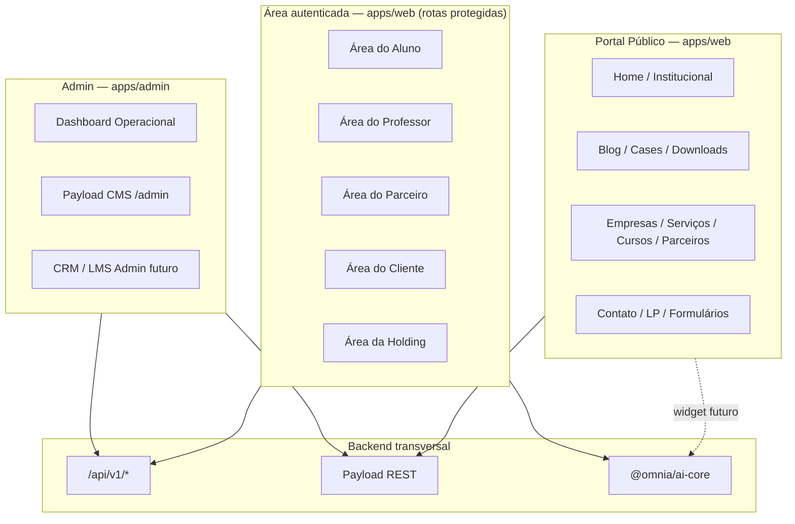
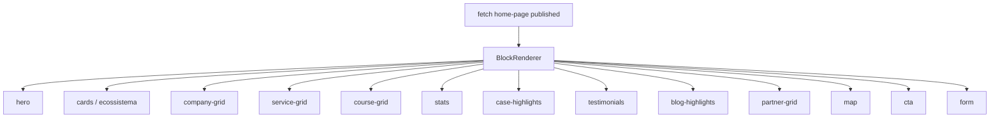
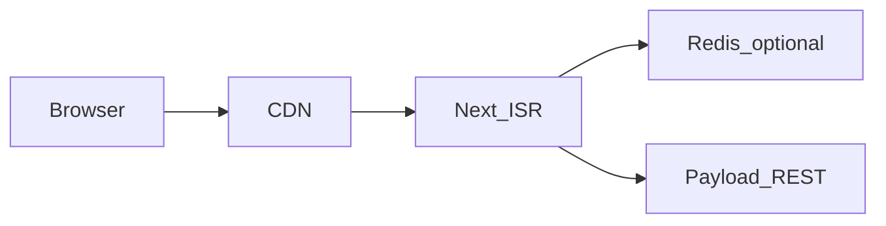
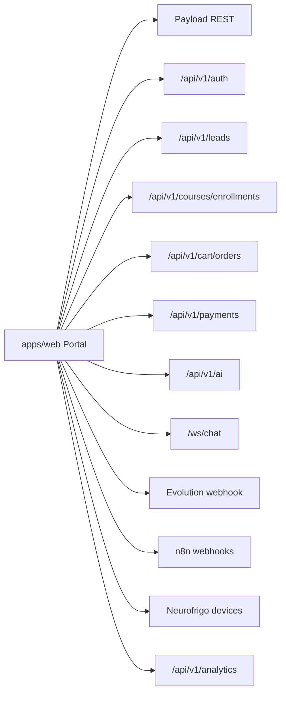

# Sprint 3.2 — Arquitetura do Portal Público

> **Versão:** 1.0  
> **Data:** 2026-07-10  
> **Tipo:** Especificação arquitetural — **sem implementação**  
> **App:** `apps/web` (Portal Público)  
> **Princípios:** CMS-First (ADR-004), multiempresa, SEO em toda página, preview/versionamento  
> **Documentos base:**  
> - `docs/00-product/PRODUCT_MASTER_V2.md`  
> - `docs/00-product/DOMAIN_MODEL_V2.md`  
> - `docs/00-product/MASTER_ROADMAP_V2.md`  
> - `docs/00-product/BACKLOG_V2.md`  
> - `docs/00-product/PRODUCT_REVIEW_V2.md`  
> - `docs/01-specifications/S03_CMS_FOUNDATION.md`

---

## Sumário

1. [Arquitetura geral do Portal](#1-arquitetura-geral-do-portal)
2. [Mapa completo de rotas](#2-mapa-completo-de-rotas)
3. [Estrutura da Home](#3-estrutura-da-home)
4. [Páginas institucionais](#4-arquitetura-das-páginas-institucionais)
5. [Landing Pages](#5-arquitetura-das-landing-pages)
6. [Blog](#6-arquitetura-do-blog)
7. [Páginas das empresas da Holding](#7-arquitetura-das-páginas-das-empresas-da-holding)
8. [Parceiros](#8-arquitetura-dos-parceiros)
9. [Cursos](#9-arquitetura-dos-cursos)
10. [Portal IA](#10-arquitetura-do-portal-ia)
11. [SEO](#11-arquitetura-seo)
12. [Navegação](#12-arquitetura-de-navegação)
13. [Responsividade](#13-arquitetura-responsiva)
14. [Performance](#14-arquitetura-de-performance)
15. [Integrações futuras](#15-integrações-futuras)
16. [Checklist de implementação](#16-checklist-de-implementação)
17. [Relatório final](#17-relatório-final)

---

## 1. Arquitetura geral do Portal

### 1.1 Visão do ecossistema de superfícies

A Omnia Platform **não é um site institucional**. O portal (`apps/web`) é a **porta de entrada pública** do ecossistema, conectando holding, empresas, parceiros, educação, comércio, suporte e IA.



### 1.2 Separação de superfícies

| Superfície | App / Rota base | Audiência | Auth | Fonte de dados |
|------------|-----------------|-----------|------|----------------|
| **Portal Público** | `apps/web` — rotas sem prefixo | Visitantes, SEO, conversão | Não | Payload REST + APIs públicas |
| **Admin Operacional** | `apps/admin` — `/` (frontend) | Equipe interna | Payload users (Sprint 3+) | Payload + Drizzle |
| **CMS Payload** | `apps/admin` — `/admin` | Marketing, editores | Payload auth | Payload direto |
| **Área autenticada** | `apps/web` — `/minha-conta`, `/dashboard` | Usuários logados (app) | JWT `@omnia/auth` | Drizzle + APIs |
| **Área do aluno** | `apps/web` — `/aluno/*` | Role `student` | JWT + RBAC | LMS APIs + CMS vitrine |
| **Área do professor** | `apps/web` — `/professor/*` | Role `instructor` | JWT + RBAC | LMS APIs |
| **Área do parceiro** | `apps/web` — `/parceiro/*` | Role `partner` | JWT + RBAC | Partners + CRM APIs |
| **Área do cliente** | `apps/web` — `/cliente/*` | Role `customer` | JWT + RBAC | Marketplace + matrículas |
| **Área da Holding** | `apps/web` ou `apps/admin` — `/holding/*` | `super_admin_holding`, `company_admin` | JWT + RBAC | Analytics consolidado |

### 1.3 Princípios arquiteturais do portal

| # | Princípio | Implementação |
|---|-----------|---------------|
| P1 | **CMS-First** | Conteúdo marketing via Payload; código = estrutura + renderers |
| P2 | **ADR-004** | Portal nunca importa Payload; consome REST do admin |
| P3 | **Multiempresa** | Toda página carrega contexto `tenant` + `company` opcional |
| P4 | **SEO universal** | `generateMetadata()` por rota; plugin SEO no CMS |
| P5 | **Preview** | `draftMode()` + token JWT em staging |
| P6 | **Versionamento** | Conteúdo CMS com drafts/versions; portal só `published` |
| P7 | **Publicação programada** | `publishedAt` — portal respeita data/hora |
| P8 | **Relacionamentos** | Páginas linkam empresas, cursos, parceiros, posts, serviços |
| P9 | **Progressive enhancement** | Público funciona sem JS; áreas autenticadas são SPA-like |
| P10 | **Isolamento de apps** | Portal e Admin deploy independentes (Docker staging atual) |

### 1.4 Estrutura de pastas alvo (`apps/web`)

```
apps/web/src/
├── app/                          # App Router Next.js 15
│   ├── (public)/                 # Layout público (header/footer CMS)
│   │   ├── page.tsx              # Home
│   │   ├── [slug]/page.tsx       # Páginas dinâmicas CMS
│   │   ├── empresas/
│   │   ├── servicos/
│   │   ├── parceiros/
│   │   ├── cursos/
│   │   ├── blog/
│   │   ├── lp/
│   │   └── ...
│   ├── (auth)/                   # Login, cadastro, recuperação
│   ├── (portal)/                 # Áreas autenticadas (middleware RBAC)
│   │   ├── aluno/
│   │   ├── professor/
│   │   ├── parceiro/
│   │   ├── cliente/
│   │   └── holding/
│   ├── api/                      # BFF portal: preview, revalidate, health
│   └── layout.tsx
├── components/
│   ├── blocks/                   # Renderers Page Builder (1:1 Payload blocks)
│   ├── layout/                   # Header, Footer, Breadcrumb, Search
│   ├── seo/                      # JsonLd, BreadcrumbSchema
│   └── ...
├── lib/
│   ├── cms.ts                    # Cliente REST Payload
│   ├── api.ts                    # Cliente /api/v1 (auth, LMS, CRM)
│   ├── blocks-map.ts             # Registry bloco → componente
│   └── metadata.ts               # Helpers generateMetadata
└── middleware.ts                 # Auth, redirects, tenant resolution
```

### 1.5 Resolução de contexto multiempresa

| Mecanismo | Sprint | Descrição |
|-----------|--------|-----------|
| **Tenant único** | 3 | Default `omnia-holding` em todas as queries |
| **Company por URL** | 3 | `/empresas/[slug]` resolve `company` |
| **Company por subpath** | 6+ | `/rr/blog` (futuro — COULD-020 backlog) |
| **Company por domínio** | 6+ | `renovacao.omniafrigo.com.br` (futuro) |
| **Header `X-Omnia-Company-Id`** | 5+ | APIs internas autenticadas |

---

## 2. Mapa completo de rotas

### 2.1 Legenda

| Símbolo | Significado |
|---------|-------------|
| 🌐 | Pública |
| 🔐 | Autenticada (JWT) |
| 🛡️ | RBAC por role |
| ⚙️ | Interna (API/BFF) |
| 🏢 | Admin (`apps/admin`) |
| 📅 | Sprint alvo |

### 2.2 Rotas públicas — Institucional e CMS

| Rota | Página | CMS / API | Sprint |
|------|--------|-----------|--------|
| `/` | Home | Global `home-page` | 3 |
| `/sobre` | Sobre a Omnia | `pages` slug `sobre` | 3 |
| `/ecossistema` | Narrativa ecossistema | `pages` slug `ecossistema` | 3 |
| `/empresas` | Listagem empresas holding | `companies` + bloco `company-grid` | 3 |
| `/empresas/[slug]` | Página da empresa | `companies.pageContent` | 3 |
| `/contato` | Contato | `pages` + `contact-settings` + form | 3–5 |
| `/faq` | FAQ geral | `faqs` + bloco `faq` | 3–4 |
| `/[slug]` | Página dinâmica genérica | `pages` | 3 |
| `/lp/[slug]` | Landing page campanha | `landing-pages` | 3 |
| `/politica-de-privacidade` | LGPD privacidade | `pages` + `legal-settings` | 4 |
| `/termos-de-uso` | Termos | `pages` + `legal-settings` | 4 |
| `/politica-de-cookies` | Cookies | `pages` + `legal-settings` | 4 |
| `/lgpd` | Portal LGPD titular | `pages` + form (futuro) | 16 |

### 2.3 Rotas públicas — Serviços

| Rota | Página | CMS | Sprint |
|------|--------|-----|--------|
| `/servicos` | Catálogo serviços | `services` list + page | 5 |
| `/servicos/[slug]` | Detalhe serviço | `services` | 5 |
| `/servicos/categoria/[slug]` | Filtro categoria | taxonomy futura | 5 |

### 2.4 Rotas públicas — Parceiros e mapa

| Rota | Página | CMS / API | Sprint |
|------|--------|-----------|--------|
| `/parceiros` | Diretório parceiros | `partners` list | 7 |
| `/parceiros/[slug]` | Perfil público parceiro | `partners` | 7 |
| `/mapa` | Mapa interativo | `partners` + geo API | 7 |
| `/encontrar-parceiro` | Alias busca geo | redirect → `/mapa` | 7 |
| `/parceiros/cadastro` | Solicitar cadastro | form → partner pending | 7 |

### 2.5 Rotas públicas — Educação (vitrine)

| Rota | Página | CMS | Sprint |
|------|--------|-----|--------|
| `/cursos` | Catálogo cursos | `courses` | 8 |
| `/cursos/[slug]` | Página do curso (vitrine) | `courses` | 8 |
| `/cursos/categoria/[slug]` | Categoria curso | `course-categories` | 8 |
| `/trilhas` | Learning paths | `learning-paths` | 9 |
| `/trilhas/[slug]` | Detalhe trilha | CMS + Drizzle | 9 |

### 2.6 Rotas públicas — Conteúdo editorial

| Rota | Página | CMS | Sprint |
|------|--------|-----|--------|
| `/blog` | Blog principal | `posts` type=blog | 4 |
| `/blog/[slug]` | Post blog | `posts` | 4 |
| `/blog/categoria/[slug]` | Categoria | `categories` | 4 |
| `/blog/tag/[slug]` | Tag | `tags` | 4 |
| `/artigos` | Artigos técnicos | `posts` type=article | 4 |
| `/artigos/[slug]` | Artigo | `posts` | 4 |
| `/noticias` | Notícias | `posts` type=news | 4 |
| `/noticias/[slug]` | Notícia | `posts` | 4 |
| `/cases` | Cases | `case-studies` list | 4–5 |
| `/cases/[slug]` | Case detalhe | `case-studies` | 4–5 |
| `/materiais` | Downloads/materiais | `downloads` | 4 |
| `/materiais/[slug]` | Download detalhe | `downloads` | 4 |
| `/downloads` | Alias materiais | redirect → `/materiais` | 4 |
| `/eventos` | Eventos | `events` | 4 |
| `/eventos/[slug]` | Evento | `events` | 4 |
| `/videos` | Vídeos | `media` + posts | 4+ |
| `/autores` | Autores | `authors` | 4 |
| `/autores/[slug]` | Perfil autor | `authors` + posts | 4 |

### 2.7 Rotas públicas — Marketplace (futuro)

| Rota | Página | Sprint |
|------|--------|--------|
| `/loja` | Catálogo produtos | 10 |
| `/loja/[slug]` | Produto | 10 |
| `/loja/categoria/[slug]` | Categoria | 10 |
| `/carrinho` | Carrinho | 10 |
| `/checkout` | Checkout | 10 |
| `/checkout/sucesso` | Confirmação | 10 |
| `/checkout/erro` | Falha pagamento | 10 |

### 2.8 Rotas públicas — IA, suporte e utilitários

| Rota | Página | Sprint |
|------|--------|--------|
| `/ia` | Página assistente IA | 12 |
| `/assistencia` | Central ajuda | 11 |
| `/chat` | Chat fullscreen (redirect widget) | 11 |
| `/busca` | Busca site-wide | 4 |
| `/feed.xml` | RSS blog | 4 |
| `/sitemap.xml` | Índice sitemap | 3–4 |
| `/sitemap-pages.xml` | Sitemap páginas | 3 |
| `/sitemap-posts.xml` | Sitemap posts | 4 |
| `/sitemap-courses.xml` | Sitemap cursos | 8 |
| `/sitemap-partners.xml` | Sitemap parceiros | 7 |
| `/robots.txt` | Robots dinâmico | 3 |

### 2.9 Rotas autenticadas — Auth gateway

| Rota | Página | Role | Sprint |
|------|--------|------|--------|
| `/login` | Login | — | 3 |
| `/cadastro` | Registro | — | 8+ |
| `/recuperar-senha` | Reset password | — | 3 |
| `/verificar-email` | Confirmação e-mail | — | 6 |
| `/dashboard` | Redirect por role | any | 3 |
| `/minha-conta` | Perfil usuário | any | 3 |
| `/minha-conta/preferencias` | Notificações, LGPD | any | 6 |
| `/minha-conta/seguranca` | Senha, MFA futuro | any | 16+ |

### 2.10 Rotas autenticadas — Área do aluno

| Rota | Página | Sprint |
|------|--------|--------|
| `/aluno` | Dashboard aluno | 8 |
| `/aluno/cursos` | Meus cursos | 8 |
| `/aluno/cursos/[slug]` | Curso matriculado | 8 |
| `/aluno/cursos/[slug]/aulas/[lessonSlug]` | Player aula | 8 |
| `/aluno/cursos/[slug]/materiais` | Materiais | 8 |
| `/aluno/provas/[examId]` | Prova online | 9 |
| `/aluno/certificados` | Certificados | 9 |
| `/aluno/certificados/[code]` | Verificar certificado | 9 |
| `/aluno/calendario` | Turmas/agenda | 9 |
| `/aluno/comunidade` | Fórum (futuro) | Future |

### 2.11 Rotas autenticadas — Área do professor

| Rota | Página | Sprint |
|------|--------|--------|
| `/professor` | Dashboard professor | 9 |
| `/professor/turmas` | Turmas | 9 |
| `/professor/turmas/[id]` | Detalhe turma | 9 |
| `/professor/cursos/[slug]` | Gestão curso | 9 |
| `/professor/cursos/[slug]/alunos` | Lista alunos | 9 |
| `/professor/cursos/[slug]/provas` | Provas e notas | 9 |
| `/professor/cursos/[slug]/materiais` | Upload materiais | 9 |

### 2.12 Rotas autenticadas — Área do parceiro

| Rota | Página | Sprint |
|------|--------|--------|
| `/parceiro` | Dashboard parceiro | 7 |
| `/parceiro/perfil` | Editar perfil (sync CMS) | 7 |
| `/parceiro/leads` | Leads recebidos | 7 |
| `/parceiro/leads/[id]` | Detalhe lead | 7 |
| `/parceiro/avaliacoes` | Reviews | 7 |
| `/parceiro/materiais` | Materiais marketing | 7 |
| `/parceiro/comissoes` | Comissões | 7+ |
| `/parceiro/disponibilidade` | Horários/plantão | 7 |

### 2.13 Rotas autenticadas — Área do cliente

| Rota | Página | Sprint |
|------|--------|--------|
| `/cliente` | Dashboard cliente | 10 |
| `/cliente/pedidos` | Pedidos marketplace | 10 |
| `/cliente/pedidos/[id]` | Detalhe pedido | 10 |
| `/cliente/matriculas` | Matrículas | 8 |
| `/cliente/servicos` | Contratos RR (futuro) | Future |
| `/cliente/faturas` | Faturas | 10 |

### 2.14 Rotas autenticadas — Área da Holding

| Rota | Página | Role | Sprint |
|------|--------|------|--------|
| `/holding` | Dashboard consolidado | admin holding | 15 |
| `/holding/empresas` | Métricas por empresa | admin | 15 |
| `/holding/leads` | Leads consolidados | sales admin | 15 |
| `/holding/conteudo` | Atalho CMS | editor | 3 |
| `/holding/analytics` | BI / conversões | admin | 15 |
| `/holding/usuarios` | Gestão usuários | super_admin | 3 |

### 2.15 Rotas autenticadas — Suporte

| Rota | Página | Sprint |
|------|--------|--------|
| `/suporte` | Central suporte | 11 |
| `/suporte/tickets` | Meus tickets | 11 |
| `/suporte/tickets/[id]` | Ticket detalhe | 11 |
| `/suporte/tickets/novo` | Abrir ticket | 11 |

### 2.16 Rotas internas (BFF portal)

| Rota | Função | Sprint |
|------|--------|--------|
| `/api/health` | Health check | 2 ✅ |
| `/api/status` | Status plataforma | 2 ✅ |
| `/api/preview` | Habilitar draftMode | 3 |
| `/api/revalidate` | Invalidar cache ISR | 3 |
| `/api/og` | OG image dinâmica (futuro) | 4+ |

### 2.17 Rotas administrativas (`apps/admin`)

| Rota | App | Função |
|------|-----|--------|
| `/` | admin frontend | Dashboard operacional |
| `/admin` | Payload | CMS completo |
| `/admin/collections/*` | Payload | CRUD collections |
| `/admin/globals/*` | Payload | Globals |
| `/api/*` | Payload | REST API consumida pelo portal |

> **Nota:** Rotas `/admin` e `/api` do Payload **não** fazem parte de `apps/web`. O portal referencia `NEXT_PUBLIC_ADMIN_URL`.

### 2.18 Matriz resumo de rotas

| Categoria | Quantidade |
|-----------|------------|
| Públicas — institucional/CMS | 14 |
| Públicas — serviços | 3 |
| Públicas — parceiros/mapa | 5 |
| Públicas — educação vitrine | 5 |
| Públicas — editorial | 18 |
| Públicas — marketplace | 6 |
| Públicas — IA/utilitários | 11 |
| Autenticadas — auth gateway | 8 |
| Autenticadas — aluno | 9 |
| Autenticadas — professor | 7 |
| Autenticadas — parceiro | 8 |
| Autenticadas — cliente | 6 |
| Autenticadas — holding | 6 |
| Autenticadas — suporte | 4 |
| Internas BFF | 4 |
| Admin (app separado) | 4+ |
| **Total rotas documentadas** | **118** |

---

## 3. Estrutura da Home

### 3.1 Modelo de composição

A home é renderizada pelo global **`home-page`** (blocks ordenados). `apps/web/src/app/page.tsx` delega a `<BlockRenderer blocks={home.blocks} />`.



### 3.2 Seções da Home — especificação completa

Cada seção segue o template: objetivo, conteúdo, CMS, blocos, SEO, responsividade, permissões, versões, preview, publicação.

---

#### Seção 1 — Hero

| Aspecto | Definição |
|---------|-----------|
| **Objetivo** | Comunicar proposta de valor da holding; CTA primário de conversão |
| **Conteúdo** | Título, subtítulo, badge opcional, imagem/vídeo fundo, CTAs primário/secundário |
| **Origem CMS** | Global `home-page` → bloco `hero` |
| **Blocos** | `hero` (variant: default, centered, split, video-bg) |
| **SEO** | H1 único; alimenta `meta.title` da home se não override |
| **Responsividade** | Mobile: stack vertical; imagem crop center; CTA full-width sm |
| **Permissões** | Edição: `marketing`, `holding_editor`; publish: `publisher` |
| **Versões** | ✅ Draft + histórico 50 revisões |
| **Preview** | `?preview=true` staging |
| **Publicação** | `_status: published` + `publishedAt` opcional |

---

#### Seção 2 — Ecossistema (narrativa)

| Aspecto | Definição |
|---------|-----------|
| **Objetivo** | Explicar integração das verticais da holding |
| **Conteúdo** | Título seção, subtítulo, 3+ cards (título + descrição + ícone) |
| **Origem CMS** | `home-page` → `cards` ou `rich-text` + `cards` |
| **Blocos** | `cards` (3-col) — **substitui `EcosystemSection.tsx` hardcoded** |
| **SEO** | Conteúdo indexável; H2 para título seção |
| **Responsividade** | 1 col mobile → 3 col desktop |
| **Permissões** | `holding_editor` |
| **Versões / Preview / Publicação** | Igual Hero |

---

#### Seção 3 — Empresas da Holding

| Aspecto | Definição |
|---------|-----------|
| **Objetivo** | Apresentar as 6 empresas com link para página dedicada |
| **Conteúdo** | Grid empresas: logo, nome, papel, descrição curta, link |
| **Origem CMS** | `home-page` → `company-grid` → collection `companies` |
| **Blocos** | `company-grid` (source: all, curated, by-role) |
| **SEO** | Links internos para `/empresas/[slug]`; Organization schema nas páginas destino |
| **Responsividade** | 1→2→3 colunas; logos com aspect-ratio fixo |
| **Permissões** | `company_editor` edita apenas sua empresa no grid curated |
| **Versões / Preview / Publicação** | Padrão |

---

#### Seção 4 — Serviços em destaque

| Aspecto | Definição |
|---------|-----------|
| **Objetivo** | Destacar serviços RR/CTE; captação leads |
| **Conteúdo** | Cards serviços com ícone, título, resumo, link |
| **Origem CMS** | `service-grid` → `services` filtrado por company |
| **Blocos** | `service-grid` |
| **SEO** | Links `/servicos/[slug]` |
| **Responsividade** | Carousel mobile opcional |
| **Sprint** | 5 — bloco placeholder até collection existir |
| **Versões / Preview / Publicação** | Padrão |

---

#### Seção 5 — Cursos em destaque

| Aspecto | Definição |
|---------|-----------|
| **Objetivo** | Vitrine FDFA/CES; conversão matrícula |
| **Conteúdo** | Cards curso: imagem, título, nível, duração, preço display, CTA |
| **Origem CMS** | `course-grid` → `courses` latest N ou curated |
| **Blocos** | `course-grid` |
| **SEO** | Links `/cursos/[slug]`; Course schema nas páginas destino |
| **Sprint** | 8 |
| **Versões / Preview / Publicação** | Padrão |

---

#### Seção 6 — Números / métricas

| Aspecto | Definição |
|---------|-----------|
| **Objetivo** | Prova social com métricas editáveis |
| **Conteúdo** | 3–6 stats: valor, label, prefixo/sufixo |
| **Origem CMS** | `stats` block |
| **Blocos** | `stats` |
| **SEO** | Não crítico; evitar dados falsos (compliance) |
| **Responsividade** | 2×2 grid mobile |

---

#### Seção 7 — Cases

| Aspecto | Definição |
|---------|-----------|
| **Objetivo** | Demonstrar resultados por vertical |
| **Conteúdo** | 2–4 cases: cliente, resumo, imagem, link |
| **Origem CMS** | `case-highlights` → `case-studies` |
| **Blocos** | `case-highlights` |
| **Sprint** | 4–5 |

---

#### Seção 8 — Depoimentos

| Aspecto | Definição |
|---------|-----------|
| **Objetivo** | Social proof |
| **Conteúdo** | Quotes, autor, empresa, foto, rating |
| **Origem CMS** | `testimonials` → collection `testimonials` |
| **Blocos** | `testimonials` (carousel/grid) |
| **Sprint** | 3 |

---

#### Seção 9 — Artigos recentes

| Aspecto | Definição |
|---------|-----------|
| **Objetivo** | SEO + engajamento editorial |
| **Conteúdo** | Últimos 3–6 posts |
| **Origem CMS** | `blog-highlights` → `posts` |
| **Blocos** | `blog-highlights` |
| **Sprint** | 4 |

---

#### Seção 10 — Parceiros em destaque

| Aspecto | Definição |
|---------|-----------|
| **Objetivo** | Curadoria rede B2B |
| **Conteúdo** | Logos ou cards parceiros verificados |
| **Origem CMS** | `partner-grid` ou `logos` |
| **Blocos** | `partner-grid`, `logos` |
| **Sprint** | 7 |

---

#### Seção 11 — Mapa

| Aspecto | Definição |
|---------|-----------|
| **Objetivo** | Encontrar parceiro por proximidade |
| **Conteúdo** | Embed mapa ou componente busca |
| **Origem CMS** | `map` block + `map-settings` global |
| **Blocos** | `map` (variant: partner-search) |
| **Sprint** | 7 |
| **LGPD** | Consentimento geolocalização |

---

#### Seção 12 — CTA final

| Aspecto | Definição |
|---------|-----------|
| **Objetivo** | Conversão final (lead, contato, admin) |
| **Conteúdo** | Título, descrição, botão |
| **Origem CMS** | `cta` block — **substitui `CtaSection.tsx`** |
| **Blocos** | `cta` (variant: banner) |

---

#### Seção 13 — Formulário

| Aspecto | Definição |
|---------|-----------|
| **Objetivo** | Captura lead home |
| **Conteúdo** | Form definido em `forms` collection |
| **Origem CMS** | `form` block → `forms` |
| **Integração** | CRM Sprint 5; LGPD consent |
| **Sprint** | 5 |

---

#### Seção 14 — Chat / IA widget

| Aspecto | Definição |
|---------|-----------|
| **Objetivo** | Assistente flutuante |
| **Conteúdo** | Widget configurado em `chat-settings` |
| **Origem CMS** | Global `chat-settings` (não bloco home) |
| **Sprint** | 11–12 |
| **Posição** | Fixed bottom-right; fora do flow de blocks |

---

### 3.3 Controles editoriais da Home

| Controle | Mecanismo |
|----------|-----------|
| Ordem seções | Drag & drop array `blocks` no admin |
| Ativar/desativar | Remover bloco ou campo `enabled` por bloco |
| Agendamento | `publishedAt` no global `home-page` |
| Preview | Draft global + `/api/preview?token=` |
| Versionamento | Payload versions no global |
| A/B futuro | `banners` com segmento + feature flag (COULD-003) |

---

## 4. Arquitetura das páginas institucionais

### 4.1 Padrão de página institucional

Toda página institucional segue:

```
pages collection
├── tenant, company, scope
├── title, slug
├── blocks[] (Page Builder)
├── meta (SEO plugin)
├── publishedAt, _status
└── related: companies, services, courses (opcional)
```

**Rota:** `/[slug]` ou rota fixa que resolve slug CMS.

### 4.2 Matriz institucional

| Página | Slug CMS | Company | Blocos típicos | Sprint |
|--------|----------|---------|----------------|--------|
| **Holding — Sobre** | `sobre` | null (holding) | hero, rich-text, timeline, team, stats, cta | 3 |
| **Ecossistema** | `ecossistema` | null | hero, cards, company-grid, rich-text, cta | 3 |
| **Empresas (listagem)** | `empresas` ou rota fixa | null | hero, company-grid | 3 |
| **Serviços (listagem)** | `servicos` | RR default | hero, service-grid, faq, form | 5 |
| **Cursos (listagem)** | `cursos` | FDFA | hero, course-grid, faq, cta | 8 |
| **Parceiros (listagem)** | `parceiros` | RR | hero, partner-grid, map, cta | 7 |
| **Contato** | `contato` | null | contact-section, form, map | 3–5 |
| **LGPD** | `lgpd` | null | rich-text, form solicitação | 16 |
| **Política privacidade** | `politica-de-privacidade` | null | rich-text | 4 |
| **Termos de uso** | `termos-de-uso` | null | rich-text | 4 |
| **Cookies** | `politica-de-cookies` | null | rich-text | 4 |

### 4.3 Layout institucional

| Elemento | Fonte |
|----------|-------|
| Header | Global `header` + menu `main` |
| Breadcrumb | Gerado por rota + hierarquia CMS |
| Conteúdo | `BlockRenderer` |
| Sidebar relacionados | Bloco ou componente automático por `company` |
| Footer | Global `footer` |
| CTA flutuante | `banners` position=bottom (opcional) |

### 4.4 Contato — arquitetura específica

| Camada | Responsabilidade |
|--------|------------------|
| CMS `contact-settings` | E-mail, telefone, WhatsApp, endereço, horários |
| CMS `pages` slug `contato` | Layout, texto introdutório, blocos |
| CMS `forms` | Definição campos + LGPD consent |
| API `/api/v1/leads` | Persistência CRM (Sprint 5) |
| Portal | Render form; validação client; submit → API |

---

## 5. Arquitetura das Landing Pages

### 5.1 Propósito

LPs são páginas de **conversão por campanha**, desacopladas da navegação principal.

### 5.2 Collection `landing-pages`

| Campo | Descrição |
|-------|-----------|
| `slug` | URL `/lp/[slug]` |
| `campaign` | Identificador UTM/campanha |
| `company` | Empresa responsável (CRM routing) |
| `conversionGoal` | lead, signup, download, purchase |
| `hideNavigation` | Remove header menu |
| `hideFooter` | Remove footer completo ou simplificado |
| `blocks` | Page Builder completo |
| `meta` | SEO — pode ser `noindex` para tráfego pago |
| `publishedAt`, `_status` | Publicação programada |

### 5.3 Estrutura típica de LP

1. `hero` — proposta única campanha
2. `rich-text` ou `cards` — benefícios
3. `testimonials` — prova social
4. `pricing` ou `comparison` — se aplicável
5. `faq` — objeções
6. `form` — captura com UTM automático
7. `cta` — reforço final

### 5.4 SEO em LPs

| Cenário | robots | canonical |
|---------|--------|-----------|
| Tráfego orgânico | index | self |
| Tráfego pago | noindex, follow | self |
| LP duplicada de página | noindex | página canônica |

### 5.5 Formulários e CRM

- Hidden fields: `utm_source`, `utm_medium`, `utm_campaign`, `landingPageId`, `companyId`
- Evento `LeadCreated` com `source: lp:{slug}`
- Consent LGPD obrigatório (Sprint 5)

### 5.6 Versionamento e preview

- Drafts independentes da página institucional equivalente
- Preview URL: `dev.omniafrigo.com.br/lp/[slug]?preview=true&token=`
- Histórico de versões para testes A/B manuais

### 5.7 A/B Testing (futuro)

| Mecanismo | Sprint |
|-----------|--------|
| Duas LPs slug `campanha-a` / `campanha-b` | Could 6 |
| Feature flag `@omnia/config` + analytics | Could 6 |
| Plugin A/B nativo | Future |

---

## 6. Arquitetura do Blog

### 6.1 Modelo de conteúdo

| Collection | Função |
|------------|--------|
| `posts` | Artigo unificado com `type`: blog, article, news |
| `categories` | Hierárquicas por tenant/company |
| `tags` | Flat tags |
| `authors` | Perfis autores |

### 6.2 Rotas por tipo

| type | Listagem | Detalhe |
|------|----------|---------|
| `blog` | `/blog` | `/blog/[slug]` |
| `article` | `/artigos` | `/artigos/[slug]` |
| `news` | `/noticias` | `/noticias/[slug]` |

### 6.3 Página de listagem

| Elemento | Fonte |
|----------|-------|
| Filtros | categoria, tag, company, autor |
| Ordenação | `publishedAt` desc |
| Paginação | cursor ou offset; ISR 60s |
| SEO | `meta` na page CMS ou generateMetadata list |

### 6.4 Página de detalhe

| Elemento | Fonte |
|----------|-------|
| Conteúdo | Lexical richText |
| Autor | relationship `authors` |
| Data | `publishedAt` |
| Imagem destaque | `featuredImage` alt obrigatório |
| SEO | Article/BlogPosting schema |
| Compartilhamento | OG tags |

### 6.5 Relacionamentos no post

| Relacionamento | Campo | UI no portal |
|----------------|-------|--------------|
| Empresa | `company` | Badge + link `/empresas/[slug]` |
| Cursos | `relatedCourses[]` | Seção "Cursos relacionados" |
| Parceiros | `relatedPartners[]` | Cards parceiros |
| Serviços | `relatedServices[]` | Links serviços |
| Downloads | `relatedDownloads[]` | Lista materiais |
| Posts | `relatedPosts[]` | "Leia também" |
| Cases | `relatedCases[]` | Cards cases |

### 6.6 Taxonomias

| Rota | Resolução |
|------|-----------|
| `/blog/categoria/[slug]` | `categories` + posts filtrados |
| `/blog/tag/[slug]` | `tags` + posts filtrados |
| `/autores/[slug]` | `authors` + posts do autor |

### 6.7 RSS e syndication

- `/feed.xml` — últimos 50 posts type=blog
- Por company: `/blog/feed/[company-slug].xml` (Should)

---

## 7. Arquitetura das páginas das empresas da Holding

### 7.1 As 6 empresas

| Empresa | Slug | Rota | Vertical |
|---------|------|------|----------|
| Omnia Frigo Holding | `omnia-frigo-holding` | `/empresas/omnia-frigo-holding` | Holding |
| Renovação Refrigeração | `renovacao-refrigeracao` | `/empresas/renovacao-refrigeracao` | Serviços |
| Neurofrigo Command IA | `neurofrigo` | `/empresas/neurofrigo` | Tecnologia/IA |
| Fred do Frio Academy | `fred-do-frio-academy` | `/empresas/fred-do-frio-academy` | Educação |
| CTE | `cte` | `/empresas/cte` | Engenharia |
| Centro Educacional Sapientia | `centro-educacional-sapientia` | `/empresas/centro-educacional-sapientia` | Educação formal |

### 7.2 Template página empresa

**Rota:** `/empresas/[slug]`

**Dados:** collection `companies` expandida (S03_CMS_FOUNDATION §3.21)

| Seção | Campo CMS | Bloco |
|-------|-----------|-------|
| **Hero** | `coverImage`, `name`, `tagline` | `hero` |
| **Manifesto** | `manifesto` | `rich-text` |
| **História / Missão** | `fullDescription` | `rich-text` |
| **Serviços** | relação `services` | `service-grid` |
| **Produtos** | relação products (S10) | `cards` |
| **Equipe** | `team[]` | `team` |
| **Cases** | filtro `case-studies` by company | `case-highlights` |
| **Downloads** | filtro `downloads` | `downloads` |
| **Cursos** | filtro `courses` | `course-grid` |
| **Artigos** | filtro `posts` | `blog-highlights` |
| **Contatos** | `contacts`, `social` | `contact-section` |
| **CTA** | `primaryCta`, `secondaryCta` | `cta` |
| **Conteúdo livre** | `pageContent` blocks[] | qualquer bloco |

### 7.3 SEO por empresa

| Meta | Fonte |
|------|-------|
| title | `{company.name} \| Omnia Frigo Holding` ou template company |
| description | `shortDescription` ou meta override |
| OG image | `coverImage` ou `logo` |
| schema.org | `Organization` com logo, url, sameAs (social) |

### 7.4 Conteúdo filho por empresa

Listagens filtradas automaticamente:

- `/blog?company=renovacao-refrigeracao` (query) ou `/empresas/renovacao-refrigeracao/blog` (futuro)
- `/servicos` default company quando vindo da página empresa
- Breadcrumb: Home → Empresas → {Nome}

### 7.5 Permissões

- `company_editor` edita apenas `companies` onde `company = user.company`
- Preview isolado por empresa

---

## 8. Arquitetura dos Parceiros

### 8.1 Páginas públicas

| Rota | Função |
|------|--------|
| `/parceiros` | Listagem com filtros (especialidade, cidade, company) |
| `/parceiros/[slug]` | Perfil completo |
| `/mapa` | Busca geo + mapa |
| `/parceiros/cadastro` | Onboarding parceiro pending |

### 8.2 Perfil público `/parceiros/[slug]`

| Seção | Dados CMS `partners` |
|-------|---------------------|
| Header | logo, cover, name, plan badge, verificado |
| Sobre | descriptions |
| Especialidades | specialties[] |
| Equipamentos / marcas | equipment[], brands[] |
| Serviços | PartnerService[] |
| Produtos | PartnerProduct[] |
| Galeria | gallery[] |
| Avaliações | PartnerReview[] moderados |
| Mapa mini | lat/long, raio |
| Contato | phone, whatsapp, email, site, social |
| CTA | "Solicitar orçamento" → form CRM |
| Certificações | certifications[] |

### 8.3 Solicitação de orçamento

```mermaid
sequenceDiagram
    U as Usuário
    P as Portal /parceiros/[slug]
    F as Form
    API as /api/v1/leads
  CRM as CRM Drizzle
    N as n8n

    U->>P: Clica Solicitar orçamento
    P->>F: Modal form com partnerId
    F->>API: Submit + consent LGPD
    API->>CRM: LeadCreated
    CRM->>N: Notifica parceiro + comercial
```

### 8.4 Mapa `/mapa`

| Feature | Especificação |
|---------|---------------|
| Geolocalização | Consent LGPD; fallback cidade/estado |
| Ordenação | distância → especialidade → rating → plano |
| UI | Lista + mapa split; clusters mobile |
| Filtros | especialidade, raio, company, 24h |
| CMS | `map-settings` global |

### 8.5 SEO parceiro

- Schema `LocalBusiness`
- Title: `{nome fantasia} — Parceiro Omnia em {cidade}`
- Sitemap `/sitemap-partners.xml`

---

## 9. Arquitetura dos Cursos

### 9.1 Separação vitrine vs LMS

| Camada | Onde | Dados |
|--------|------|-------|
| **Vitrine pública** | `/cursos/[slug]` | Payload `courses` — marketing |
| **LMS operacional** | `/aluno/cursos/[slug]` | Drizzle — matrícula, progresso, provas |

### 9.2 Página pública `/cursos/[slug]`

| Seção | Fonte |
|-------|-------|
| Hero | title, featuredImage, level, duration, price display |
| Sobre | description (Lexical) |
| O que você vai aprender | modules resumo (CMS) |
| Programa | syllabus blocks ou modules list |
| Professor(es) | `instructors` → `authors` |
| Carga horária | campo `duration` |
| FAQ | `faq` block filtrado ou inline |
| Depoimentos | `testimonials` filtrados |
| CTA | "Matricular-se" → login + enrollment (S8) |
| Empresa | badge FDFA/CES + link |
| Relacionamentos | posts, cases, parceiros, downloads relacionados |

### 9.3 Catálogo `/cursos`

| Feature | Spec |
|---------|------|
| Filtros | company, categoria, nível, preço |
| Busca | integrada `/busca?type=course` |
| Cards | imagem, título, nível, duração, preço |
| ISR | 60s |

### 9.4 SEO curso

- Schema `Course` com provider (company), offers (price)
- Title: `{curso} \| {FDFA ou CES}`
- Canonical: `/cursos/[slug]`

### 9.5 Fluxo matrícula (portal)

```
/cursos/[slug] → CTA Matricular
  → /login?redirect=/cursos/[slug]/matricular
  → /api/v1/enrollments (S8)
  → redirect /aluno/cursos/[slug]
```

---

## 10. Arquitetura do Portal IA

> **Documentação apenas — Sprint 12+. Não implementar na Sprint 3.**

### 10.1 Componentes

| Componente | Descrição | Rota/posição |
|------------|-----------|--------------|
| **Widget IA** | Botão flutuante + painel chat | Todas páginas públicas (config `chat-settings`) |
| **Página IA** | Experiência fullscreen | `/ia` |
| **Chat** | Thread mensagens | Widget + `/ia` + `/chat` |
| **Copilot contextual** | Ajuda em páginas curso/serviço | Área autenticada |

### 10.2 Widget IA — comportamento

| Aspecto | Spec |
|---------|------|
| Ativação | `chat-settings.enabled` + feature flag |
| Posição | bottom-right; z-index acima header |
| Estados | closed, open, minimized, typing |
| Persistência | `AgentSession` Drizzle |
| Rate limit | Por IP (anônimo) e por user (auth) |

### 10.3 Página `/ia`

| Seção | Conteúdo |
|-------|----------|
| Hero | Explicação assistente Omnia (CMS block) |
| Chat principal | Thread fullscreen |
| Sugestões | Chips: "Ver cursos", "Encontrar parceiro", "Falar com humano" |
| Histórico | Sessões anteriores (auth required) |

### 10.4 Orquestração de agentes

Conforme DOMAIN_MODEL §5:

| Intenção | Agente |
|----------|--------|
| Comercial | `sales` |
| Técnico refrigeração | `technical` |
| Cursos/matrícula | `educational` |
| Parceiros | `partner` |
| Suporte | `attendance` |
| Aluno matriculado | `student` |

### 10.5 Transferência humana

| Trigger | Ação |
|---------|------|
| Usuário pede humano | `AgentEscalated` → fila suporte |
| Pagamento/contrato | Handoff obrigatório |
| SLA não resolvido | Auto-escalate |
| Baixa confiança LLM | Sugestão handoff |

### 10.6 Busca documental (RAG)

- Index: posts, courses (público), faqs, services, case-studies, knowledge-documents
- Endpoint: `/api/v1/kb/search` + contexto injetado no agente
- **Não** indexar: dados CRM, matrículas, telemetria Neurofrigo

### 10.7 Integrações

| Sistema | Integração |
|---------|------------|
| CRM | `create_lead` tool; histórico no timeline |
| Cursos | `recommend_course`, `enroll_info` tools |
| Parceiros | `partner_status`, busca geo |
| Neurofrigo | Apenas devices autorizados (S13) |

### 10.8 APIs portal IA

| Endpoint | Função |
|----------|--------|
| `POST /api/v1/ai/chat` | Mensagem + stream SSE |
| `GET /api/v1/ai/sessions` | Histórico |
| `POST /api/v1/ai/sessions` | Nova sessão |
| `POST /api/v1/ai/escalate` | Handoff humano |

---

## 11. Arquitetura SEO

### 11.1 Stack SEO

| Camada | Tecnologia |
|--------|------------|
| CMS fields | `@payloadcms/plugin-seo` |
| Portal | Next.js `generateMetadata()` |
| Structured data | Componentes `JsonLd` por tipo |
| Sitemaps | Dynamic routes `app/sitemap.ts` |
| Redirects | `redirects` collection + middleware |

### 11.2 Metadata por página

| Campo | Origem | Fallback |
|-------|--------|----------|
| `<title>` | `meta.title` | `{document.title} \| {siteName}` |
| `<meta name="description">` | `meta.description` | excerpt / shortDescription |
| `<link rel="canonical">` | `meta.canonical` | URL absoluta atual |
| `robots` | `meta.robots` | index, follow |
| OG `og:title` | meta.title | title |
| OG `og:description` | meta.description | description |
| OG `og:image` | `meta.image` | featuredImage / default OG |
| OG `og:url` | canonical | — |
| OG `og:type` | website / article / product | por tipo |
| Twitter Card | `summary_large_image` | herda OG |

### 11.3 JSON-LD / Schema.org

| Tipo página | Schema | Componente |
|-------------|--------|------------|
| Home | Organization, WebSite | `OrganizationJsonLd` |
| Empresa | Organization | `CompanyJsonLd` |
| Blog post | Article, BlogPosting | `ArticleJsonLd` |
| Curso | Course | `CourseJsonLd` |
| Evento | Event | `EventJsonLd` |
| Parceiro | LocalBusiness | `LocalBusinessJsonLd` |
| FAQ | FAQPage | `FAQJsonLd` |
| Breadcrumb | BreadcrumbList | `BreadcrumbJsonLd` |
| Produto | Product | `ProductJsonLd` (S10) |

### 11.4 Breadcrumb

Gerado automaticamente:

```
Home → Empresas → Renovação Refrigeração → Serviços → Instalação
```

Fonte: hierarquia rota + `company.name` + títulos CMS.

### 11.5 Sitemaps

| Arquivo | Conteúdo | Update |
|---------|----------|--------|
| `/sitemap.xml` | Índice | ISR 3600 |
| `/sitemap-pages.xml` | pages + landing-pages published | on-publish |
| `/sitemap-posts.xml` | posts published | on-publish |
| `/sitemap-courses.xml` | courses | on-publish |
| `/sitemap-partners.xml` | partners approved | daily |
| `/sitemap-companies.xml` | companies active | weekly |

### 11.6 Redirects

- Collection `redirects`: from, to, type 301/302
- Middleware `apps/web/src/middleware.ts` carrega redirects (cache Redis ou build)
- Prioridade: redirect exato → página CMS → 404 custom CMS

### 11.7 SEO por entidade — resumo

| Entidade | Title template | Schema |
|----------|----------------|--------|
| Empresa | `{name} \| Omnia` | Organization |
| Parceiro | `{name} em {city} \| Parceiro Omnia` | LocalBusiness |
| Curso | `{title} \| {company}` | Course |
| Artigo | `{title} \| Blog Omnia` | Article |
| Serviço | `{name} \| {company}` | Service |
| LP | Custom (pode noindex) | WebPage |

### 11.8 Preview social

- Admin plugin SEO: preview Google + Twitter + Facebook
- Validação: title ≤60, description ≤160, OG image 1200×630

---

## 12. Arquitetura de Navegação

### 12.1 Header

| Elemento | Fonte CMS |
|----------|-----------|
| Logo | `header.logo` |
| Menu principal | `menus` slug `main` |
| CTA header | `header.ctaButton` |
| Busca | ícone → `/busca` |
| Login | link `/login` |
| Idioma (futuro) | `header.showLanguageSwitcher` |

### 12.2 Mega menu (Should — Sprint 4+)

| Coluna | Conteúdo |
|--------|----------|
| Empresas | 6 links + ícones |
| Soluções | Serviços por vertical |
| Educação | Cursos destaque |
| Conteúdo | Blog, cases, eventos |
| CTA | Contato / LP |

Implementação: `menus` items com `children[]` depth 2 + layout mega-menu em `@omnia/ui`.

### 12.3 Footer

| Coluna típica | Links |
|---------------|-------|
| Ecossistema | Empresas, parceiros, sobre |
| Soluções | Serviços, cursos, loja |
| Conteúdo | Blog, cases, materiais |
| Legal | Privacidade, termos, cookies, LGPD |
| Social | `social-settings` |
| Copyright | `footer.copyright`, CNPJ |

### 12.4 Busca `/busca`

| Aspecto | Spec |
|---------|------|
| Engine | `@omnia/search` (Sprint 4) |
| Escopo | pages, posts, courses, services, partners, downloads |
| Filtros | type, company |
| UI | Input + resultados agrupados por tipo |
| Autocomplete | Could Sprint 6 |

### 12.5 Links relacionados

Automáticos no final de:
- Posts → related posts, courses, downloads
- Cursos → related posts, services
- Cases → company, services
- Empresas → services, courses, cases

Configurável via campos `related*` no CMS ou algoritmo por `company` + tags.

### 12.6 Sugestões contextuais

| Contexto | Sugestão |
|----------|----------|
| Página serviço RR | Parceiros próximos, cases RR |
| Página curso FDFA | Artigos educação, outros cursos |
| 404 | Páginas populares do CMS |

---

## 13. Arquitetura Responsiva

### 13.1 Breakpoints (`@omnia/ui` / Tailwind)

| Token | Largura | Layout portal |
|-------|---------|---------------|
| default | <640px | Mobile first |
| `sm` | 640px | Mobile landscape |
| `md` | 768px | Tablet |
| `lg` | 1024px | Desktop |
| `xl` | 1280px | Wide |
| `2xl` | 1536px | Ultra wide |

### 13.2 Padrões por dispositivo

| Componente | Mobile | Tablet | Desktop |
|------------|--------|--------|---------|
| Header | Drawer menu | Drawer | Horizontal nav |
| Mega menu | Accordion | — | Hover columns |
| Home hero | Stack, imagem abaixo | Split 50/50 | Full bleed |
| Company grid | 1 col | 2 col | 3 col |
| Blog list | Cards stack | 2 col | 3 col + sidebar |
| Mapa parceiros | Mapa full + lista scroll | Split 40/60 | Split 50/50 |
| Player curso | Full width vídeo | — | Sidebar materiais |
| Chat widget | Full screen overlay | Painel 400px | Painel 400px |
| Tabelas (área auth) | Cards | Scroll horizontal | Tabela completa |

### 13.3 Touch e acessibilidade

- Touch targets mínimo 44×44px
- Menu drawer: focus trap, ESC fecha
- Skip link "Ir para conteúdo"
- Contraste WCAG 2.1 AA
- `prefers-reduced-motion` respeitado em animações

### 13.4 PWA (futuro — Sprint 16)

| Feature | Spec |
|---------|------|
| Manifest | `app/manifest.ts` |
| Service worker | Cache assets + offline cursos (FUT-002) |
| Install prompt | Após 2ª visita |
| Push | COULD-015 Sprint 6+ |

---

## 14. Arquitetura de Performance

### 14.1 Estratégia de renderização

| Tipo rota | Estratégia | Revalidate |
|-----------|------------|------------|
| Home | ISR | 60s |
| Páginas CMS | ISR | 300s |
| Blog list | ISR | 60s |
| Blog post | ISR | 300s |
| Empresa | ISR | 300s |
| Parceiro/mapa | ISR + client fetch geo | 60s / client |
| Busca | SSR | — |
| Área autenticada | SSR (dynamic) | no-store |
| LP campanha | ISR | 60s |

### 14.2 Cache em camadas



| Camada | TTL | Invalidação |
|--------|-----|-------------|
| Browser | Cache-Control headers | versioned assets |
| Next ISR | 60–300s | `revalidateTag` on publish |
| Redis (opcional) | 5min agregados | event PagePublished |
| Payload | — | source of truth |

### 14.3 Lazy loading

| Recurso | Técnica |
|---------|---------|
| Blocos below-fold | `dynamic()` + Intersection Observer |
| Mapa | Load Mapbox/Leaflet on scroll |
| Vídeo | `loading="lazy"`; poster image |
| Chat widget | Dynamic import Sprint 12 |
| Imagens | `next/image` sizes + priority só LCP |

### 14.4 Otimização de imagens

| Aspecto | Spec |
|---------|------|
| Componente | `next/image` sempre |
| Sizes | `(max-width: 768px) 100vw, 50vw` etc. |
| Formats | WebP/AVIF automático |
| Payload sizes | thumbnail, card, hero, og |
| Remote | `remotePatterns` MinIO/CDN domain |
| LCP | Hero image `priority` |

### 14.5 Vídeos

| Tipo | Abordagem |
|------|-----------|
| YouTube/Vimeo | Embed lite (facade click-to-play) |
| Self-hosted MinIO | HLS Sprint 8+; poster obrigatório |
| Background hero | MP4 curto loop muted; mobile static image fallback |

### 14.6 MinIO e CDN

| Sprint | Config |
|--------|--------|
| 3 | MinIO staging; `remotePatterns` |
| 6+ | CDN Cloudflare/CloudFront na frente do bucket |
| 16 | Edge cache global (FUT-019) |

### 14.7 Metas Core Web Vitals

| Métrica | Alvo |
|---------|------|
| LCP | < 2.5s (4G) |
| INP | < 200ms |
| CLS | < 0.1 |
| TTFB | < 800ms staging |

---

## 15. Integrações futuras

### 15.1 Mapa de integrações portal



### 15.2 CRM (Sprint 5)

| Ponto integração | Portal |
|------------------|--------|
| Forms | Submit → `/api/v1/leads` |
| LP UTM | Hidden fields automáticos |
| Parceiro orçamento | Lead com `partnerId` |
| Chat handoff | Lead ou ticket |
| Contato | `/contato` form |

### 15.3 LMS (Sprint 8–9)

| Ponto | Portal |
|-------|--------|
| Vitrine | CMS `courses` |
| Matrícula | `/api/v1/enrollments` |
| Player | `/aluno/cursos/.../aulas/...` |
| Certificados | `/aluno/certificados` |
| Progresso | API Drizzle; não CMS |

### 15.4 Marketplace e pagamentos (Sprint 10)

| Ponto | Portal |
|-------|--------|
| Loja | `/loja` CMS products |
| Carrinho | `/api/v1/cart` |
| Checkout | `/checkout` + gateway redirect |
| Webhook | Confirmação → `/cliente/pedidos` |

### 15.5 Evolution WhatsApp (Sprint 13)

- Botão "Falar no WhatsApp" em parceiros e contato
- Deep link `wa.me` com mensagem template CMS
- Omnichannel: WhatsApp → chat → CRM (admin)

### 15.6 n8n (Sprint 14)

| Evento portal | Workflow |
|---------------|----------|
| LeadCreated | E-mail comercial + Slack |
| PartnerApproved | Indexação mapa |
| EnrollmentCreated | Boas-vindas aluno |
| OrderPaid | Fulfillment |

### 15.7 Neurofrigo (Sprint 13)

- Dashboard em área autenticada cliente/parceiro — **não** portal público
- Widget alertas em `/cliente` para devices vinculados
- Página pública `/empresas/neurofrigo` — vitrine CMS only

### 15.8 Analytics (Sprint 15)

| Evento | Onde |
|--------|------|
| PageView | Middleware + client beacon |
| Conversion | Form submit, enroll, order |
| Campaign | LP UTM parsing |
| Dashboard | `/holding/analytics` |

---

## 16. Checklist de implementação

### 16.1 Must Have

| ID | Item | Sprint | Depende |
|----|------|--------|---------|
| M-01 | Layout público `(public)` route group | 3.3 | CMS foundation |
| M-02 | `BlockRenderer` + 9 blocos MVP | 3.3 | S03_CMS_FOUNDATION |
| M-03 | Home via `home-page` global | 3.3 | M-02 |
| M-04 | Header/Footer dinâmicos CMS | 3.3 | menus, header, footer globals |
| M-05 | `/empresas` + `/empresas/[slug]` | 3.3 | companies expand |
| M-06 | `/[slug]` páginas dinâmicas | 3.3 | pages collection |
| M-07 | `/lp/[slug]` landing pages | 3.3 | landing-pages |
| M-08 | `generateMetadata` + SEO plugin | 3.3 | seo-settings |
| M-09 | Preview + draftMode | 3.3 | Payload drafts |
| M-10 | Revalidate on publish | 3.3 | hooks |
| M-11 | `/robots.txt` + `/sitemap-pages.xml` | 3.3 | seo-settings |
| M-12 | Redirects middleware | 3.3 | redirects collection |
| M-13 | Remover hardcoded Must (§11 S03_CMS) | 3.3 | M-03, M-04 |
| M-14 | `middleware.ts` base (redirects) | 3.3 | — |
| M-15 | `/login` + auth gateway | 3 | @omnia/auth |
| M-16 | `/contato` página CMS | 3.3 | contact-settings |
| M-17 | Breadcrumb component | 3.3 | — |
| M-18 | JsonLd Organization home | 3.3 | — |
| M-19 | `next/image` remotePatterns MinIO | 3.3 | storage S3 |
| M-20 | 404 página CMS customizável | 3.3 | pages slug `404` |

### 16.2 Should Have

| ID | Item | Sprint |
|----|------|--------|
| S-01 | `/sobre`, `/ecossistema`, `/faq` | 3.4 |
| S-02 | `/busca` site-wide | 4 |
| S-03 | Blog completo rotas | 4 |
| S-04 | `/cases`, `/eventos`, `/materiais` | 4 |
| S-05 | Mega menu | 4 |
| S-06 | RSS `/feed.xml` | 4 |
| S-07 | Legal pages LGPD básico | 4 |
| S-08 | `/servicos` catálogo | 5 |
| S-09 | Forms → CRM integrados | 5 |
| S-10 | `/parceiros`, `/mapa` | 7 |
| S-11 | `/cursos` vitrine | 8 |
| S-12 | Área `/aluno` MVP | 8 |
| S-13 | Área `/parceiro` MVP | 7 |
| S-14 | `/holding` dashboard básico | 15 |
| S-15 | OG image route dinâmica | 4 |
| S-16 | Related content automático | 4 |
| S-17 | Company filtered listagens | 4 |
| S-18 | PWA manifest básico | 16 |

### 16.3 Future

| ID | Item | Sprint |
|----|------|--------|
| F-01 | `/loja` marketplace | 10 |
| F-02 | `/ia` + widget IA | 12 |
| F-03 | `/suporte` tickets | 11 |
| F-04 | Subdomínio por empresa | 6+ |
| F-05 | i18n EN rotas `/en/*` | 6+ |
| F-06 | A/B testing LPs | 6+ |
| F-07 | PWA offline cursos | 16 |
| F-08 | `/lgpd` portal titular | 16 |
| F-09 | Voice assistant | 16+ |
| F-10 | GraphQL content API | 16+ |
| F-11 | `/professor` área completa | 9 |
| F-12 | `/cliente` marketplace | 10 |
| F-13 | Comunidade `/aluno/comunidade` | Future |
| F-14 | App React Native deep links | 16 |

---

## 17. Relatório final

### 17.1 Estatísticas

| Métrica | Quantidade |
|---------|------------|
| **Rotas documentadas** | **118** |
| **Tipos de página (templates)** | **32** |
| **Áreas autenticadas distintas** | **6** (gateway, aluno, professor, parceiro, cliente, holding) + suporte |
| **Áreas públicas (grupos)** | **8** (institucional, serviços, parceiros, educação vitrine, editorial, marketplace, IA/utilitários, legal) |
| **Seções home documentadas** | **14** |
| **Blocos Page Builder referenciados** | **26** |
| **Schemas JSON-LD** | **9** |
| **Integrações futuras mapeadas** | **8** sistemas |

### 17.2 Tipos de página (32 templates)

1. Home  
2. Página CMS genérica  
3. Landing page  
4. Listagem empresas  
5. Página empresa  
6. Listagem serviços  
7. Página serviço  
8. Listagem parceiros  
9. Perfil parceiro  
10. Mapa geo  
11. Listagem cursos  
12. Vitrine curso  
13. Listagem blog  
14. Post blog/artigo/notícia  
15. Categoria blog  
16. Tag blog  
17. Perfil autor  
18. Listagem cases  
19. Página case  
20. Listagem eventos  
21. Página evento  
22. Listagem materiais  
23. Página download  
24. Contato  
25. Busca  
26. FAQ  
27. Página legal  
28. Página IA  
29. Listagem loja  
30. Página produto  
31. Checkout  
32. 404 CMS  

### 17.3 Lacunas encontradas

| ID | Lacuna | Gravidade | Ação |
|----|--------|-----------|------|
| L-01 | `apps/web` sem route groups `(public)`/`(auth)` | Alta | Implementar Sprint 3.3 |
| L-02 | Sem `BlockRenderer` — home componentes fixos | Alta | Sprint 3.3 |
| L-03 | Sem `middleware.ts` redirects/auth | Alta | Sprint 3.3 |
| L-04 | Metadata hardcoded `layout.tsx` | Alta | seo-settings |
| L-05 | Rotas área autenticada sem auth Drizzle | Alta | Sprint 3 auth paralelo |
| L-06 | `PORTAL_IA_V2` ausente como doc dedicado | Média | Coberto neste doc §10 |
| L-07 | Mega menu não modelado em `menus` nested | Média | Sprint 4 |
| L-08 | Filtro conteúdo por company em URLs | Média | Sprint 4 Should |
| L-09 | 404/500 não CMS-driven | Média | Sprint 3.3 |
| L-10 | Página `/empresa/[slug]` vs `/empresas/[slug]` — padronizar plural | Baixa | Usar `/empresas/[slug]` |
| L-11 | `course-categories` collection não em S03_CMS | Média | Adicionar na 3.3 |
| L-12 | Área holding em web vs admin não decidida | Média | Holding métricas → admin; `/holding` web Sprint 15 |

### 17.4 Dependências para Sprint 3.3

| # | Dependência | Origem |
|---|-------------|--------|
| 1 | `S03_CMS_FOUNDATION.md` aprovado | Sprint 3.1 ✅ |
| 2 | `S03_PORTAL_ARCHITECTURE.md` aprovado | Sprint 3.2 (este doc) |
| 3 | Collections: pages, landing-pages, menus, redirects | CMS 3.3 |
| 4 | Globals: home-page, header, footer, seo-settings | CMS 3.3 |
| 5 | Blocks MVP (9) definidos | CMS 3.3 |
| 6 | Plugin SEO + S3 MinIO | CMS 3.3 |
| 7 | ADR-009 dual users (se auth paralelo) | Identity |
| 8 | `@omnia/ui` componentes: Breadcrumb, MegaMenu (opcional) | UI package |
| 9 | `remotePatterns` Next config para MinIO | Portal config |
| 10 | Staging URLs validadas CORS | Infra ✅ |

### 17.5 Recomendações antes da implementação

1. **Aprovar este documento** e `S03_CMS_FOUNDATION.md` em revisão humana conjunta.  
2. **Implementar CMS antes do portal** — blocks e collections devem existir antes dos renderers.  
3. **Criar `blocks-map.ts` tipado** espelhando slugs Payload exatamente.  
4. **Migrar home em um PR isolado** — maior impacto visual; feature flag `CMS_HOME_ENABLED`.  
5. **Não iniciar rotas autenticadas** até `@omnia/auth` mínimo (M-15).  
6. **Padronizar `/empresas/[slug]`** (plural) em todo o ecossistema.  
7. **Configurar `revalidateTag` day-1** — evita cache stale em staging.  
8. **E2E Playwright**: home, empresa, página dinâmica, preview — gate DoD.  
9. **Documentar `remotePatterns`** para `dev.omniafrigo.com.br` e domínio MinIO.  
10. **Manter rotas futuras como stubs 501** ou não criar até sprint — evita SEO thin content.

### 17.6 Ordem de implementação portal (Sprint 3.3)

```
1. infra: middleware, cms.ts expand, metadata.ts, blocks-map
2. BlockRenderer + blocos MVP
3. header/footer globals consume
4. home-page global → page.tsx
5. /[slug] dynamic pages
6. /empresas + /empresas/[slug]
7. /lp/[slug]
8. /contato
9. preview + revalidate API routes
10. SEO: robots, sitemap-pages, generateMetadata
11. redirects middleware
12. remove hardcoded
13. E2E tests
```

### 17.7 Alinhamento com roadmap

| MASTER_ROADMAP Sprint 3 | Coberto neste doc |
|-------------------------|-----------------|
| Pages, blocks, menus, footer | §2, §3, §4, §12 |
| Portal CMS pages/menus | §2, §14 |
| Preview CMS | §2.16, §3 |
| Zero hardcoded home | §3, §16 M-13 |
| Auth login | §2.9 (gateway only — implementação identity) |

---

*Omnia Platform — Sprint 3.2 Portal Architecture © 2026*  
*Documentação apenas — aguardando revisão humana antes da Sprint 3.3.*
