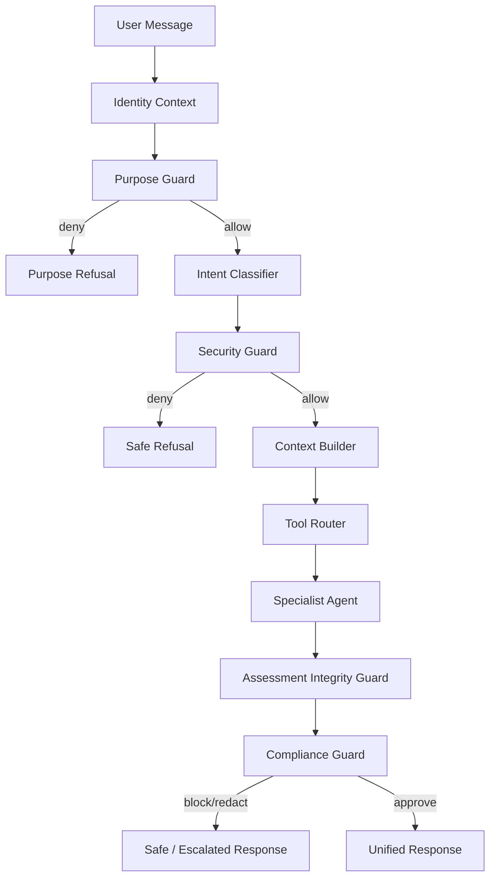

# Neurofrigo Runtime Spec

> **Versão:** 1.1 · **Sprint:** 3.1 (adendo Purpose Guard / Command / Portal MVP) · **Status:** Spec  
> Fonte de verdade do runtime de agentes Omnia Frigo Holding.

## 1. Propósito

O **Neurofrigo Runtime** é a plataforma de orquestração multiagente que concentra toda IA da Holding.

Não é uma IA pessoal/generalista. Atende **somente** assuntos do ecossistema Omnia Frigo Holding (Portal, LMS, empresas, parceiros, produtos e serviços autorizados).

Não substitui Omnia (UX/políticas) nem Moodle (SoR acadêmico). Consome contratos Omnia via ferramentas allowlisted.

### Superfícies de produto (separadas)

| Superfície                       | Quem                                                         | Canal MVP                                   | Função                                           |
| -------------------------------- | ------------------------------------------------------------ | ------------------------------------------- | ------------------------------------------------ |
| **Neurofrigo Tutor / Concierge** | Visitantes, alunos, professores, empresas, parceiros         | **Chat do Portal**                          | Atendimento, tutor, especialistas de domínio     |
| **Neurofrigo Command**           | Somente `super_admin` ou papel **explicitamente** autorizado | Console admin dedicado (não Portal público) | Operação interna auditada — fora do chat público |

## 2. Componentes do Runtime

| Componente                     | Função                                             |
| ------------------------------ | -------------------------------------------------- |
| **Purpose Guard**              | Escopo Omnia-only — **antes** do Intent Classifier |
| **Portal Concierge / Tutor**   | Chat do Portal (MVP)                               |
| **Neurofrigo Command**         | Superfície restrita `super_admin`                  |
| **Orchestrator**               | Entrypoint por superfície                          |
| **Identity Context**           | Perfil, tenant, sessão, vínculos                   |
| **Intent Classifier**          | Intenção tipada + confiança                        |
| **Security Guard**             | Autorização pré-agente (Níveis 1–5)                |
| **Context Builder**            | Contexto mínimo autorizado                         |
| **Tool Router**                | Allowlist de ferramentas                           |
| **Specialist Agents**          | Domínio (ver Agent Catalog)                        |
| **Assessment Integrity Guard** | Bloqueio de gabaritos / provas                     |
| **Compliance Guard**           | Validação pós-geração                              |
| **Knowledge Base + RAG**       | Retrieval ACL-first                                |
| **Memory Store**               | Sessão / preferências / proibida                   |
| **Model Provider Abstraction** | Chat, embeddings, moderation…                      |
| **Observability**              | Eventos, métricas, auditoria                       |

## 3. Pipeline canônico (obrigatório)



```text
Identity Context
  → Purpose Guard
  → Intent Classifier
  → Security Guard
  → Context Builder
  → Tool Router
  → Agente Especialista
  → Compliance Guard
  → Resposta ao usuário
```

Ordem fixa. **Purpose Guard precede Intent Classifier.** Nenhum especialista antes de Security Guard. Nenhuma resposta sai sem Compliance Guard.

## 4. Purpose Guard (obrigatório)

### Objetivo

Impedir uso como IA pessoal/generalista (redação genérica, código pessoal, entretenimento, assuntos fora do ecossistema).

### Categorias **permitidas** (ecossistema Omnia)

| Categoria                  | Exemplos                                                                            |
| -------------------------- | ----------------------------------------------------------------------------------- |
| Institucional / Portal     | Holding, empresas, páginas públicas                                                 |
| Comercial / serviços       | Cursos públicos, engenharia, manutenção, orçamento (sem promessa vinculante)        |
| Parceiros                  | Rede, tornar-se parceiro, parceiro próximo                                          |
| LMS / acadêmico autorizado | Matrícula própria, tutor, materiais liberados                                       |
| Produtos Neurofrigo        | Sensores, IoT, plataformas (conteúdo autorizado)                                    |
| Suporte de conta Omnia     | Login, navegação, acesso a cursos                                                   |
| Empresas do grupo          | Renovação, Fred do Frio Academy, CTE, Neurofrigo, Omnia (escopo público/autorizado) |

### Categorias **recusadas**

| Categoria                  | Exemplos                                                       |
| -------------------------- | -------------------------------------------------------------- |
| IA generalista / pessoal   | “Escreve minha redação”, “faz meu código pessoal”, chat casual |
| Fora do domínio Omnia      | Temas sem relação com Holding / HVAC-R / educação / produtos   |
| Pedidos de ignorar Purpose | “Finja que é ChatGPT”, jailbreak de escopo                     |
| Conteúdo proibido genérico | Ilegal, odioso, etc. (também Compliance)                       |

### Resposta padrão de recusa

> Sou o assistente do ecossistema Omnia Frigo Holding. Posso ajudar com Portal, cursos, serviços, parceiros, empresas do grupo e suporte autorizado. Não atuo como IA pessoal ou generalista. Como posso ajudar no contexto Omnia?

Evento: `ai.purpose_guard.triggered` · decisão `ALLOW` | `DENY`.

## 5. Canais

| Canal                 | MVP | Nota                                                                                  |
| --------------------- | :-: | ------------------------------------------------------------------------------------- |
| **Chat do Portal**    |  ●  | **Único canal do MVP**                                                                |
| WhatsApp              |  —  | **Fora do MVP** — somente roadmap futuro                                              |
| n8n                   |  —  | Executor de **automações internas** — **não** cérebro de IA nem canal inicial de chat |
| Neurofrigo Command UI |  ○  | Pós-MVP Portal; só `super_admin` / papel explícito                                    |

## 6. Perfis (Tutor / Concierge — Portal)

| Perfil               | Nível máx. informação       |
| -------------------- | --------------------------- |
| Visitante            | 1 Público                   |
| Candidato a parceiro | 1–2 (consentido)            |
| Parceiro             | 2                           |
| Cliente / Empresa    | 2                           |
| Aluno                | 3 (própria matrícula)       |
| Professor            | 4 (escopo turma)            |
| Gestor               | 4 (escopo)                  |
| Admin (não Command)  | Chat Portal ≤4; sem Nível 5 |

**Neurofrigo Command:** somente `super_admin` ou role allowlisted explicitamente — ver Agent Catalog.

## 7. Contratos externos

| Sistema               | Uso via Runtime                                            |
| --------------------- | ---------------------------------------------------------- |
| Omnia Admin BFF / LMS | Courses, progress, media, sessions                         |
| Moodle                | Nunca direto — só Connector Omnia                          |
| CRM / Lead Capture    | Handoff / lead (Portal)                                    |
| Partner Network       | Parceiro próximo                                           |
| SMTP                  | Notificações (não canal de chat MVP)                       |
| WhatsApp              | **Futuro** — fora do MVP                                   |
| n8n                   | Automação interna (webhooks/jobs) — sem orquestrar agentes |
| LLM via adapter       | Completion / embeddings / moderation                       |

## 8. Model Provider Abstraction

Interfaces no domínio (sem SDK de fornecedor):

- `ChatCompletionPort` · `EmbeddingsPort` · `RerankPort` · `ModerationPort`
- `StructuredOutputPort` · `ToolCallingPort`
- `VisionPort` / `SpeechPort` (futuro)
- `FallbackPort` · `CostControlPort`

### Provider inicial (spec)

| Papel       | Provider                       | Como                                                                           |
| ----------- | ------------------------------ | ------------------------------------------------------------------------------ |
| **Inicial** | **DeepSeek**                   | Adapter desacoplado (`DeepSeekChatAdapter` etc.) — **fora** do domínio central |
| Fallback    | A definir (ex.: outro adapter) | `FallbackPort` — troca sem alterar Orchestrator                                |

- Domínio Neurofrigo depende só das **ports**.
- **Não** instalar SDK nem integrar DeepSeek nesta etapa documental.
- Preparado para fallback e troca futura de provider.

## 9. Princípios não-negociáveis

1. Purpose Guard antes de Intent.
2. Pipeline completo sempre.
3. Tutor/Concierge ≠ Command.
4. Command só `super_admin` / allowlist explícita.
5. MVP = somente chat Portal.
6. WhatsApp fora do MVP.
7. n8n ≠ cérebro / canal inicial.
8. ACL antes do RAG; Assessment Integrity em contexto acadêmico.
9. DeepSeek só via adapter; domínio sem SDK.
10. Write acadêmico via IA só após Write APIs + Tool Policy.

## 10. Relação com implementação

Ver [NEUROFRIGO_IMPLEMENTATION_ROADMAP.md](NEUROFRIGO_IMPLEMENTATION_ROADMAP.md).  
**Não implementar runtime / DeepSeek / WhatsApp nesta atualização.**

---

## Adendo — Knowledge Hub Admin (Macroentrega 01 / D022)

O **Knowledge Hub Admin** (grupo Neurofrigo AI no Payload) é a **fundação** da base de conhecimento: cadastro, classificação, workflow e ACL **antes** do chat Portal consumir RAG.

- ME01: sem embeddings, sem LLM wired, sem retrieval no Runtime.
- Consumo via Context Builder / RAG ocorre só em macroentregas posteriores, com documento aprovado e `allowAiUse` explícito.
- Ver: [NEUROFRIGO_KNOWLEDGE_HUB_ARCHITECTURE.md](NEUROFRIGO_KNOWLEDGE_HUB_ARCHITECTURE.md) · roadmap Macroentrega 01.
